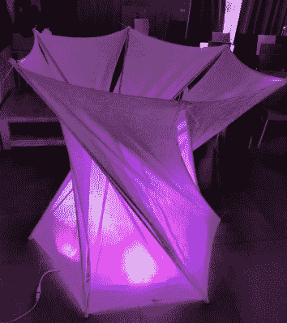
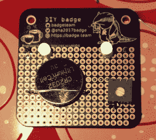
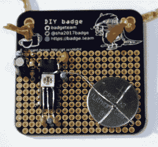
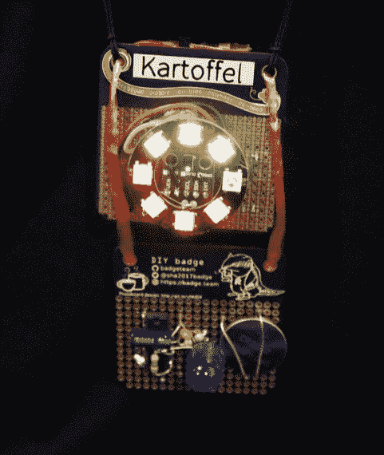
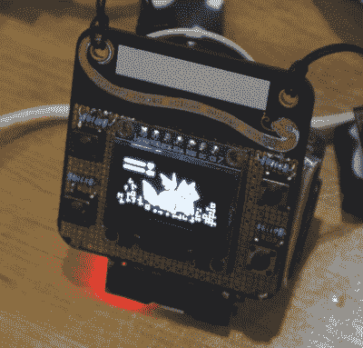

# eth 0 2019 秋季:微型营地，创意徽章

> 原文：<https://hackaday.com/2019/11/03/eth0-autumn-2019-tiny-camp-creative-badge/>

荷兰组织 eth0 多年来已经举办了一系列非正式的小型夏令营，参加者从未超过三位数，也没有预先计划的活动或娱乐。发生的事情是在参与者的鼓动下发生的，结果是一个更密切的社交和合作项目的周末，而不是你花时间四处奔波捕捉一切的大型营地。

最大的黑客营地提供所有你能接受的灯光、机器人、音乐和电子音乐；他们可以是一个爆炸，但也势不可挡。在过去的一周周末，我去了 eth0，享受了更私密的空间，并在 Lichtenvoorde 附近的一家大型私人露营旅馆与优秀的人共度时光，建立了友谊。这是在该国靠近德国边境的远东地区，在一位英国硬件黑客朋友的陪同下，我乘坐一辆小巧的欧洲掀背车前往那里。荷兰的道路很容易导航！

A prototype tensegrity structure. Image: Igor Nikolic.

这次活动是通常的一系列活动，尽管因为这是一个限制摄影的事件，我缺少包含人的更宽的镜头。今年的热门来自退役德国公交车上的剩余 flipdot 显示器，其中有许多小故障，因为我们的朋友 Lucy Fauth 和 Jana Marie Hemsing 发现了它们的怪癖。直觉告诉我，将来我会看到很多荧光圈。

我带来了一个纺织村的核心，海牙的 RevSpace 为我的包缝机和缝纫机增加了刺绣机。它的操作者是来自埃因霍温 [Hackalot](https://hackalot.nl/Hoofdpagina) 的 Boekenwuurm，她好心地为我绣了一个扳手，现在我想要一个这种 600 欧元的机器，即使我买不起。她和 RevSpace 的伊戈尔·尼科利茨正在试验充气玩具和张拉整体结构，创造原型，着眼于未来营地更令人印象深刻的装置。

一个有趣的故事，关于和朋友在荷兰乡村闲逛的几天，可能会被编为一个合理的故事，但是在这个营地还有更有趣的事情。它有一个徽章，由多产的徽章团队荷兰徽章团队提供。虽然它没有带他们的商标 ESP32 固件，但为了符合活动的预算，它是一个原型板，参与者可以在上面创建自己的徽章。由此产生的结果令人印象深刻，并且在事件发生后仍在继续。

## 创意人员的徽章

  NR21 opted for the simple approach.  Bernadski meanwhile produced a CMOS flasher.  Kartoffel evidently wasn’t satisfied with just one badge!

徽章本身有一个有趣的布局，因为除了一些与徽章、团队和事件相关的艺术品之外，它还使用了来自 [Electronic Eel](https://github.com/electroniceel/protoboard) 的多用途布局，这是为 SMD 和通孔零件设计的。这被证明是非常通用的，但也带来了轻微的负担，即通孔焊盘被接地层紧密包围，使得焊接有点棘手。尽管如此，夏令营参与者的热情很高，提供的内容远远超出了世俗的范畴。

对于大多数与会者来说，有一个徽章酒吧，有大量的 led 和其他组件的供应。一些与会者用一对变色 led 和 CR2032 凑合，但其他人用 4093 施密特与门制作了 CMOS 非稳态振荡器，以获得完整的闪烁效果。今天，当微控制器做了这么多事情，看到人们黑客攻击逻辑门振荡器，这几乎是意想不到的，但有一个电路弯曲元素，这一切都是为了更愉快的体验。

A fully functional event badge built upon an event badge. Fuchsia’s Tamafoxi runs the badge.team firmware.

一个或两个徽章以新像素和类似的形式展示了额外的照明。这种 LED 徽章的主要部分是 eth0 徽章的显而易见的选择，即使它相对缺乏空间。eth 0 2019 冬季徽章的*部分没有任何 LED 灯，而是带有一个小有机发光二极管显示屏和一组按钮。Fuchsia'e [Tamafoxi](https://pixie.garden/~/Thingies/tamafoxi) 是一个功能齐全的电子鸡克隆体，在[徽章.团队徽章固件](https://github.com/badgeteam/ESP32-platform-firmware)下运行，徽章背面安装了 Wemos ESP32 板。权力并不那么优雅，需要一个小的原型板和脂肪细胞夹在徽章的背面，但为了获得一个徽章，不会让一个更大的活动在实际上是一个花哨的原型板上运行的壮举，我们会原谅这一切。许多活动徽章团队已经着手实现这一级别的功能，但并没有完全实现，所以在这样的活动徽章上实现这一点确实是一个非常重要的壮举。*

以其他一些人的标准来看，这是一次短暂的露营，从周五晚上开始，到周日午餐时间结束。在一个潮湿的秋日下午，我们在细雨中离开，穿过桌球台般光滑的荷兰高速公路，轻松地前往夜间渡轮，没有更大的营地带来的打包时受到限制的压力。这是我们想要从一个小型黑客营中得到的一切，所以就个人而言，如果有机会，我肯定会回到这里。

这提出了另一个观点，我们在 Hackaday 这里的之前已经提到过。我们英国人去荷兰参加 eth0，因为这是一个和朋友们在黑客训练营聚会的机会，也因为在我们这一地区没有任何类似的活动。但正如我们的荷兰朋友所证明的那样，在组织方面，像这样的活动与大型夏令营不可同日而语，也不一定不可能举办。如果你渴望像 eth0 这样的活动，总有一天你可以去荷兰，但那不是必须的。也许对你来说最好的小活动是你参与组织的活动，不管你来自哪里。