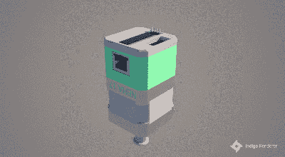

# Ethersweep:易于部署的以太网连接步进控制器

> 原文：<https://hackaday.com/2022/09/07/ethersweep-an-easy-to-deploy-ethernet-connected-stepper-controller/>

[Neumi]在 Hackaday。IO 想要一种简单易用的方式来驱动步进电机，这种方式可以快速部署到各种各样的应用中，但尚未确定。该解决方案被命名为 [Ethersweep](https://hackaday.io/project/187187-ethersweep) ，是一个小型 PCB 堆栈，位于常见的 NEMA17 格式步进电机的后部。除了电机之外，唯一的物理连接是以太网和通过用户友好的 XT30 连接器的电源。该系统可以是闭环的，既有终端停止输入，也有机载 [AMS AS5600 磁性旋转编码器](https://ams.com/en/as5600)(它感应电机组件后侧的旋转磁场——聪明！)给予必要的反馈。利用 [Trinamic TMC2208 步进电机驱动器](https://www.trinamic.com/products/integrated-circuits/details/tmc2208-la/)为 Ethersweep 提供丝般平滑和安静的电机控制，这对于某些应用非常重要。一个面向后方的有机发光二极管显示器显示一些有用的调试信息，以及所有重要的 IP 地址分配给该单位。

控制由无处不在的 ATMega328 微控制器执行，部署了 Arduino 软件堆栈，使上传固件变得轻而易举。为此，还提供了一个 USB 端口，按照大多数类似 Arduino 的设计，通过廉价的 CP2102 USB 桥接芯片连接到 uC。使这个版本有点不寻常的是以太网端口。硬件方面的事情由 [Wiznet W5500](https://www.wiznet.io/product-item/w5500/) 以太网芯片负责，它在单个设备中实现了 MAC 和 PHY，只需要几个无源器件和一个磁插孔就可以操作。该芯片还在内部处理整个 TCP/IP 堆栈，因此只需要一个外部 SPI 接口来与主机设备通信。

暂时谈一下固件，为了简化部署，网络配置由 DHCP 处理，尽管将来会对 MAC 地址分配进行一些控制。所有的控制都是通过以太网上的 UDP 实现的，基本的功能还是有的，但是一些细节，比如电机同步和状态查询，还需要进一步的发布。硬件设计用 KiCAD 和 FreeCAD 实现，Arduino 用 python 覆盖固件和主机控制端。你可以在 [Ethersweep 项目 GitHub](https://github.com/neumi/ethersweep) 上读到关于它的所有内容，有什么不喜欢的呢？

如果你认为你以前见过这个步进安装的驱动程序设置，那你就对了，这里有一个 [CANBUS 控制的驱动程序](https://hackaday.com/2017/05/12/hackaday-prize-entry-modular-stepper-control/)的 2017 年 Hackaday 奖参赛作品。我们也在【智汇君】的[假人:制作精良的机器人手臂](https://hackaday.com/2022/02/21/dummy-the-robot-arm-is-not-so-dumb/)上看到了这个，如果你错过了，那就绕回去看看吧，你不会后悔的！

 [https://www.youtube.com/embed/uKO0q6SgS60?version=3&rel=1&showsearch=0&showinfo=1&iv_load_policy=1&fs=1&hl=en-US&autohide=2&start=50&wmode=transparent](https://www.youtube.com/embed/uKO0q6SgS60?version=3&rel=1&showsearch=0&showinfo=1&iv_load_policy=1&fs=1&hl=en-US&autohide=2&start=50&wmode=transparent)

