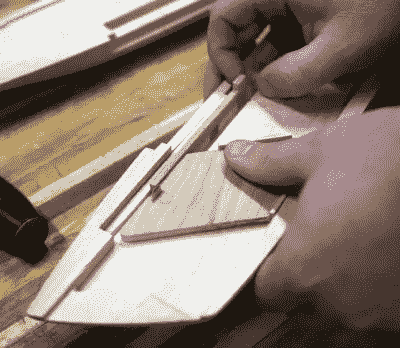

# 每个商店都需要一把巨大的木制美工刀

> 原文：<https://hackaday.com/2018/08/15/every-shop-needs-a-giant-wooden-utility-knife/>

一般来说，我们在 Hackaday 不会涉及太多木工项目。有什么意义？木头让我们想起外面的世界已经够糟糕了，但它几乎从不眨眼，更别提把它连上 Wi-Fi 了。这似乎不会困扰你的好读者，所以我们必须假设你们大多数人都有同样的感觉。但是，虽然我们可能不总是“得到”这些地方的大型木工项目，但我们非常熟悉在一个项目上工作所需的~~痴迷~~奉献，没有别的原因，只是说你成功地完成了它。

 关于这一点，我们展示了【保罗·杰克曼】的最新作品，一把完全由木头制成的[斯坦利美工刀的超大型复制品。所有木制的，除了刀刃，它是由 1/8”厚的刀钢切割而成。没错，这把巨大的美工刀功能齐全。我们并不建议用它打开太多的盒子，因为如果这个怪物滑倒，你可能会打开一条动脉。](https://www.jackmanworks.com/giant-utility-knife/)

我们无法想象会有许多其他人复制这个项目，但不管怎样[Paul]在他的网站上记录了构建的每一步，做得非常出色。从在他的带锯上切割出粗略的形状到做所有艰苦的细节工作，一切都被清晰地拍摄和描述。休息之后，甚至有一个完整的构建视频。

最有趣的部分必须是所有的小内部机制，每一个都是根据组件的要求从不同的木材中以完美的比例精心复制的。例如,[Paul]提到他选择白橡木做春季装饰是因为它的弹性。就连固定手术刀的螺丝也是用车床上的一块木头做的。

不管出于什么原因，人们似乎喜欢建造事物的放大复制品。我们已经看到[的所有东西，从乐高积木](https://hackaday.com/2017/07/21/electric-skateboard-rocks-the-giant-lego/)到[金条，都受到了特殊对待](https://hackaday.com/2017/08/18/fool-giants-with-novelty-sized-gold-bricks/)。我们认为这比另一种选择更容易:[构建大型事物的微型版本](https://hackaday.com/2017/02/10/a-micro-rc-plane-builder-shares-his-tricks/)。

 [https://www.youtube.com/embed/GT5FDlbZvLE?version=3&rel=1&showsearch=0&showinfo=1&iv_load_policy=1&fs=1&hl=en-US&autohide=2&wmode=transparent](https://www.youtube.com/embed/GT5FDlbZvLE?version=3&rel=1&showsearch=0&showinfo=1&iv_load_policy=1&fs=1&hl=en-US&autohide=2&wmode=transparent)

