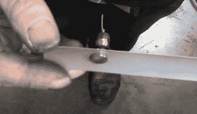

# 振动风力发电机实验

> 原文：<https://hackaday.com/2020/06/30/experimenting-with-vibratory-wind-generators/>

我们对传统的风力发电机都有一个很好的印象:本质上是一个装在棍子上的大螺旋桨。有些人可能还熟悉垂直风力涡轮机，无论风从哪个方向吹，它都可以运行。无论哪种情况，他们都使用某种形式的旋转结构来利用风能。

但是正如罗伯特·默里-史密斯所展示的，在没有任何移动部件的情况下利用风力发电是可能的。他用简单的组件展示了如何建造一个只需振动就能利用风力的装置。好的，所以我们假设这意味着零件在技术上是*移动的，但是你明白了。*

 在休息之后的视频中，【罗伯特】展示了两种不同的设备，它们在相同的基本原理下工作。首先，他从一个标准的扬声器上切下一个圆锥体，然后把一根扁平的棍子粘在音圈上。当棍子在风中来回移动时，磁场中的线圈产生可测量的电压。这证明了这个想法是有价值的，可以很容易地组合在一起，但并不十分优雅。

对于修改后的版本，他将一个线圈粘在一小块氯丁橡胶上，而氯丁橡胶又粘在一个从威尼斯百叶窗上取下的板条上。在线圈的另一边，他粘上一块磁铁。当百叶帘开始在风中振动时，磁体相对于线圈的振荡足以产生电流。当然，它很小。但是如果你有数百甚至数千个这样的电“草叶”，你就有可能积累相当多的能量。

如果这一切听起来对你的口味来说有点太理论化，你可以随时 [3D 打印自己一个更传统的风力涡轮机](https://hackaday.com/2018/10/15/wind-turbine-pushes-limits-of-desktop-3d-printing/)。如果你想了解更多，我们甚至可以在[看到它们的垂直形态](https://hackaday.com/2019/09/19/3d-print-a-complete-wind-generator/)。

 [https://www.youtube.com/embed/Nj3pH95aMOQ?version=3&rel=1&showsearch=0&showinfo=1&iv_load_policy=1&fs=1&hl=en-US&autohide=2&wmode=transparent](https://www.youtube.com/embed/Nj3pH95aMOQ?version=3&rel=1&showsearch=0&showinfo=1&iv_load_policy=1&fs=1&hl=en-US&autohide=2&wmode=transparent)

【感谢 Itay 的提示。]