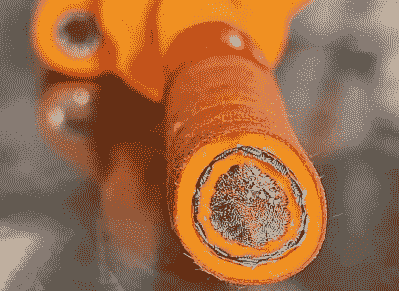

# 探索 Tesla Model S 高压布线

> 原文：<https://hackaday.com/2022/01/13/exploring-tesla-model-s-high-voltage-cabling/>

作为韦伯州立大学的计算机和汽车工程教授，当他不忙的时候，[John Kelly]是一个多产的教育视频制作人。我们发现他的视频[描绘了特斯拉 Model S](https://www.youtube.com/watch?v=OSL_935l568&t=275s) 中 22 米多长的高压电缆(在断裂处下方)非常有趣。[John]警告说，他的视频非常详细，可能不适合所有人:

> 这不是迪斯尼频道。如果你正在寻找娱乐，这不是你的渠道。

我们无视警告，直接跳了进去。像 Model S 这样的电动汽车的“高”电压约为 400 伏。简而言之，通过充电连接器的外部输入可以是单相或三相，120 或 250 VAC，这取决于您所在的地区和充电站。这被提升到标称的 400 VDC 总线，该总线分布在各种车辆系统中，包括电动机和电池组。

**后部模块**

**前模块**

他检查了每个模块，详细展示了电源布线和功能，最终组装了跨越两个工作台的整个系统。我们喜欢他对最近取代标准样式保险丝的电脑控制保险丝的投入，并对他对标签的彻底使用印象深刻。

如果你曾经对电动汽车的高压分布感到好奇，拿些爆米花来看看这个视频吧。浏览他的几十个播放列表，如果你对任何与混合动力和电动汽车、传动系统和/或变速器相关的话题感兴趣，[John]的频道将是一个不错的访问地点。我们以前写过一些拆卸特斯拉、[Model 3](https://hackaday.com/2018/06/04/tesla-model-3-battery-pack-teardown/)和[Model S](https://hackaday.com/2017/02/28/tesla-model-s-battery-pack-teardown/)电池组的文章。你曾经修理过/黑过你电动车的高压系统吗？请在下面的评论中告诉我们。

 [https://www.youtube.com/embed/OSL_935l568?version=3&rel=1&showsearch=0&showinfo=1&iv_load_policy=1&fs=1&hl=en-US&autohide=2&start=275&wmode=transparent](https://www.youtube.com/embed/OSL_935l568?version=3&rel=1&showsearch=0&showinfo=1&iv_load_policy=1&fs=1&hl=en-US&autohide=2&start=275&wmode=transparent)

