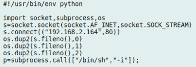

# 探索 Dell N1108T-ON 以太网交换机

> 原文：<https://hackaday.com/2019/06/17/exploring-the-dell-n1108t-on-ethernet-switch/>

在一个一切似乎每年都变得“更智能”的时代，发现即使是相对中等的网络硬件现在也拥有高级功能和相当大的计算能力可能也不会令人惊讶。一个恰当的例子是 Dell N1108T-ON 以太网交换机。尽管在二手市场上只花了大约 100 美元， [[Ben Cox]发现这种特殊的交换机比宣传的要多得多](https://blog.benjojo.co.uk/post/dell-switch-hacking)通过探索它的板载操作系统。

这一切都是从插入交换机前面的串行端口开始的，[Ben]高兴地指出，这是一个集成的 FTDI USB 串行适配器，使生活变得简单。引导进入恢复模式使他能够访问本地 shell，经过一番探索，他确定这是一种嵌入式设备上常见的 BusyBox 驱动的 Linux 系统。最大的发现是它运行的是一个相对较新的内核(3.8.1)，而且它显然安装了 Python。

The reverse shell Python script

从那里，[Ben]发现这些交换机有一个功能，管理员可以通过将 Python“应用程序”打包成 tarballs 并从 USB 闪存驱动器中复制来安装和运行它们。因此，他编写了一个简单的 Python 程序，使用`socket`库来打开他的桌面计算机的反向外壳，令他惊讶的是，它在第一次尝试时就完美地工作了。现在有了 root 权限，乐趣才真正开始。

下一步是在交换机上安装并运行 SSH，这样他就不必每次都使用反向 shell。然后，他开始安装必要的软件包，将交换机转换成带有 Wireguard 的安全 VPN 隧道。由于[Ben]没有安装普通 Wireguard 内核模块的选项，这需要一点小改动，但他最终将必要的工具修改并交叉编译到 ARM 上。他认为这仅仅是这类设备功能的开始，我们很有兴趣看看这个社区将何去何从。

过去，我们已经看到黑客为“哑”的非托管交换机增加管理功能，但像这样的软件修改有望使定制、安全网络的创建变得更加容易，甚至在黑客的预算之内。自从我们上次看到有人[真正投入专业以太网交换机](https://hackaday.com/2013/02/15/cracking-open-a-24-port-switch-so-you-dont-have-to/)以来，确实发生了很多变化。