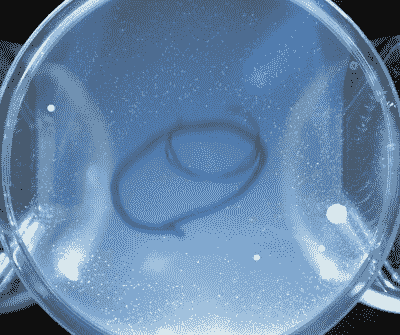

# 探索冷等离子体的治愈能力

> 原文：<https://hackaday.com/2021/11/12/exploring-the-healing-power-of-cold-plasma/>

发现一股热等离子体可以用来给物体表面消毒，这可能并不令人惊讶。不幸的是，所述表面在磨损后可能会看起来有点糟糕，这限制了这种特殊技术的实用性。但事实证明，有可能产生一种所谓的“冷”等离子体，以更友好的形式提供相同的清洁特性。

虽然这听起来像科幻小说，但多产的实验者[【杰伊·鲍尔斯】能够为他最新的*等离子体频道*视频](https://www.youtube.com/watch?v=wOV8kliF4eo)创造一个可靠的非热等离子体源，而设备却出奇的少。假设你已经有了一个能够泵出高电压的装置，你真正需要的只是一箱氦气和一些管道。

Cold plasma stopped bacterial growth in the circled area.

[Jay]带领观众通过他尝试过的几种不同的方法，最终确定了玻璃移液器和中心铜线的成功组合。当连接到一个派对商店的氦气罐和他去年建造的紧凑型杀戮者激励线圈时，该装置产生了一股集中的等离子射流，冷到可以触摸。

它看起来很美，但是一场漂亮的灯光秀是你用氦气换来的吗？为了检验他的装置是否能够对表面进行消毒，他在一组生长板上接种了从他手上收集的细菌，然后将它们暴露在冷的等离子流中。与未经处理的对照组相比，细菌生长的减少看起来确实令人信服，尽管窄射流确实具有非常局部的效果。

如果你只是想保持双手干净，一些肥皂和温水可能是更安全的选择。但是这项技术确实有一些迷人的医学应用，正如[Jay]指出的，欧洲航天局已经研究这个概念有一段时间了。谁知道？在不久的将来，你可能会在医生的办公室里看到一个类似的装置。这肯定不是第一次[太空测试技术落到我们地球人身上](https://hackaday.com/2021/09/23/the-astronomical-promises-of-the-fisher-space-pen/)。

 [https://www.youtube.com/embed/wOV8kliF4eo?version=3&rel=1&showsearch=0&showinfo=1&iv_load_policy=1&fs=1&hl=en-US&autohide=2&wmode=transparent](https://www.youtube.com/embed/wOV8kliF4eo?version=3&rel=1&showsearch=0&showinfo=1&iv_load_policy=1&fs=1&hl=en-US&autohide=2&wmode=transparent)

