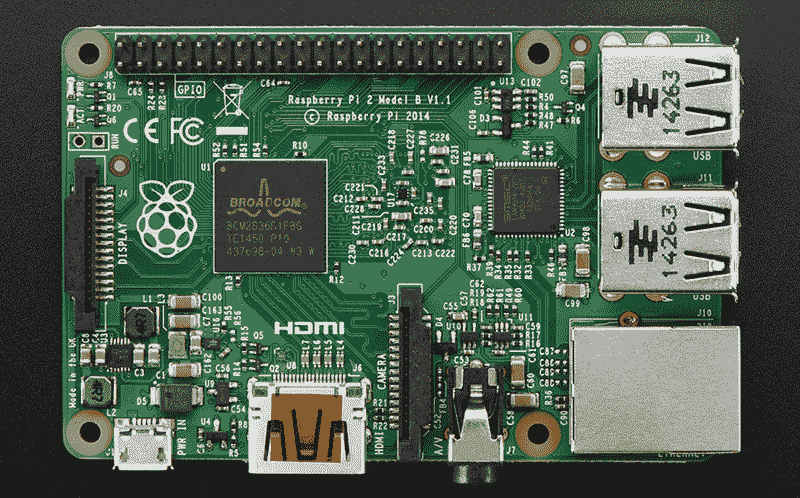
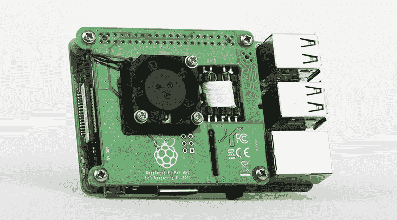
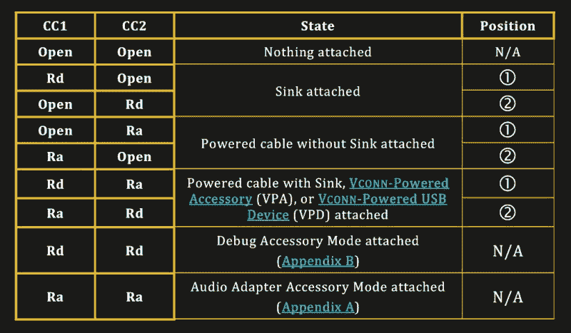
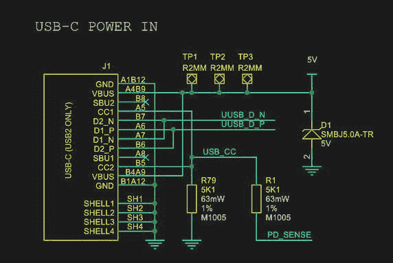
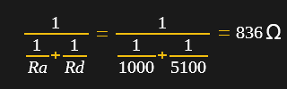

# 深入探讨 Raspberry Pi 4 USB-C 问题

> 原文：<https://hackaday.com/2019/07/16/exploring-the-raspberry-pi-4-usb-c-issue-in-depth/>

公平地说，Raspberry Pi 团队并非没有硬件问题，Raspberry Pi 2 不喜欢拍照，Raspberry Pi PoE 帽子遇到了一个相当尴尬的 USB 电源问题，现在全新的 Raspberry Pi 4 是第一个具有 USB-C 电源传输的产品，但它不能很好地实现 USB-C，除非你选择一根“哑”电缆。

下面请和我一起简要回顾之前的问题，深入总结 USB-C、普通电缆和电子标记(e-marked)电缆之间的差异，以及为什么检测逻辑可能会让您的全新 Raspberry Pi 4 看起来像一套模拟耳机，而不是电力传输硬件。

## 回忆之旅

The Raspberry Pi 2, with the camera shy U16 IC in the lower left.

早在 2015 年 2 月，Raspberry Pi 官方博客上的一篇博文报道了他们认为可能是有史以来最可爱的虫子。简而言之，Raspberry Pi 2 单板计算机(SBC)采用晶圆级封装( [WL-CSP](https://en.wikipedia.org/wiki/Wafer-level_packaging) )，执行开关模式电源功能。不幸的是，像这种晶圆级封装的风险一样，它会将裸芯片暴露给外界。在这种情况下，一些电磁辐射——像氙气相机闪光灯发出的光——进入芯片，导致了[光电效应](https://en.wikipedia.org/wiki/Photoelectric_effect)。

由此造成的破坏导致芯片的监管安全系统启动，并关闭了整个系统，幸运的是没有任何永久性的损害。解决这个问题的方法是在用氙气闪光灯拍照或用激光笔瞄准之前，用不透明材料覆盖住有问题的芯片。

虽然 Raspberry Pi 2 的问题确实难以预测，而且客观上更可爱，而不是危险，但以太网供电(PoE)帽子的问题显然不太可爱。由于过流保护的出现，它实际上使 USB 端口变得不可用。这里的罪魁祸首是 [MPS MP8007 PoE 功率 IC](https://www.monolithicpower.com/pub/media/document/MP8007_r1.0.pdf) (PDF link)，其相对缓慢的反激式 DC-DC 转换器实现运行在 100 kHz(数据手册中建议< 200 kHz)。加上输出容量不足(建议的 41%)，这意味着在每个(缓慢的)电源输入周期中，电流浪涌被传递到 USB 缓冲电容，从而触发 USB 芯片组的过流保护。

Raspberry Pi board fitted with a PoE HAT

这里的[解决方案](https://hackaday.com/2018/11/09/raspberry-pi-poe-redux/)是[对 PoE 帽子](https://www.martinrowan.co.uk/2018/11/raspberry-pi-poe-hat-official-modified-version/)的重新设计，它增加了电源输出电容，并尽可能平滑输出以防止浪涌。这解决了问题，允许连接更高功率的 USB 设备。房间里大象大小的问题当然是为什么 Raspberry Pi 团队没有在预发布测试中发现这个问题。

## USB Type-C 不仅仅是一个连接器

新的 Raspberry Pi 4 在几周前刚刚发布，这是自定义了“ [Raspberry Pi 形状因子](https://hackaday.com/2019/07/08/five-years-of-the-raspberry-pi-model-b-form-factor-what-has-it-taught-us/)”的原始模型 B+以来，该平台最大的一次大修。但是在不到一周的时间里，我们开始听说[USB-C 电源输入如何表现的缺陷](https://hackaday.com/2019/06/28/power-to-the-pi-4-some-chargers-may-not-make-the-grade/)。原来，关键问题是当使用电子标记的电缆时，这些电缆包括 USB-C 规范用于解锁高级功能的电路(如提供更多电源或重新配置设备之间使用的信号)。这些电子标记的电缆根本无法与 Pi 4 一起工作，而它们的“哑”表兄弟却可以做得很好。让我们找出原因。

[USB-C 规范](https://www.usb.org/document-library/usb-type-ctm-cable-and-connector-specification-revision-14-march-29-2019)相当复杂。虽然机械上 USB-C 连接器是可逆的，但在电气上，许多工作正在幕后进行，以使事情按预期工作。关键是每个 USB-C 插座上的两个配置通道(CC)引脚。这些将分别与电缆中的 CC 线或(e 标记电缆中的)V [连接器]导线配对。普通的 USB-C 电缆会让 V [连接器]引脚悬空(未连接)，而 e 标记的电缆会通过电缆内 R [a] 电阻将 V [连接器]连接到地，正如我们在 USB-C 规格的图表中看到的那样。

通过在电缆两端安装 SOP ID 芯片，并让主机和设备都为电缆提供 V [连接器]，也可以使用不带 V [连接器]导体的 e 标记 USB-C 电缆。无论哪种方式，主机和设备都会监控其端的 CC 引脚，并通过监控的电压测量电阻。在这种情况下，主机的行为由下表决定:

# 模拟树莓 Pi 4

既然我们已经了解了基本的 USB-C 设置，那么是时候看看本文的主题了。由于 Raspberry Pi 团队如此优雅地公布了 [Raspberry Pi 4 原理图](https://www.raspberrypi.org/documentation/hardware/raspberrypi/schematics/README.md)(由于某种原因减去了 SoC 端)，我们可以看看他们为 USB-C sink(设备)端实现了什么样的电路:

正如我们在这里看到的，与 USB-C 规范相反，Raspberry Pi 设计团队不仅选择将 CC1 和 CC2 连接到同一个 R [d] 电阻，还在此过程中短接了 CC1 和 CC2。

请记住，规格是在两个 CC 引脚上各寻找一个电阻(R [d] )。这样，连接 Pi 4 板和能够使用该标准的 USB-C 充电器的电子标记电缆将被注册为具有适当的 R [d] 电阻，因此 5V 的 3A 将可用于该接收器设备。

 然而，由于这并没有完成，我们得到了一个有趣的设置，CC 连接仍然建立，但在树莓 Pi 端，电阻不会读取 R [d] 电阻的 5.1 千欧，因为在插座的另一个 CC 引脚上的电缆中仍然有 R [a] 电阻。因此，对于 R [d] 和 R [a] 电阻器，所得电阻器网络分别具有 5.1k 和 1k 的值。该电路的等效电路电阻[为 836 欧姆。](https://www.electronics-tutorials.ws/resistor/res_4.html)

这个值落在 R [a] 允许的范围内，因此树莓 Pi 4 被源检测为 R [a] + R [a] ，这意味着它是一个音频适配器附件，本质上是一个 USB-C-to-analog 音频加密狗。这意味着电源不在 V [总线]上提供任何功率，树莓 Pi 4 将不会工作，因为它没有获得任何功率。

在非电子标记电缆的情况下，这不会是前面提到的问题，因为它不进行这种形式的检测，没有 R [和]电阻来阻止 Raspberry Pi 4 做它的事情。

# 测试比开发更重要

就像 PoE HAT 的问题一样，这个问题很快就被提出来了:为什么 Raspberry Pi 4 的 USB-C 端口的这个问题没有在测试中早点发现？回到 Pi 2 PoE HAT，[来自 Raspberry Pi 团队的官方解释](https://www.raspberrypi.org/blog/poe-hat-revision/)是他们没有用合适的设备进行测试，因为发货晚了而减少了测试，并且没有向现场测试人员询问正确的问题，导致许多场景根本没有被测试。

在对*科技共和国*的回应中，Raspberry Pi 有限公司的首席执行官 Eben Upton 承认了 Pi 4 USB-C 错误。树莓派有限公司的发言人在[回应 *Ars Technica*](https://arstechnica.com/gadgets/2019/07/raspberry-pi-4-uses-incorrect-usb-c-design-wont-work-with-some-chargers/) 时表示，树莓派 4 的下一个版本可能会在“未来几个月”内出现。

这个错误是如何设法潜入产品中的，这一点似乎很明显。就像 PoE HAT 一样，一个设计缺陷溜了进来，在原理图验证期间没有人发现它，原型板没有看到所需的测试量(留下一些用例未经测试)，因此我们现在看到的另一个问题是全新的 Raspberry Pi 硬件存在本质上的缺陷。

当然，作为一种变通方法，黑掉这些主板是可能的。有了 PoE 帽子，人们可以将一个大电解电容焊接到变压器次级侧的输出级，并可能以这种方式“固定”事物。类似地，人们可以在两个 CC 引脚之间切割一条迹线后，在 Raspberry Pi 4 上接入一个电阻…或者甚至更简单:永远不要在 Raspberry Pi 4 上使用 e 标记的 USB-C 电缆。

然而，所有这一切中令人难过的一点无疑是，这些应该是随时可用的，经过全面测试的设备，任何学校教师都可以为他们的教室购买。这种设备不需要先去电子实验室分析各种问题，将电线和元件焊接到不同的点上，然后再塞进外壳，交给学生或自己的孩子。

具有讽刺意味的是，由于这些错误，Raspberry Pi 团队无意中向许多人表明，测试硬件并不难，只是必须要做。

# 兼容 USB-C 并不容易

在撰写本文的过程中，您确实需要深入研究 USB-C 规范，公平地说，Raspberry Pi 设计团队第一次实现 USB-C 并不容易。在所有的规范中，USB-C 在用户友好性甚至简洁性方面排名都不是很高。这是一个大的，曲折的，329 页的文件，它甚至没有涵盖被称为 USB-C 电源传输的怪物。

当一个人第一次在设计中使用 USB-C 接口时犯了一个错误，这并不是什么大不了的事情。USB-C 规范增加了无数的细节和复杂性，这些在以前版本的 USB 标准中根本不存在。不同类型的电缆和更多的导线混杂在一起，也不会让生活变得更轻松。

这里的失败之处在于，在产品生产出来并交付给客户之前，USB-C 设计错误没有在测试阶段被发现。这是任何参与到这样一个项目中的团队需要退后一步，重新评估他们的测试实践的地方。