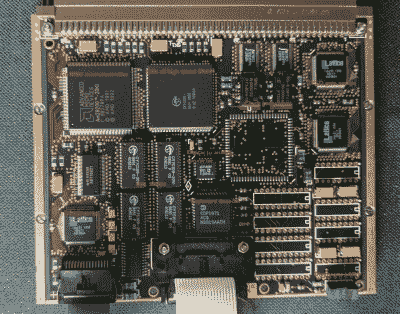

# 探索世纪之交的英国皇家空军航空电子设备

> 原文：<https://hackaday.com/2020/12/01/exploring-turn-of-the-century-raf-avionics/>

二手市场是个奇妙的东西；你永远不知道你会发现什么，仅仅是因为它落后了几年。你甚至可以在军用飞机最后一次改装时找到一些电子设备。这似乎就是[阿德里安·史密斯]如何得到最初安装在皇家空军阿古斯塔韦斯特兰 AW101“梅林”直升机上的控制显示单元(CDU)的。他不满足于仅仅把它扔在架子上，他决定[看看重型驾驶舱模块的内部，看看他是否能弄清楚它是如何工作的](https://www.adrian-smith31.co.uk/blog/2020/11/merlin-helicopter-cdu-teardown-and-power-up-demo-three-microprocessors-inside/)。

不出所料，[阿德里安]在公共互联网上找不到关于这款设备的太多信息。军队就像那样有趣。但仔细观察 CDU 橙黑等离子显示屏上的老化现象，似乎表明这与直升机的通信系统有关。有趣的是，即使该设备在飞机外并没有严格的功能，但它确实有一个非常全面的机载自检和诊断系统。正如你在休息后的视频中看到的，一旦在工作台上通电，他就可以乱搞几个菜单和测试功能。

 随着机箱的裂开，【阿德里安】在 CDU 的正面发现了除了显示屏和键盘面板之外的三块独立的 PCB。第一块板可能负责与直升机的内部系统通信，因为它具有 MIL-STD-1553B 接口模块、UART 芯片和几个 RS-232/RS-485 收发器。第二个 PCB 具有 32 位 AMD 微控制器，似乎充当键盘和显示控制器，也可能提供板载用户界面。最后一块板看起来像是操作的大脑，配有 25 MHz 的摩托罗拉 68EC020 CPU 和 1Mb 的闪存。

CDU 内部的所有硬件都很普通，但这可能就是重点。[阿德里安]理论上说，该设备作为一种通用的飞行员界面模块，当安装在梅林，可以承担各种功能的基础上加载的任何软件。他在网上找到的图片显示，驾驶舱里有多达三个相同的 CDU，可能都运行着不同的系统。

[【Adrian】已经发现了一些有趣的诊断信息](https://www.adrian-smith31.co.uk/blog/2020/11/merlin-helicopter-cdu-update-serial-port-probing/)被转储到 CDU 的后部连接器，但他距离真正将该设备投入任何实际使用还有很长的路要走。如果任何黑客读者[有一些关于这种硬件](https://hackaday.com/2018/04/30/milspec-teardown-ah-64a-apache-data-entry-panel/)的内部消息，我们肯定很想听听。

 [https://www.youtube.com/embed/-YJ3qRym5rM?version=3&rel=1&showsearch=0&showinfo=1&iv_load_policy=1&fs=1&hl=en-US&autohide=2&wmode=transparent](https://www.youtube.com/embed/-YJ3qRym5rM?version=3&rel=1&showsearch=0&showinfo=1&iv_load_policy=1&fs=1&hl=en-US&autohide=2&wmode=transparent)

