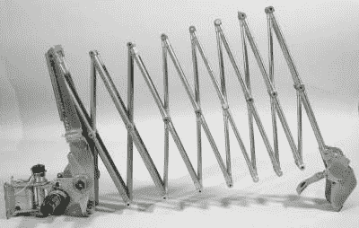
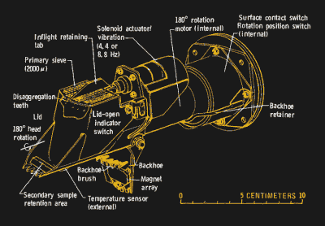
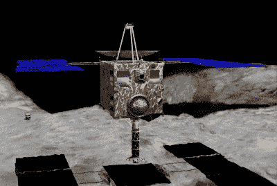

# 外星挖掘:在其他世界挖洞

> 原文：<https://hackaday.com/2019/03/27/extraterrestrial-excavation-digging-holes-on-other-worlds/>

我们人类擅长很多事情，但是在地上打洞是我们最伟大的成就之一。我们已经从用棍子挖树根发展到用大马力拖拉机拉着巨大的犁养活几十亿人，从在陆地上开凿简单的道路发展到在英吉利海峡下钻隧道。无论我们走到哪里，我们都会搬走路上的泥土和岩石，改造地球以适应我们的需要。

其他世界也受制于我们挖洞的倾向，在我们拜访或派遣机器人作为我们代理人的 50 多年里，我们已经在相当多的天体上留下了我们的痕迹。到目前为止，我们所有的挖掘都是以科学的名义进行的，要么是在原地探索这些遥远世界的物理和化学性质，要么是实际上打包一点点天空，以便回家分析。毫无疑问，有一天我们会因为不同的原因而挖掘，但在那之前，让我们来看看我们挖过的洞以及我们是如何挖的。

## 月亮

就本文的目的而言，我将只讨论那些为了探索的目的而故意在天体上挖洞、钻孔或爆破的任务。这忽略了重要但纯粹象征性的挖掘行为，比如在月球上留下脚印和插上旗帜。它还排除了所有几十次飞船被有意或无意撞上的事情。许多这样的早期登月任务都以这种方式结束，第一次是 1959 年 9 月苏联的月球 2 号任务，在*人造卫星*之后不到两年。

*Luna 13* with a close-up of the rocket-powered penetrometer. Source: [RusssianSpaceWeb.com](http://www.russianspaceweb.com/index.html)

直到 1966 年 12 月底，第一艘设计用来挖洞的飞船才在月球着陆。月球 13 号的任务是评估月球表面是否适合苏联的载人登陆，但这永远不会实现。主要的仪器是一个贯入仪，连接在着陆后展开的长吊杆的末端。该仪器有一根尖端锋利的短杆和一个小型固体推进剂火箭发动机，以驱动它进入月球表面。它深入风化层 45 厘米，测量土壤的密度和稠度。

四个月后，第一个人造的月球洞被“勘测者 3 号”跟踪，这是美国一系列探测器中的一个，旨在为计划中的阿波罗任务寻找合适的着陆地点。着陆器携带了一个土壤力学表面采样器(SMSS)，以及末端带有一个小土勺的可伸缩伸缩臂。该臂的基座上有方位角和仰角控制电机，使其能够在一个宽的弧形范围内移动，遥测技术允许工程师根据电机产生的电流推断风化层上的力。SMSS 号忙碌了 18 个小时，通过着陆器的慢扫描电视摄像机进行近乎实时的控制。它挖了多个壕沟，压在月球表面，并通过从高处扔下铲子来进行撞击测试。它甚至捡起一块石头，试图压碎它；遗憾的是，独家新闻对此没有足够的吸引力。

The Soil Mechanics Surface Sampler from the Surveyor program. Source: [National Air and Space Museum](https://airandspace.si.edu/collection-objects/lunar-lander-surveyor-soil-mechanics-surface-sampler)

随后的探测器任务也收集了 SMSS 数据，足以合理地确定阿波罗任务能够安全着陆并从月球表面带回样本。阿波罗 11 号是第一次成功的样本返回任务，从月球返回样本被任务规划者认为是如此重要，以至于尼尔·阿姆斯特朗踏上月球后做的第一件事就是用取样棒上的塑料袋舀起一个小“应急样本”。这个样本塞在他衣服的口袋里，目的是至少带一些月球回家，以防他们需要在收集其他东西之前中止任务。那是 382 公斤的头几克(！)的土壤和岩石，有些是铲起的，有些是铲掉的，有些是通过岩心钻探获得的。

## 火星

Viking sampler head. Source: [*Rock Pushing and
Sampling Under Rocks
on Mars*, US Geological Survey](https://pubs.usgs.gov/pp/1081/report.pdf)

虽然 20 世纪 60 年代末和 70 年代初的大部分行动都集中在月球上，但我们的行星邻居也计划进行探索。苏联访问红色星球的尝试始于 1960 年，但直到 1971 年，他们才成功地让宇宙飞船着陆。火星 3 号任务有一个看起来非常像月球计划着陆器的着陆器，它不仅携带了一个带铲子的机械臂来采集火星土壤，还携带了一个小型漫游车，它应该可以在滑道上自主滑行，并包含一个类似于月球 13 号上的贯入仪。可悲的是，探测器着陆后仅仅 15 秒就失去了联系，计划中的科学研究也没有进行。

五年后，美国海盗计划成功发射了两个火星着陆器，海盗 1 号和 T2 海盗 2 号。两个着陆器完全相同，都是专门设计来采集火星土壤样本以寻找生命的。取样臂是一个巧妙的装置，一个可以延伸 10 英尺(3 米)的吊杆，可以将取样头推入土壤中，但仍然可以缩回足够的距离，以便将样品送到着陆器顶部的各种科学包中。吊杆基本上是两个大型不锈钢带，有点像巨大的卷尺刀片，凹面彼此相对，边缘相连。吊杆包含一根用于采样器头部的带状电缆，当它卷到卷轴上时变平，当它放出时膨胀，使其足够坚硬以挖掘土壤。

 [https://www.youtube.com/embed/4c5o6jaJOuI?version=3&rel=1&showsearch=0&showinfo=1&iv_load_policy=1&fs=1&hl=en-US&autohide=2&start=134&wmode=transparent](https://www.youtube.com/embed/4c5o6jaJOuI?version=3&rel=1&showsearch=0&showinfo=1&iv_load_policy=1&fs=1&hl=en-US&autohide=2&start=134&wmode=transparent)

不幸的是，海盗号对火星土壤的化学和生物化学分析结果并不确定。对这颗红色星球的进一步挖掘将不得不等待一段时间，因为送往火星的任务一个接一个地失败了。最终，在 2003 年，火星探测车“勇气号”和“机遇号”抵达并开始了他们长达 15 年的穿越地球的史诗般的旅程。每个漫游者都携带了一个岩石研磨工具(RAT)，一个装在机械臂末端的小金刚石砂轮。它压在一块岩石上，以 3000 转/分的速度旋转，钻出 5 毫米深的洞，露出未风化的岩石，供火星车光谱仪和其他仪器分析。

尽管如此，所有这些在月球和火星上的挖掘仅仅触及了表面。随着火星洞察号任务的开展，这种情况正在改变。洞察号本身于去年 11 月登陆火星，并部署了一台仪器，旨在制造迄今为止最深的地外洞穴。热流和物理特性包(HP)由着陆器的机械臂放置在表面上，包含一个自钻传感器包，被称为“鼹鼠”。“鼹鼠”的操作方式与普通的无线撞击驱动装置非常相似，它应该会在火星的风化层中打洞，并拖着一条传感器尾巴。它能到达的最大深度是 5 米，但目前停留在 30 厘米左右。它可能撞上了一块岩石或一块砾石，在这种情况下，它看起来不适合再深入下去。

 [https://www.youtube.com/embed/KAxiHK6dYvE?version=3&rel=1&showsearch=0&showinfo=1&iv_load_policy=1&fs=1&hl=en-US&autohide=2&start=50&wmode=transparent](https://www.youtube.com/embed/KAxiHK6dYvE?version=3&rel=1&showsearch=0&showinfo=1&iv_load_policy=1&fs=1&hl=en-US&autohide=2&start=50&wmode=transparent)

## 小行星

 

*【隼 2】*带采样器扩展。来源:JGarry【公共领域】，[via Wikimedia Commons](https://commons.wikimedia.org/wiki/File:Hayabusa_hover.jpg)

主要天体并不是我们挖掘的唯一地方。散落在太阳系中的小行星也已被造访，第一颗是小行星 25143 丝川，日本探测器*隼鸟号*于 2010 年在其上着陆。其目的是向小行星表面发射一枚炮弹，并收集喷出物返回地球，但采样器失败了。尽管如此，探测器卷起的尘埃足以捕获大约 1500 粒小行星物质，这些物质被安全地带回家进行分析。Hayabusa2 是一项后续任务，目前正在小行星 162173 Ryugu 的轨道上运行，它在 2 月份将其采样器喇叭接触到表面，并向表面发射了一颗钽子弹，收集了大量的喷出物。一种更强大的穿甲弹，由聚能射孔弹推动的 2.5 公斤铜块组成，将于下个月在地表发射，产生一个 2 米宽的坑，并暴露出尚未受到太空蹂躏的物质。隼鸟号将从人造陨石坑中采集样本，并打包，准备在 2020 年返回地球。

美国宇航局自己的小行星样本返回任务正在进行中，OSIRIS-REx，目前正在调查小行星 101955 贝努鸟。一旦找到合适的位置，探针将下降，让接触式样本采集装置(TAGSAM)接触表面。塔格萨姆的挖掘肯定不如隼鸟号探测器有活力；用氮气将浮土吹入取样器。这将足以收集地球上分析所需的至少 60 克物质。

 [https://www.youtube.com/embed/NjlGYHJ2560?version=3&rel=1&showsearch=0&showinfo=1&iv_load_policy=1&fs=1&hl=en-US&autohide=2&wmode=transparent](https://www.youtube.com/embed/NjlGYHJ2560?version=3&rel=1&showsearch=0&showinfo=1&iv_load_policy=1&fs=1&hl=en-US&autohide=2&wmode=transparent)

鉴于通过分析这些样本产生的科学数据宝藏，我们不太可能很快停止在其他世界挖掘、爆破、刮擦和膨化孔洞。无论我们去哪里，如果有一个表面挖掘，你可以打赌，我们会找到一种方法做到这一点。