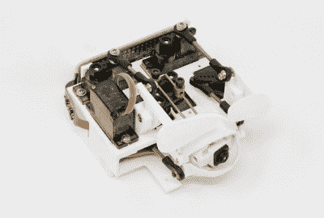

# 眼睛摄像头在眨眼之间看着你

> 原文：<https://hackaday.com/2021/04/12/eyecam-is-watching-you-in-between-blinks/>

我们会第一个承认，在家工作通常很难有效率，尤其是如果没有人真正在你身后看的话。好吧，这里有一种令人毛骨悚然的方式，让你感觉好像有人在盯着你，如果这能让你振作起来，飞得更好的话。由[Marc Teyssier]等人进行的 Eyecam 研究项目。艾尔。是一个逼真的电动眼球，包括一个摄像头，挂在电脑显示器上。它旨在引发关于传感器的讨论，这些传感器已经以各种感冒和临床形式存在于我们周围。这是一个开源项目，有一份[文件](https://marcteyssier.com/content/publications/chi2021-eyecam-teyssier.pdf)和一份[回购](https://github.com/marcteys/eyecam)，还有一个操作视频正在制作中。

 眉毛上扬的设计在不可思议的方面毫不留情:眼睛的行为就像你预料的那样(如果你能预料到的话)——它会眨眼、环顾四周，甚至会晃动眉毛。眼球、眉毛和眼睑由 Arduino Nano 控制的总共六个伺服系统驱动。

眼球内部是一个 Raspberry Pi 摄像头，连接到 Raspi Zero，用于这个有趣的恐怖节目的网络摄像头部分。休息之后继续关注 Eyecam 电视广告。

令人毛骨悚然或引人入胜的是，它成功地让人们思考现在我们周围的大量传感器，以及它们的未来可能会是什么样子。与标准的黑色和灰色长方形眼睛相比，模仿眼神交流是一种进步吗？也许一双眼睛不会那么令人不安，我们真的不确定。但是我们想知道下一个会是什么，一个看起来像耳朵的麦克风？大概吧。它会有头发冒出来吗？也许吧。

是的，这是真的；两只眼睛更迷人，但仍然令人毛骨悚然，尤其是当它们跟着你在房间里走来走去，还能射出该死的激光束。

 [https://www.youtube.com/embed/JMxr8Nq-w_w?version=3&rel=1&showsearch=0&showinfo=1&iv_load_policy=1&fs=1&hl=en-US&autohide=2&wmode=transparent](https://www.youtube.com/embed/JMxr8Nq-w_w?version=3&rel=1&showsearch=0&showinfo=1&iv_load_policy=1&fs=1&hl=en-US&autohide=2&wmode=transparent)

感谢提示，[斯文，格雷格，和意大利]！