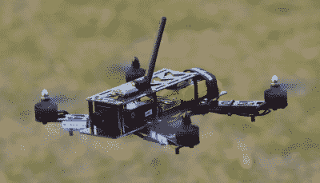

# FAA 提出细化无人机法规

> 原文：<https://hackaday.com/2019/02/04/faa-proposes-refined-drone-regulations/>

政府的车轮运转缓慢，远远低于现代技术发展的速度。因此，法律和法规明显落后于它们旨在控制的技术并不罕见。这可能会导致某种“狂野西部”的情况，这可能被视为一件好事或坏事，取决于你站在围栏的哪一边。

 在美国，公平地说，在无人机法规方面，我们已经正式走过了“狂野西部”的阶段。这并不是说遥控(RC)飞机以前不受监管，而是管理它们的规则根本无法跟上我们在过去几年中看到的技术的快速发展。联邦航空局以前对遥控飞机的规定是在遥控飞机飞行更低更慢的时代制定的，远在远程视频技术将操作员移出飞机视线之前。

为了解决遥控飞机能力及其受欢迎程度的飙升，联邦航空管理局最终被授权监管官方称为无人驾驶航空系统(UAS)的东西，并废除了 2018 年联邦航空局再授权法案第 336 条。被称为“模型飞机的特殊规则”的第 336 条之前已经到位，以确保联邦航空局的权力仅限于“真实”的飞机，小型遥控飞机不会受到与全尺寸飞机相同的审查。随着第 336 条的废除，人们可以把新的联邦航空局指令解释为对有人驾驶和无人驾驶飞机及其操作人员采取同样的标准；许多爱好者强烈反对的不合理的立场。

当时，联邦航空局认为，废除第 336 条将允许他们从强势地位创造新的 UAS 法规。换句话说，从严格的限制和规定开始，并开始削减，直到找到一个大家都满意的平衡。[美国交通部长 Elaine L. Chao 透露，第一个完善的规则正在制定中](https://www.transportation.gov/briefing-room/transportation-research-board-annual-meeting-washington-dc)，虽然它们还不是正式的，但看起来美国联邦航空局正在努力为业余爱好者找到一个合理的中间地带。

## 提议的规则更改

根据联邦航空局的现行规定，禁止在人群上方或夜间驾驶 UAS 或无人机，除非你申请特殊的 107 部分豁免。值得称赞的是，美国联邦航空局一直在为提出合理请求的无人机飞行员提供豁免，正如公开的豁免列表所证明的那样。但正如人们可能预料的那样，在与联邦政府打交道时，这仍然是一个繁琐的过程。不仅审查你的申请需要长达 90 天的时间，而且根据 FAA 自己的数字，大多数豁免申请都因缺乏必要的信息而被拒绝。

只要满足其他条件，新提议的规则将允许夜间飞行和载人飞行，而无需经过豁免程序。这些规则不会取代豁免，但会为那些愿意(或能够)满足要求的人提供另一条前进的道路。这种细致入微的方法意味着，一次性事件或实验仍然可以获得豁免，但那些希望定期在夜间飞行或飞越人群的人有一个更永久的选择。

选择总是一件好事，尤其是对于爱好者或实验者来说。如果这些限制航班的官方途径对个人来说过于困难或昂贵，至少他们仍有能力在个案基础上申请豁免。所以唯一的问题是，在提议的改变下，具体的要求是什么？

## 夜间飞行

对于夜间飞行，操作者必须通过认可的夜间飞行知识测试，UAS 本身必须配备可见的防撞灯。与该测试相关的信息，如小册子和培训视频，将在 FAA 网站上免费提供。至于防撞灯，唯一的要求是它在三个法定英里内可见。

Aveo Engineering PicoMax

根据新规则的草案版本，曾考虑过更复杂的照明要求，如频闪灯或多色导航灯，但最终确定它们是不合理的负担。它特别指出，小型无人机的尺寸和有限的电池容量使得要求制造商包括复杂的照明系统是不合理的。

有趣的是，三英里可见防撞灯是对超轻型飞机(以及更大的商用无人机)的相同要求，因此已经有小型商用 LED 模块通过了 FAA 认证，可以满足这一要求。将这些改装到遥控飞机上应该不会有太大的困难，而且很难反对在夜间飞行的物体上安装清晰可见的防撞灯的必要性。

## 飞过人群

拟议中的飞越人的规则要复杂得多，因为联邦航空局的目标是根据发生碰撞时造成身体伤害的可能性对 UAS 进行分类。这不仅考虑了重量，还考虑了外露螺旋桨等设计元素。美国联邦航空局的建议甚至表示，大型无人机的制造商需要利用褶皱区等功能，以便降低任何潜在撞击的动能。

这种分类系统将把负担放在商业制造商身上，似乎只有最昂贵的交钥匙无人机才有可能具备所需的安全功能，才有资格定期飞越人类。如果你所在的行业需要这种能力(电影制作人、体育报道、新闻等)，那么这些就是你在购买下一个航拍平台时需要考虑的因素。

幸运的是，对于业余爱好者和其他空中黑客来说，除非无人机重量超过 250 克，否则这些要求不会生效。根据这些拟议的规则变化，任何重量或低于该重量的物体都可以自由飞越人，而无需任何设计建议或额外要求。一段时间以来，减轻重量一直是业余爱好四轴飞行器世界的游戏名称，[许多非常有能力的设计都远远低于 250 克的门槛](https://hackaday.com/2017/01/05/the-worlds-lightest-brushless-fpv-quadcopter/)。考虑到在撰写本文时，任何未经联邦航空局批准的*无人机飞越人上空都是非法的，这可能是一个非常受欢迎的变化。*

## 保持爱好的乐趣

在过去五年左右的时间里，我们已经看到了一系列令人眼花缭乱的小型无人驾驶飞机的新规则和条例。越来越多的人可能会被吓到而失去兴趣。考虑到媒体会多么迅速地报道任何负面的“无人机”故事，很难责怪他们。没有人想因为在自家后院驾驶四轴飞行器而被捕，因为他们没有提交相应的文件。

但是，如果运气好，加上社区的一些投入，我们可能会看到隧道尽头的亮光。至少从表面上看，这些拟议的规则变化似乎是普通远程操作员可能会发现自己处于的两种非常常见的情况的合理解决方案。希望未来对联邦航空局无人机规则的完善将继续明确区分业余爱好者和商业运营商，并简化休闲飞行的流程。