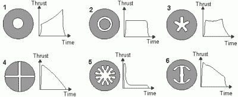

# 本周失败:3D 打印零件像美国宇航局的火箭燃料一样燃烧

> 原文：<https://hackaday.com/2022/01/09/fail-of-the-week-3d-printed-parts-that-burn-like-nasas-rocket-fuel/>

[Integza]的使命是找到尽可能多的方法，利用 3D 打印和其他可行的制造技术来制造火箭和其他发动机。他有一个很棒的想法——[有可能 3D 打印固体燃料火箭](https://www.youtube.com/watch?v=0kPgw_S_pS4)(视频，嵌入在下面)具体来说，你能 3D 打印火箭颗粒本身吗？通过使用树脂作为燃料，并混合一种强氧化剂(特别是高氯酸铵——感谢美国宇航局的提示！)他有一些，呃，混合的成功。

Effective thrust vs grain cross-sectional profile

正如我们许多人(咳咳，我是说*你*)可以证明的那样，当在业余的[固体推进剂火箭](https://en.wikipedia.org/wiki/Solid-propellant_rocket)发动机实验的阵痛中(只是从理论上讲，你明白)随着时间的推移平衡推力并保持燃烧压力在外壳能力范围内不是一件容易的事情。一旦你在燃烧室内制造并固定了一个喷嘴，最简单的任务就是控制燃料/氧化剂/粘合剂(称为燃料*颗粒*)的比例、颗粒大小，并在内部将混合物铸造成固体、干燥的物质。困难的部分是设计和控制颗粒的形状，这样当颗粒表面燃烧时，活跃燃烧的表面积随着时间的推移保持相当稳定。随着时间的推移，一个简单的圆柱形孔的直径会明显增加，从而增加燃烧表面积，并导致燃烧速率和产生的压力不断增加。这是个坏消息。已经测试了各种内部轮廓，但目前最常见的是多点星形，当与抑制剂化合物混合在药柱中使用时，可以精确控制推力。

[Integza]尝试了一些实验来确定最合适的燃料/粘合剂/氧化剂比例，然后 3D 打印了一些燃料颗粒，将它们撞进一个丙烯酸管燃烧室(显然)并连接了一个 3D 打印的喷嘴。你可以自己看到排气羽流中的[马赫菱形](https://en.wikipedia.org/wiki/Shock_diamond)(这很好),因为超音速气流在边缘过度膨胀。理想情况下，喷嘴不是由塑料制成的，但它只需要坚持几秒钟，所以这不是一个真正的问题。

3D 打印燃料颗粒是否可行的问题是几年前在太空堆栈交换上提出的，这是一个有趣的阅读。

我们最近看到了一些更复杂的 3D 打印火箭发动机，例如这个[涡流冷却的液体燃料发动机](https://hackaday.com/2020/12/08/sla-3d-printed-vortex-cooled-rocket-engine/)，在 Hackaday，IO 上，这里有一个 [3D 打印发动机试图使用 PLA 作为燃料来源](https://hackaday.io/project/12437-fully-3d-printed-rocket-with-3d-printed-fuel)。

 [https://www.youtube.com/embed/0kPgw_S_pS4?version=3&rel=1&showsearch=0&showinfo=1&iv_load_policy=1&fs=1&hl=en-US&autohide=2&wmode=transparent](https://www.youtube.com/embed/0kPgw_S_pS4?version=3&rel=1&showsearch=0&showinfo=1&iv_load_policy=1&fs=1&hl=en-US&autohide=2&wmode=transparent)

