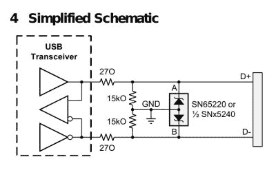

# 本周失败:将单位误认为数值

> 原文：<https://hackaday.com/2021/04/24/fail-of-the-week-mistaking-units-for-values/>

通常，当我们发布一周失败时，这是一个项目的英雄故事，这个项目是出于最良好的意图，但不知何故未能达到目标。没有这样做的交流器，或者 3D 打印的连接把喷射塑料的边界推得有点远了。但是今天我们带给你的东西应该是无可非议的，感谢[Boldport]带给我们[Stargirl]和[tick Tok]之间关于[德州仪器数据表](https://www.ti.com/lit/ds/symlink/sn65220.pdf)的推特对话。

The SN65220 schematic

[SN65220](https://www.ti.com/product/SN65220) 是 USB 端口的抑制芯片，旨在保护 USB 硬件免受电压尖峰的影响。你可能已经有好几个了，但你并没有意识到，这个小小的 6 引脚封装就在 USB 连接器旁边的 PCB 上。它的数据手册显示，它需要在它和它保护的 USB 设备之间连接一个电阻网络，这就是失败的根源。

有两个电阻，15kω和 27O，15kω和 270ω，对吗？不过，仔细观察，27O 不是带零的 270，而是带大写“O”的 27O，因此实际上是 27 欧姆。

几十年来，抵抗的符号一直是大写的希腊ω。众所周知，有时字体不包含希腊字母，因此有一个广泛使用的惯例，即使用大写字母“R”来表示它，后跟“K”表示千欧，“M”表示兆欧，等等。因此，一个 270 欧姆的电阻通常被写成 270 欧姆，而一个 270 千欧姆的电阻被写成 270 千欧姆。在小数值的情况下，惯例是将分数放在字母后面，例如 2.7 千欧变成 2K7。出于某种原因，TI 数据手册的编辑自行使用大写字母“O”来表示“欧姆”，导致 1 千欧以下的值模糊不清。

我们无法想象一名工程师会做出这样的选择，因此我们期待他们的出版部门能做出这样的选择，同时我们也想知道有多少 USB 设备在数据路径中使用了 270R 电阻。毕竟[放错电阻会影响到我们任何一个人](https://hackaday.com/2016/04/25/fail-of-the-week-dont-tie-those-serial-lines-high/)。