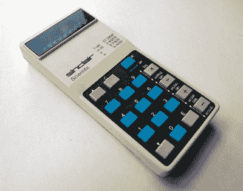

# 再见克莱夫·辛克莱爵士；激励了一代工程师

> 原文：<https://hackaday.com/2021/09/16/farewell-sir-clive-sinclair-inspired-a-generation-of-engineers/>

我们悲痛地注意到英国作家、工程师、家用电脑先驱和企业家克莱夫·辛克莱爵士在长期患病后于今晨去世，享年 81 岁。在黑客读者中，他最出名的可能是上世纪 80 年代的 ZX 系列家用电脑，但在科技行业的一生中，他几乎没有接触过消费电子产品的任何角落。

20 世纪 50 年代，辛克莱的第一份职业是技术记者和作家，20 世纪 60 年代，他创建了电子公司辛克莱无线电公司。他早年的作品是微型晶体管收音机和高保真元件的混合物，为几十年来更小的设备奠定了基调，包括 20 世纪 70 年代初的早期 LED 数字手表，70 年代和 80 年代的微型 CRT 电视，以及 90 年代上市的另一款微型入耳式调频收音机。

The Sinclair Cambridge Scientific calculator.

在 70 年代初，他通过使用纽扣电池而不是笨重的干电池来应对新兴的大众市场计算器世界，然后通过对更普通的计算器芯片进行极其聪明的重新编程，以低价推出科学计算器。随着计算器变得商品化，他不可避免的下一步是进入计算世界，这从一个不起眼的开始导致了巨大成功的 ZX 系列机器，1982 年的 ZX 频谱成为英国有史以来最受欢迎的计算机之一。这些机器巧妙地利用了一个非专用逻辑阵列芯片来减少设备数量，尽管它们缺乏更昂贵的竞争对手的先进功能，但它们低于 100 美元的价格使它们成为现金意识强的父母的轻松选择。有一系列 Sinclair 外设，包括[一个微型磁带存储设备](https://hackaday.com/2020/09/18/the-zx-microdrive-budget-data-storage-1980s-style/)，以及一个庞大的第三方硬件和软件生态系统。

到了 20 世纪 80 年代，计算机业务失败了，被卖给了竞争对手艾伦·休格的阿姆斯特拉德公司，尽管辛克莱的发明创造势头依然如故。他的 [C5 电动汽车](https://hackaday.com/2018/12/27/1985-electric-vehicle-restoration/)是一个商业上的失败，但它导致他在 90 年代生产了一系列电动自行车附加产品，这些产品预示了今天电动自行车几十年的繁荣。然而，他并没有完全放弃电脑，因为他在 1987 年发明的[剑桥 Z88](https://hackaday.com/2017/10/05/the-cambridge-z88-lives-as-a-usb-keyboard/) 是一款使用 AA 电池的 LCD 便携式电脑，提供了有用的路上办公设施。

除了一系列总是有趣但有时设计不足的技术产品，克莱夫爵士真正的遗产在于从他的工作中受益的几代人。无论是他在 20 世纪 60 年代通过写作向他们介绍电子学，还是在 20 世纪 80 年代通过 Sinclair Basic 的魔力向他们介绍计算机，他都将不可能的事情从科幻小说直接变成了一份负担得起的圣诞礼物。在英国和其它国家，有一大批工程师和软件开发人员，他们第一次体验到的计算机带有 Sinclair 标识，他们学会了 ZX 方式的内存映射。对我们来说，克莱夫爵士的公司和产品提供了一份职业和终身的兴趣，很少有其他人对我们有如此持久的影响。克莱夫·辛克莱，谢谢你！

标题:Mark Sanders， [CC BY-SA 4.0](https://commons.wikimedia.org/wiki/File:Sir_Clive_Sinclair_on_X-Bike_Prototype.jpg) 。