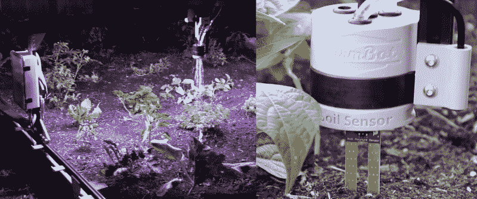

# FarmBot 推出新的数控园艺机器人模型

> 原文：<https://hackaday.com/2019/07/01/farmbot-unveils-new-cnc-gardening-robot-models/>

在北半球，现在是夏天，生长季节正在全面展开。很快就会结出美味果实的生机勃勃的植物从土壤中长出，但不幸的是，杂草丛生，需要园丁的不断关注。"要是有一台机器能做这件事就好了！"她哭了，碰巧她很幸运。

这个[农场机器人](https://farm.bot/)是一个[开源](https://github.com/FarmBot)机器人蔬菜种植者，能够照顾播种和照料菜地的所有方面。我们第一次看到他们是五年前第一届 Hackaday 奖的半决赛选手[。这是一台数控机床，用于你后院花园的高架床。给它供电、供水和 WiFi 连接，FarmBot 就开始服务于种植、浇水、除草和监测土壤。现在他们已经卖出了 1000 多台 Genesis 模型，今天又宣布了一对新模型，承诺让他们的技术比以往任何时候都更容易使用。](http://hackaday.io/project/2552-FarmBot---CNC-Farming-and-Gardening)

FarmBot has a tool changer. Soil moisture sensor and watering heads are shown here.

为了向特斯拉致敬，FarmBot 称这是他们的“*Model 3 moment*”——与他们富有的、热爱数控机器的早期采用者相比，新产品更小，更倾向于吸引更广泛的客户群。新的 FarmBot Express 和 Express XL 型号现在 95%都是预组装的，以降低启动和运行的门槛。它们包括两种尺寸的种植床:1.2 米 x 3 米或 2.4 米 x 6 米，建议零售价为 2295 美元/2795 美元，尽管目前有 800 美元的折扣。

对我们来说，FarmBot 是早期 Hackaday 奖参赛者的成功故事。从一个伟大的想法和功能原型，该项目已经成功地过渡到商业可行性，并通过帮助人们种植自己的产品，使世界成为一个更美好的地方。谁知道呢，五年后可能是你的想法达到商业可行性，我们认为你也应该[参加 Hackaday 奖](https://prize.supplyframe.com/)！

[hack adayprize 2019](https://prize.supplyframe.com)主办单位:     