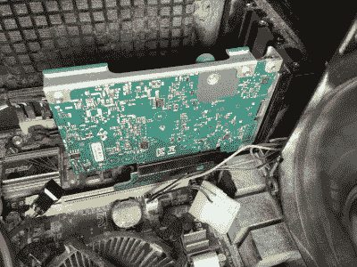

# 带有服务器网络适配器的更快的桌面以太网

> 原文：<https://hackaday.com/2020/10/03/faster-desktop-ethernet-with-server-network-adapters/>

就消费者网络硬件而言，我们都希望通过 Cat 6 电缆使用 802.11n WiFi 和千兆以太网。对于大多数家庭用户来说，这足以让他们每天观看流媒体电影和在 Twitter 上发布 K-pop 视频。如果你想要一个更粗的管子，东西会变得很贵，很快。然而，[TobleMiner]找到了一种在普通 PC 上使用多余的服务器级卡的方法—[在预算有限的情况下提供巨大的带宽。](https://twitter.com/Toble_Miner/status/1310242309347463168)

The adapter is designed to allow a FlexibleLOM card to fit into a regular ATX PCI-E card slot. A small additional bracket should be used to fix the card in place with the typical bracket retention screw.

HPE 的 FlexibleLOM 标准包括 HPE 服务器上的特殊边缘连接器，允许最终用户在专为刀片式和机架式服务器设计的外形规格中安装各种网络适配器。在电气层面，它只是 PCI-Express 8x。FlexibleLOM 网卡专为高速数据中心使用而构建，通常具有 SFP+和 QSFP+接口，分别支持 10 千兆位和 40 千兆位速度。

这些卡在易贝上售价不到 20 美元，但不适合标准的 PCI-Express 插槽。[进入【ToberMiner】的适配器](https://github.com/TobleMiner/HPE-FlexibleLOM-adapter)，该适配器将相关的 PCI-Express 线路连接到它们需要去的地方，并机械地调整 FlexibleLOM 硬件以适合常规的 ATX PC 机箱。

这是一个很好的方式，让你的家庭钻机服务器级网络适配器，而不打破银行。我们以前也展示过其他高速家庭网络的尝试。如果你知道如何从廉价的多余硬件中获得几千兆的速度，[你知道该找谁。](http://hackaday.com/submit-a-tip)

【感谢 Marco 的提示！]