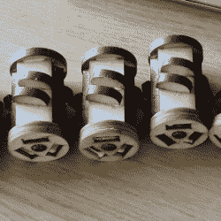

# 人造空调设备，完全由 2D 切割而成

> 原文：<https://hackaday.com/2018/09/28/faux-aircon-units-made-entirely-from-2d-cuts/>

2D 的设计和零件制造并不局限于 2D 的成品，这在最近在英国举行的 2018 年电磁场黑客营中，这些[人造空调单元](http://msraynsford.blogspot.com/2018/09/faux-aircon-units.html)【马丁·雷恩斯福德】的创建有助于充实赛博朋克主题的零扇区。零区主要由集装箱和创意照明和道具组成，这些假空调设备有助于增加实用的氛围，同时也有掩盖偶尔出现的集装箱标志的令人愉快的副作用。更有甚者，风扇叶片可以在杂散气流中自由旋转；加上令人信服的铁锈效果，使他们获得了成功。

Fan hubs, showing spots for fan blades to be glued. With the exception of embedded bearings, the entire hub (like the rest of the unit) is made from laser-cut MDF.

这些单元几乎全部由激光切割的中密度纤维板制成。风扇叶片由三叉孔留下的废料切割而成，真正展示“用 2D 材料制作 3D 组件”的是由激光切割件制成的风扇轮毂(轴承除外)；这里显示了轮毂的特写。

收尾工程是一些油漆和生锈的外观。【马丁】是如何获得如此令人信服的铁锈效果的？通过使用真正的铁锈，事实证明。一些氰基丙烯酸酯胶用雾状水强制固化以获得纹理，然后用铁粉、醋和过氧化氢以及少量盐来提供令人信服的效果。他好心地在自己的博客上记录了假锈的过程，并附上了每个阶段的照片。

零部门展示了一系列的创造力；这个不寻常的头饰就是在这里被发现的，这个装置也展示了精心组装和设计的好处。