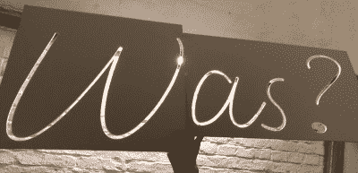

# 人造霓虹灯写着什么？，Auf 德语

> 原文：<https://hackaday.com/2019/09/02/faux-neon-sign-says-what-auf-deutsch/>

对一个说英语的人来说，一个询问“曾经是？“可能没有多大意义。然而，在德语中，这个问题是一个更发人深省的“什么？“这正是[这个由【noniq】](https://noniq.at/0019/faux-neon-sign-1/)创造的人造霓虹灯的意义所在。该标志使用硅树脂封装的“氖状”LED 灯条，让所有人都能看到并思考这个问题。

虽然真正的霓虹灯爱好者甚至会对称这种 LED 灯条为“人造霓虹灯”感到愤怒(查看下面的评论以获取示例)，但我们真的很喜欢它们用于这样的标志项目。它们外观漂亮，价格低廉，易于操作，并配有 RGB LEDs，可提供各种颜色。在这种情况下，它们被安装在 3 毫米的聚苯乙烯板上，该板被粘合到由 22 毫米的方形梁制成的木框上。

 这款车吸引我们眼球的一点是使用数控铣床制作原型。用泡沫板磨出的笔画，最终的效果可以在提交给设计之前被可视化。这块板子后来被用作切割 LED 灯条的模板——聪明！我们怀疑，对于那些没有数控铣床的人来说，用业余爱好刀和足够的耐心也可以做到这一点。

当然，这种类型的项目第一次并不总是完美的。该标志缺少一个问号点，单个部分末端的漏光在底部产生了分散注意力的亮点，连接 led 的硅胶被移除的区域明显变暗，字母看起来太细。我们期待着承诺的第二个帖子，其中[noniq]描述了这些问题的解决方案。

这并不是我们第一次看到这些 LED 灯条被用于标志制作，就像去年春天制作的这个标志一样。