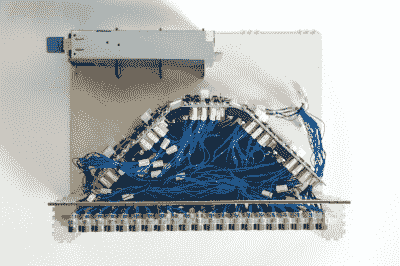

# 铁磁流体显示器获得新的、更好的驱动电路

> 原文：<https://hackaday.com/2021/08/26/ferrofluid-display-gets-new-better-driver-circuitry/>

2019 年，奥斯陆大学的两名学生[Simen]和[Amud]着手设计一种独特的开源显示器。结果就是 Fetch，一种使用电磁铁将铁磁流体悬浮在屏幕上 252 个像素的显示器。由于 COVID 的原因，经过一些延迟后，[他们最近在他们的项目页面](https://hackaday.io/project/167056-fetch-a-ferrofluid-display/log/197057-fetch-v2-massive-hardware-upgrade)上发布了显示的 2.0 版本。

虽然两人设法相当容易地克服了与使用铁磁流体相关的机械挑战，但他们很快就受到了电子设备的瓶颈。使用电磁铁托住液体是一个独特的挑战；磁铁不能关闭，哪怕是一毫秒，否则“像素”就会掉到屏幕的底部。这立即排除了任何形式的多路复用，意味着一切都必须并行驱动。如果这还不够困难的话，让多个电磁体相邻激活的效果将改变铁磁流体的流动方式。这意味着每个电磁铁的强度必须根据当前显示的内容进行调整，而不仅仅是开或关。

The mess of connections were not helped with the layout of the old driver boards shown here. The new design puts the connections closer to each individual electromagnet.

所有这些，再加上为输入产生脉宽调制等其他开销，对于单个微控制器来说实在是太多了。因此，两人着手设计他们的电子产品的更好版本，这将减轻许多艰苦的工作。与此同时，他们决定进行一些机械优化；他们将电路板重新设计得更长更薄，让它们干净利落地安装在他们控制的那排电磁铁后面。

这款新型电路板采用 PCA9685 IC，可通过 i2C 控制多达 16 个 12 位 PWM 通道，非常适合显示器尺寸。由于该 IC 无法提供足够的电流来驱动电磁体，因此它与 ULN2803 达林顿晶体管阵列配对，能够向每个电磁体提供高达 500mA 的电流。

手里拿着原型(到处都有几根电线)，[Simen]和[Amud]让新的驱动板运行得很漂亮，以一种迷人的方式显示文本，这是普通显示器无法比拟的。休息后观看视频，观看新控制器的运行演示，并深入了解开发过程。

想了解更多？查看我们之前关于 Fetch 的文章！或者如果你正在寻找另一种使用铁磁流体的酷方法，那么[让它在一个定制的扬声器里跳舞怎么样](https://hackaday.com/2021/04/21/ferrofluid-dances-in-custom-bluetooth-speaker/)！

 [https://www.youtube.com/embed/F948Or4ulhA?version=3&rel=1&showsearch=0&showinfo=1&iv_load_policy=1&fs=1&hl=en-US&autohide=2&wmode=transparent](https://www.youtube.com/embed/F948Or4ulhA?version=3&rel=1&showsearch=0&showinfo=1&iv_load_policy=1&fs=1&hl=en-US&autohide=2&wmode=transparent)

[主图像动画速度减慢 3 倍]