# 海运集装箱现场指南

> 原文：<https://hackaday.com/2021/04/07/field-guide-to-shipping-containers/>

20 世纪 50 年代，货车运输业巨头马尔孔·麦克林改变了世界，因为他对货车运输的速度和交通感到非常失望，于是他创办了一家商业运输公司，以便更快地在东海岸运输货物。[十年内，集装箱标准化](https://westerncontainersales.com/shipping-container-dimensions/)，第一艘国际集装箱船于 1966 年起航。货物呢？美国的威士忌和欧洲的枪支。[曾经缓慢而不可靠的用桶、袋子和盒子搬运各种物品的方法变成了一种流水线作业](https://nautil.us/issue/3/in-transit/the-box-that-built-the-modern-world)——现在每年搬运数百万个同样的集装箱，里面装满了深不可测的杂物。

当我开始写这篇文章的时候，一艘集装箱船被困在苏伊士运河已经有好几天了。就这样，一条至关重要的通道被完全堵塞，从石油和武器到 ESP8266 板和高腰牛仔裤，所有东西的运输计划都被迫停止。这一事件确实凸显了整个联运系统的脆弱性，并让我们怀疑是否会有任何改变。

[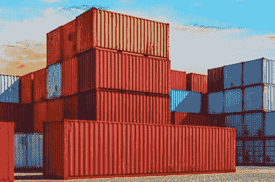](https://hackaday.com/wp-content/uploads/2021/03/dry-storage.jpg)

A rainbow of dry storage containers. Image via [xChange](https://container-xchange.com/blog/container-types-and-dimensions/)

## 设定标准

我们都习惯于看到标准的集装箱，或者是 10 英尺，20 英尺，或者 40 英尺长的钢或铝制箱子，一端有门。到目前为止，这是最常见的类型，可能是每当提到集装箱时想到的。

这些被称为干储存集装箱，根据 ISO 集装箱标准，它们都是 8 英尺宽，8 英尺 6 英寸高。也有高一英尺的“高立方体”容器，但在其他方面都有相同的尺寸。这些集装箱中的许多最终成为某种类型的住房，要么是时尚的工作室，灾后幸存者庇护所，要么是建筑工地办公室。随着疫情时间的推移，对它们的需求变得如此之大，以至于[的价格在过去几个月里飙升。](https://www.marketplace.org/2021/03/17/inflation-shipping-container-rates-prices-soar-on-u-s-customer-demand/)

尽管马尔孔·麦克莱恩没有发明集装箱运输，但他所遵循的严格的集装箱标准防止了堆放、运输和储存过程中的问题，并允许任何集装箱在世界上任何港口安全装卸，或轻松装载到任何铁路车辆上。容器的每一部分都是标准化的，从尺寸到容器信息在末端的显示方式。最多，任何两个相同的容器之间的差异是数量，油漆工作，也许在一个维度上几毫米。

尽管这些集装箱可能是标准的，但并不适用于所有类型的货物。有很多不同类型的集装箱可以满足不同的需求。让我们来看看其中的一些，好吗？

[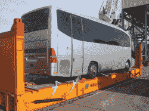](https://hackaday.com/wp-content/uploads/2021/03/flat-rack.png)

Flat rack with a bus. Image via [Alconet Containers](https://www.alconet-containers.com/flat-rack-container/)

## 平板货柜

平板架集装箱基本上是没有墙壁或屋顶的平台，用于运输管道、机械、木材、公共汽车和船只等物品。换句话说，任何需要从顶部装卸的大型或笨重物品。

一些平板架集装箱具有可折叠的侧面，使得货物易于移动，而其他的侧面则固定在适当的位置。可折叠平板架可以叠放在一起，一叠四个大约相当于一个干燥的存储容器的大小。扁平机架有 20 英尺和 40 英尺两种尺寸，尽管两者的宽度和高度通常相似。

[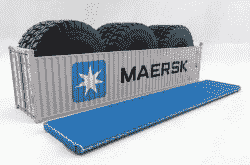](https://hackaday.com/wp-content/uploads/2021/03/open-top.jpg)

The biggest tires ever? Image via [xChange](https://container-xchange.com/blog/container-types-and-dimensions/)

## 开顶容器

有很多像干存储集装箱，除了他们有一个防水布在顶部或一个可转换的盖子，可以完全取下，以适应任何高度的货物，包括巨大的轮胎。

短边兼作门，因此装卸货物时有多种选择。

[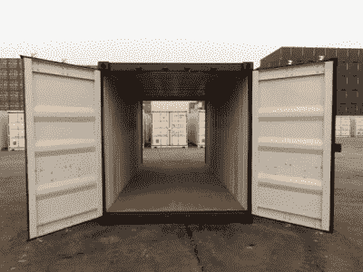](https://hackaday.com/wp-content/uploads/2021/03/tunnel.jpg)

Image via [Florida Container Depot](http://www.floridacontainerdepot.com/tunnel-shipping-containers.html)

## 隧道集装箱

隧道集装箱也称为双门集装箱，基本上是两端开口而不是仅一端开口的干式储存集装箱。这使得装载和卸载货物变得非常容易，或者如果集装箱被用作临时仓库，则可以获得一件存储的货物，否则这些货物会卡在集装箱的后部。

如你所料，隧道集装箱有 20 英尺和 40 英尺长。它们通常由钢制成，并有胶合板地板。

[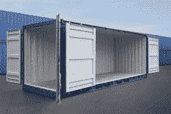](https://hackaday.com/wp-content/uploads/2021/03/open-side-storage.jpeg)

Image via [xChange](https://container-xchange.com/blog/container-types-and-dimensions/)

## 开口侧储存容器

这很像隧道集装箱，除了只有一个短边有门，一个长边可以打开以容纳宽的东西。这种设计也有助于定位特定的货物，而不必卸载太多的集装箱。

许多类型的集装箱都有叉车插口，这样它们在空的时候可以很容易地移动。你可以清楚地看到叉车口袋周围的底部这个开放的存储容器。

[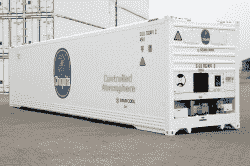](https://hackaday.com/wp-content/uploads/2021/03/chiquita-reefer.jpg)

Bananas like to travel in a certain way. Image via [Refrigerated and Frozen Foods](https://www.refrigeratedfrozenfood.com/articles/94591-chiquita-stays-fresh-with-energy-efficient-reefer-containers)

## 冷藏或“冷藏”集装箱

冷藏集装箱用于长距离运输恒温的产品和其他易腐物品。它们通常是风冷或水冷的，尽管其中一些带有发电机。

尽管我住在中西部，这些容器是我一年到头都能买到橘子和苹果的原因。它们也用于鲜花和药品等物品。

图中的容器是为运输香蕉而设计的，香蕉必须远离氧气，以免它们开始成熟。它有一个可控的空气系统，可以让香蕉保持绿色长达 45 天。

[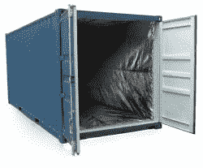](https://hackaday.com/wp-content/uploads/2021/03/insulated.jpg)

Image via [Marine Insight](https://www.marineinsight.com/tech/insulated-shipping-containers/)

## 保温箱

并非所有易腐食品都必须在运输过程中主动冷藏，但它们确实需要保存在特定的温度范围内。一些东西，如苹果或某些类型的药物，放在隔热或保温容器中会很好。

隔热集装箱还通过首先使货物通过过滤器来保护货物免受外部空气污染。一些隔热容器像热水瓶一样有双层壁，其他的只是简单地衬有保温毯。

[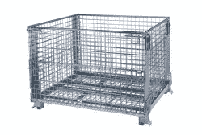](https://hackaday.com/wp-content/uploads/2021/03/cargo-storage-roll-containers.jpg)

Image via [Maritime Manual](https://www.maritimemanual.com/container-types-units-sizes-design/)

## 货物储存滚动集装箱

这些是专门用于运输成套或成堆物品的容器。它们底部有滚轮，便于移动，整体可以折叠起来存放和堆叠。

货物存储辊集装箱通常由坚固的金属丝网制成，并有不同的颜色。

Image via [Florida Container Depot](http://www.floridacontainerdepot.com/half-height-shipping-containers.html)

## 半高集装箱

半高容器基本上是一半高的干燥储存容器，可以是顶部开口的，也可以是封闭的。

这些通常用于移动像煤、石头和其他需要方便装卸的沉重、可倾倒的货物。他们也用于车辆，重型设备，或任何其他适合内部。较低的重心使它们对重载非常有用。

Image via [Conexwest](https://www.conexwest.com/accessories-and-parts/car-rack)

## 汽车承运人

是的，你猜对了——这些是用来运输汽车和其他车辆的。如果你在海外买车，它总会以某种方式影响你。

许多汽车运输车都有一个斜坡和两层货架，这样就可以在不浪费任何空间的情况下装满汽车。

[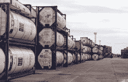](https://hackaday.com/wp-content/uploads/2021/03/tank.jpg)

Image via [More Than Shipping](https://www.morethanshipping.com/what-is-an-iso-tank-container/)

## 坦克

罐式集装箱是巨大的钢制圆柱形罐，周围建有框架。它们被用来运输从糖蜜到汽油的各种液体。

每个罐式集装箱可以装载 21，000 到 40，000 升任何类型的液体。

[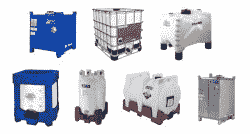](https://hackaday.com/wp-content/uploads/2021/03/intermediate-bulk.jpg)

IBCs come in several styles. Image via [Wikipedia](https://en.wikipedia.org/wiki/Intermediate_bulk_container)

## 中型散装容器

这是一类特殊的容器，可以装从液体到固体的任何东西。它们通常用于运输化学品、食品糖浆、油漆和原材料等货物。中型散货箱被称为中型，因为它们比罐体小，但比桶大。

一些容器是刚性的，而另一些容器是柔性的，空的时候可以折叠起来存放。IBC 集装箱只有大约三十年的历史。

Image via [Air Sea Containers](https://www.airseacontainers.com/blog/how-are-steel-shipping-drums-made/)

## 鼓

我们以前都见过这些，尽管除了 55 加仑的桶之外还有许多类型。根据预期用途，桶通常由钢、硬塑料或致密纸板制成。

圆桶是许多液体和粉末的便捷容器，因为它们可以滚动，用手推车移动，或堆放在托盘上，便于用叉车移动。

[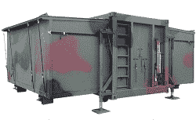](https://hackaday.com/wp-content/uploads/2021/03/special-purpose-container.jpg)

Image via [Maritime Manual](https://www.maritimemanual.com/container-types-units-sizes-design/)

## 特殊用途集装箱

这些都是独一无二的，有时是一次性的集装箱，通常用于武器和军用货物等高调运输。正因为如此，它们通常被严密保护。

与大多数其他标准化容器不同，这些容器有多种形状和尺寸，由任何适合特殊用途的材料制成。

Image via [Wikipedia](https://en.wikipedia.org/wiki/Swap_body)

## 交换身体

这些大多是在欧洲使用，有一个强大的底部与活顶，所以他们可以运送多种物品。

交换体集装箱通常只用于卡车和火车，而不用于集装箱船。这些集装箱没有带叉车口袋的坚固底座，而是在拐角处有细长的折叠腿，以支撑码头或卡车和火车之间的集装箱。

## 容纳一切的容器

除了我们都很熟悉的金属箱之外，这些是一些最常见的海运集装箱。许多货物都有特殊需求，但都可以用某种方式进行集装箱运输。

那么通过集装箱船接收一大批货物是什么感觉呢？我们自己的[Bob Baddeley]有第一手经验，不久前告诉了我们这一切。你有过这种规模的运输经验吗，或者你曾经改变过集装箱的用途吗？请在评论中告诉我们！