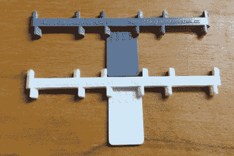

# 与所有可能出错的树脂战斗

> 原文：<https://hackaday.com/2022/07/04/fighting-all-that-can-go-wrong-with-resin/>

[Jan Mrázek]致力于让您的树脂 3D 打印更加精确、更加实用、不易出错。让我们从他最近关于[对抗树脂收缩](https://blog.honzamrazek.cz/2022/06/getting-perfectly-crisp-and-dimensionally-accurate-3d-prints-on-a-resin-printer-fighting-resin-shrinkage-and-exposure-bleeding/)的帖子开始。

当你想要一个内径为 35 mm 的零件时，你可能有很好的理由，当你在 CAD 软件中画一个圆时，你希望在现实世界中出现一个圆。树脂收缩会阻碍这两个计划。[Jan]确定了三个罪魁祸首:树脂挤压、树脂收缩和暴露出血。这三个因素会以意想不到的方式叠加起来，所以当你单独打印时，你会得到一个小的参考立方体，而当作为一个组打印时，你会得到大的参考立方体。[Jan]的文章附带了一个测试片段，可以帮助您诊断发生了什么。

 然后事情就复杂了！曝光渗色取决于您的打印机和曝光，但也取决于树脂的颜色和紫外线不透明度。收缩显然取决于树脂的化学性质，但也需要几天时间才能达到最终状态，因为印刷品完全固化。当然，固化速度也取决于温度。[Jan]刚刚开始记录所有的变量，但是你可以打印出他的测试片并做你自己的工作——因为树脂与树脂之间的差异，你可能不得不这样做。

当你在这个兔子洞的时候，看看[Jan]关于[粘性效果和大象的脚](https://blog.honzamrazek.cz/2022/01/prints-not-sticking-to-the-build-plate-layer-separation-rough-surface-on-a-resin-printer-resin-viscosity-the-common-denominator/)的帖子。如果你被奇怪的第一层困扰，这是一个巨大的资源和一个简单的教训:在开始等待更长时间，让树脂流入。

无论你是刚刚开始树脂印刷，还是经验丰富的专业人士，我们都有大量有趣的资源。从这篇关于[挑选合适树脂](https://hackaday.com/2022/06/13/3d-printering-todays-resins-can-meet-your-needs/)的文章，到这篇关于是否[使用树脂或者](https://hackaday.com/2020/04/30/3d-printering-will-a-resin-printer-retire-your-filament-based-one/)使用 FDM 树脂的文章，你有很多阅读要做。这还没提到去年秋天[与【安德鲁·辛克】的亲密黑客聊天，在那次聊天中，他和观众都分享了很多智慧。](https://hackaday.io/event/181910-resin-printing-hack-chat)