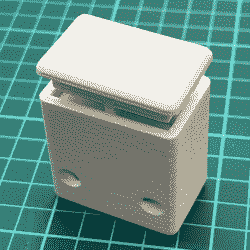

# 切丝机采用不寻常(但有效)的 3D 打印弹簧设计

> 原文：<https://hackaday.com/2022/09/23/filament-cutter-uses-unusual-but-effective-3d-printed-spring-design/>

当一个人需要弹簧时，3D 打印版本可能不是他的首选。甚至可以公平地说，印刷弹簧是一个人*最终*制造的东西，而不是一个人开始使用的东西。一旦你尝试了【the_ress】的[带印刷弹簧的 3D 打印细丝切割器](https://www.printables.com/model/137522-filament-cutter-with-printed-spring)中的弹簧设计，这种情况可能会改变。

 切丝器的工作原理是这样的:细丝通过底部的一对孔插入装置。要切断薄膜，只需按下活塞。这会将刀片向下推，以一个角度整齐地切割细丝。刀具是该设备唯一的非印刷部分；18 毫米多用途刀片的一个片段。

这些弹簧特别有趣，看起来不太像典型的弹簧。他们的设计来自 reprap.org 上记载的这个[柔性直线运动机构](https://reprap.org/wiki/Compliant_Linear_Motion_Mechanism_1)，类似于小平行[四连杆机构](https://hackaday.com/2017/03/29/marvelous-mechanisms-the-ubiquitous-four-bar-linkage/)。这些弹簧的行程有限，但对于它们需要做的工作来说，绝对有足够的弹性，这是最重要的部分。

想要更传统的螺旋弹簧吗？缠绕在心轴上的灯丝退火可以产生有用的结果，别忘了[被称为弯曲的奇妙机制](https://hackaday.com/2021/06/22/print-your-own-flexures/)；它们与所用的弹簧有明显的相似之处。你可以在下面的短片中看到她的设计。

 [https://www.youtube.com/embed/r-_xeIZpIj4?version=3&rel=1&showsearch=0&showinfo=1&iv_load_policy=1&fs=1&hl=en-US&autohide=2&wmode=transparent](https://www.youtube.com/embed/r-_xeIZpIj4?version=3&rel=1&showsearch=0&showinfo=1&iv_load_policy=1&fs=1&hl=en-US&autohide=2&wmode=transparent)

