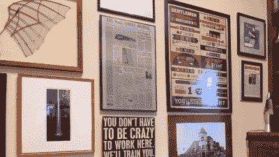

# Hackaday 奖展示挑战的最后一个周末

> 原文：<https://hackaday.com/2021/06/10/final-weekend-for-display-challenge-of-the-hackaday-prize/>

这是[参加 2021 年 Hackaday 奖](https://prize.supplyframe.com/#section-challenges)的展示相关项目的最后一个周末。好消息是，几乎任何有显示器的东西都符合这里的要求。

“反思显示”挑战的目标是设想可视化数据的有趣方式。你一个小时会有多少次伸手解锁智能手机，只是为了获取一点点数据——当前温度、即将到来的约会、下一条要打开的街道，或者你的蛋奶酥还剩多少时间。一定有别的办法！

The newspaper is an eInk display that hides in plain sight among non-dynamic framed artwork.

这就是你进来的地方！为我们展示一种巧妙的表达方式，选择一款适合数据类型和功耗预算的显示器。也许这是一个把自己伪装成墙壁艺术的电子壁纸，一套当前天气的[模拟仪表](https://hackaday.com/2020/08/08/vintage-gauges-turned-classy-weather-display/)，或者是一种在便携式显示器寿命结束后让旧显示器继续存在的方式[。](https://hackaday.com/2019/07/18/put-those-ipad-displays-to-work-with-this-edp-adapter/)

这不需要成为最终产品。将选出 10 名参赛者获得 500 美元的奖金，并在 10 月底进入决赛。因此，如果你用这个周末的时间来收集概念证明，并出色地讲述你正在构建的故事，你将稳操胜券！决赛选手将有充足的时间来完成设计。

有一个伟大的想法，但没有时间去实现它？通过分享下面的概念，让人们知道这是可以争取的。

[hack adayprize 2021](https://prize.supplyframe.com)主办单位: