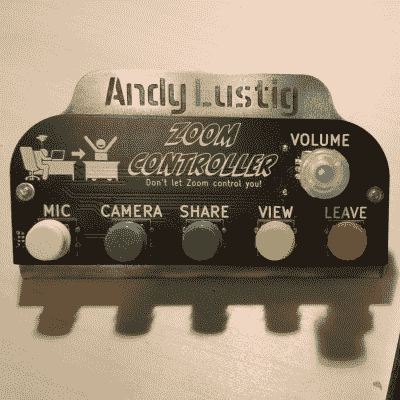

# 黑客日大奖在家工作挑战的最后一个周末

> 原文：<https://hackaday.com/2021/07/16/final-weekend-for-work-from-home-challenge-of-the-hackaday-prize/>

这是参加 2021 年 Hackaday 奖的最后一个周末。我们知道，让你在不干扰非工作生活的情况下继续工作的家庭布置是多么有趣。展示你所做的，你将有机会赢得一些大奖。

 改善你家通往工作世界的窗户是最容易实现的目标之一。在视频通话中，你所能做的任何让你的音频和视频体验更好的事情都会让你更开心，让虚拟办公室感觉更像一个团队。【安迪·卢斯蒂格】[建立了一个专用的视频通话控制面板](https://hackaday.io/project/180731-zoom-controller)，可以切断麦克风和摄像头，共享他的屏幕，切换视图，离开会议。拥有随时可用的物理控制对你远离办公室的小隔间来说是一个巨大的动力。

长时间伏案工作会损害你的身体。有许多参赛项目提醒你要休息，但[ImageryEel]采取了不同的方法。这是一个可穿戴的姿势包，它使用一个 IMU 来测量你脊椎的位置。当姿势包注意到你的上背部开始下垂时，你会收到推送通知。希望这是一个自我纠正的问题！

拥有一个舒适的工作场所对你的身心健康都有好处。[Peter van der Walt]将家庭“战斗站”的概念带到了另一个层次，当你开始工作时，[一个躺椅设计可以将双显示器包裹在](https://hackaday.io/project/180418-throne-of-dev)周围。

还不算太晚。让这个周末成为你自己的迷你黑客马拉松，并在周一早上收到这些参赛作品。十名决赛选手将每人获得 500 美元的现金奖励，并参加 10 月底开始的最后一轮比赛。最终，一个参赛作品将获得 25，000 美元的 Hackaday 奖金，其他四个决赛选手将获得最高奖金。

立即在 Hackaday.io 上开始您的项目，并使用项目页面左侧栏中的“提交项目至”下拉框来参加竞赛。祝你好运！

[hack adayprize 2021](https://prize.supplyframe.com)主办单位: