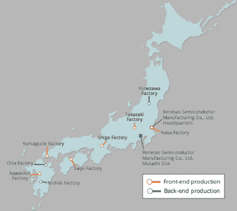

# 瑞萨工厂火灾加剧芯片供应困境

> 原文：<https://hackaday.com/2021/03/23/fire-at-renesas-plant-fuels-chip-supply-woes/>

小城纳卡(pop。53K)，从东京到日本东海岸需要两个小时的火车车程，在周五清晨被推到了国际聚光灯下。[瑞萨 300 纳米 N3 制造厂电镀设备发生火灾](https://www.eetasia.com/fire-destroys-300mm-line-of-renesas-naka-factory/)。它在早餐时间前被扑灭，幸运的是没有人受伤，也没有任何有毒化学物质泄漏。只有工厂一楼的 600 平方米被损坏，但整个建筑不得不关闭维修。恢复正常运营大约需要一个月的时间，首席执行官柴田秀俊“担心芯片供应将受到巨大影响”。

Renesas Naka Plant Location

在周日下午的新闻发布会上，瑞萨公司报告说起火原因已经确定，但具体细节仍不清楚:

> 设备外壳和电镀槽的耐热性相对较低，设备因过电流而着火。但是，目前正在调查过电流的原因和点火的原因。

正如我们在一月份报道的那样，半导体已经供不应求，这迫使许多汽车制造商放缓生产。纳卡工厂主要生产汽车半导体，这让本已紧张的供应链雪上加霜。虽然新闻集中在汽车行业，但这种短缺也蔓延到许多其他行业。

 [https://www.youtube.com/embed/vvUEihzm-qU?version=3&rel=1&showsearch=0&showinfo=1&iv_load_policy=1&fs=1&hl=en-US&autohide=2&wmode=transparent](https://www.youtube.com/embed/vvUEihzm-qU?version=3&rel=1&showsearch=0&showinfo=1&iv_load_policy=1&fs=1&hl=en-US&autohide=2&wmode=transparent)

