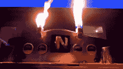

# 喷火 N64 让爆炸处理相形见绌

> 原文：<https://hackaday.com/2019/08/15/fire-breathing-n64-puts-blast-processing-in-the-shade/>

多年来，游戏机不断创新，每一代都带来了新的功能和体验。随着公司在市场上争夺霸权，隆隆声、运动控制以及最近的虚拟现实都脱颖而出。然而，没有人真正有勇气去处理火灾。[直到现在。](https://www.youtube.com/watch?v=TBEPvu7idjM)

The case and spinning logo alone would have made the front page; the fire is simply next level. Our parents were always telling us to sit further from the TV… and now we know why.

该版本基于任天堂 64。主板从原来的外壳中取出，安装到令人印象深刻的金属外壳上。这允许安装机器的派对用品——由控制器上的一个额外按钮触发的两股火焰。机箱前面还有一个旋转的 N64 标志，背光是不祥的红色——向玩家暗示这不是普通的控制台。

该控制台能够喷射长达 4 英尺的火焰，如果你必须问为什么，你可能上错了网站。我们希望看到由隆隆声触发的喷气机，理想的是基于每个玩家——使马里奥赛车和粉碎兄弟的回合比以往任何时候都更加危险。

事实证明，火也是一种很好的可视化声波的方式。休息后的视频。

 [https://www.youtube.com/embed/TBEPvu7idjM?version=3&rel=1&showsearch=0&showinfo=1&iv_load_policy=1&fs=1&hl=en-US&autohide=2&wmode=transparent](https://www.youtube.com/embed/TBEPvu7idjM?version=3&rel=1&showsearch=0&showinfo=1&iv_load_policy=1&fs=1&hl=en-US&autohide=2&wmode=transparent)

【感谢 marcelvarallo 的提示！]