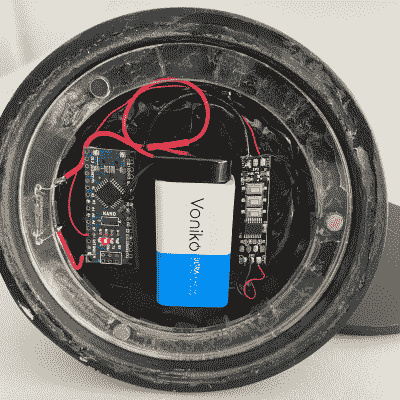

# 扔火球的小雕像给小说提供素材

> 原文：<https://hackaday.com/2022/05/03/fireball-flinging-figurine-feeds-fiction/>

如果你正在写一部电影剧本或小说，在这个过程中你可能会从朋友和家人那里得不到足够的鼓励。虽然善意的话语是善意的，但像[scubabear]这样的行为可以提供一种无与伦比的推动力。你可能会说，通过委托另一位 3D 设计师朋友[从第一位朋友的剧本中塑造一个角色，以便他可以打印并制作动画](https://hackaday.io/project/185064-bloodletter-maquette),【scubabear】用一个烤饼喂了两只鸟。

 设计师朋友【Sean】在 Maya 和 Z-brush 中为强大的 Braomar 建模，而【scubabear】在 Formlabs Form2 上测试打印，同时他们继续关注事情。最终，他们讨论了为电线等腾出空间的问题，所以[Sean]使用搅拌机为 Braomar 制作了足够空的电线，但又不会空得让他在(我们假设)主角的压力下崩溃。

Braomar 站在一个可以改变颜色的印记上，这要归功于底部由 Arduino Nano 驱动的 RGB LED 环。火球中的一个像素通过 Braomar 的身体连接，并在可寻址 LED 序列板的帮助下闪烁。

我们最喜欢的部分是电源方案。不满足于从底座伸出一根电线或者甚至是一个遥控器来消耗电量，[scubabear]在底座上使用了圆盘磁铁，当剧本朋友旋转它时，它可以打开 9 V 电池。

当然，如果你需要灵感来开始写剧本或小说，也许你应该先做模型制作，然后围绕你的创作构思一个故事。

* * *

这个项目是 2022 年科幻竞赛的参赛作品。[点击这里查看所有获奖作品](https://hackaday.com/2022/04/28/2022-sci-fi-contest-the-winners-are-in/)。