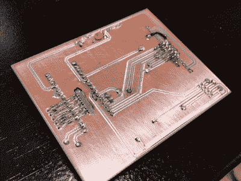

# 五频道监视器保持船电池井然有序

> 原文：<https://hackaday.com/2019/10/31/five-channel-monitor-keeps-boat-batteries-shipshape/>

虽然我们这些被困在航海桌前的人可能无法真正理解这个问题，但[Timo Birnschein]已经厌倦了发现他船上的一些电池没电了。他想要某种方法来同时检查系统中所有电池的电压，并在一个中心位置显示信息，并且不喜欢商业市场上的任何东西[他决定自己建造它](https://hackaday.io/project/168055-a-simple-5-ch-boat-battery-monitor)。

 即使对于那些听不到大海召唤的人来说，这也是一个潜在有用的项目。任何有多个电池的系统都可以受益于一个中央监视器，它可以一眼显示电压，但[Timo]实际上比这更好。随着 nRF24 模块的增加，电池监控器也能够将电池的状态无线传输到…某个地方。他实际上还没有实现这一功能，但是某种将数据输入计算机的方法看起来像是一种自然的应用，这样它就可以随着时间的推移绘制图表。

这个的材料清单很短。除了前面提到的 nRF24 模块，当前版本的显示器还具有 Arduino Nano 克隆、128×160 SPI TFT 显示屏和一些无源器件。

知道一个 perfboard 不会在公海上持续很久，[Timo]甚至为这个项目铺设了自己的 PCB。我们怀疑这种板的未来会有某种防水的外壳，但看起来事情仍处于早期阶段。这将是一件有趣的事情，看看它最终是如何整合到船的电气系统中的。

如果你正在寻找一种方法来监视你的陆地船上的电压，这种伪装成汽车继电器的[电池监控器](https://hackaday.com/2018/08/03/voltage-monitor-relay-is-more-than-meets-the-eye/)仍然是我们书中的高水位标志。