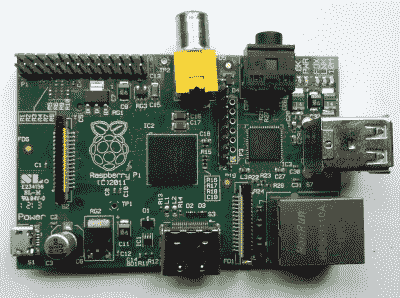
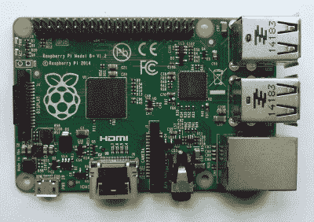
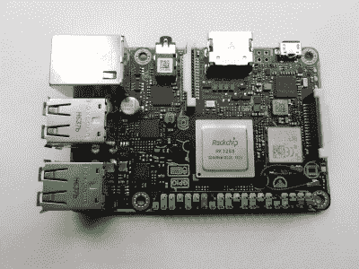
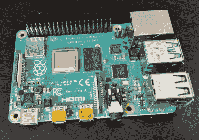

# 五年的 Raspberry Pi Model B+外形，它教会了我们什么？

> 原文：<https://hackaday.com/2019/07/08/five-years-of-the-raspberry-pi-model-b-form-factor-what-has-it-taught-us/>

随着最近新的《树莓 Pi 4》的发布，人们很容易忽略 Pi 日历中的另一个事件。七月将迎来[发布树莓派 B+](https://web.archive.org/web/20140714173900/https://www.raspberrypi.org/introducing-raspberry-pi-model-b-plus/) 五周年纪念日，它迎来了一个新的外形。它现在对我们来说很熟悉，但在当时这是一个巨大的变化，40 针扩展连接器，四个安装孔，没有复合视频插座，以及更精心安排的接口连接器。

由于 Pi 4 的双迷你 HDMI 连接器和颠倒的以太网和 USB 位置标志着与 B+及其继任者设定的标准的第一次重大偏离，因此值得看看外形的成功及其更广泛的影响。树莓派的设计者们还能把它引向一个新的方向吗？或者说，在它从它的创始者传递到支持它的制造商社区的集体所有权之前，它还能像许多标准一样吗？

## 从一次偶然的成功演变成一种外形

An early Chinese-made Pi Model B from 2012.

2012 年，我们可以买回的第一个树莓派并不是一家华而不实的电子公司精心制作的，而是一群电子和计算专业人士的小本发明，他们只希望卖出几万块主板，希望能教一些孩子编程。在 2011 年秋冬紧张的几个月里，通过他们的生产博客，我们了解到一家中国组装公司制造了第一批样品，然后在第一批样品上完成了一项真正英勇的 SMD 返工任务，这是一个充满挑战的复杂电路板生产准备的精彩课程。

公平地说，仅仅是让它达到我们可以买一个 Pi 的程度就是一个了不起的成就，而董事会的布局本身更多地是出于需要，而不是着眼于未来的继任者。例如，信用卡大小非常完美，但没有安装孔，各种连接器被放置在指南针的所有位置，复合视频和 USB 插座突出于电路板边缘。

The first of the new form factor, a 2014 Pi Model B+

通过一个吸引人的价格点、一个可用且受支持的软件发行版，以及一次巧妙管理的正面宣传，第一个树莓 Pi 超出了最初适度预期的许多倍。它的上市被大量超额认购，并继续大量销售。生产从中国转移到位于威尔士 Pencoed 的索尼工厂，并生产了一个修订版，修复了几个 bug 并添加了几个安装孔，可以将它们硬塞进其他组件中。

显然需要更好的东西，2014 年的 B+提供了与原来基本相同的硬件，具有上述安装孔、整理好的连接器和新的引脚接头。这种外形成为扩展板的新 HAT 规范的基础，它的一对额外引脚为一个包含操作系统设备树指令的小 EEPROM 服务。

## 每个人都想成为私家侦探

Pi 的成功没有被潜在的竞争对手忽视，在它的第一年里，有许多其他的董事会被吹捧为 Pi 杀手。然而，它们都将遵循自己的外形，例如【2012 年末的 Cubieboard 为 Pi 竞争者设定了将平板 SoC 作为其核心的既定路线，但却是以定制的外形来实现的。甚至[的 Odroid-W](https://www.theregister.co.uk/2014/07/31/korean_vendor_launches_rpicompatible_dev_board/) ，唯一上市的软件兼容的 Pi 克隆体(我们不确定 [Arducam 的微型产品](https://hackaday.com/2016/07/18/arducam-introduces-a-third-party-raspberry-pi/)是否上市)也遵循了自己的外形。直到 2014 年末， [SolidRun CarrierOne](https://hackaday.com/2013/11/06/the-raspberry-pi-becomes-a-form-factor/) 才会作为第一款直接复制 Pi 外形的 SBC 亮相，随后成为商用[蜂鸣板](https://www.solid-run.com/product-tag/hummingboard-pro/)。

One of the better Pi clones using the same form factor, the [Asus Tinker Board](https://hackaday.com/2017/09/26/return-to-the-asus-tinker-board-have-six-months-changed-anything/).

B+的推出改变了这一切，因为 Pi 现在有了一个经过深思熟虑的外形，保证经得起未来的考验。Model B+的继任者将遵循相同的模式，这给了附加制造商的售后市场支持它所需的信心。如果你想和 Pi 竞争，不承认这种新的外形是一个勇敢的举动，所以我们已经看到了其他主板的持续跟进。

通过搜索引擎从几分钟内挑选出来的一份绝非完整的列表为我们带来了 Orange Pi、Nano Pi、Banana Pi、Odroid、RockPi、华硕、Libre Computer 的模型，以及我们最喜欢的 [Zberry](https://hackaday.com/2017/06/03/z80-based-raspberry-pi-look-alike/) (我们在 2017 年推出的基于 Z80 的个人项目)。还有很多，但应该很清楚的是，如果你在深圳从事 SBC 业务，拿一个中国平板电脑或手机 SoC，让它看起来像一个带有随机水果名称 Pi 名字的 B+

## 他们做对了吗？他们能再坚持五年吗？

所有这些机器以相同的外形尺寸和大量的帽子获得了成功，这表明树莓派的设计师们在五年前做对了一些事情。但是，如果认为他们已经无路可走，那就太危险了，他们真的成功了吗？电路板的物理尺寸和在一边的 40 针连接器的选择避免了传统的奇数尺寸 Arduino 所带来的缺陷，并且将较大的插座重新定位到电路板的一边避免了对笨拙的切口的需要，这是一些原始插件的标志。你可能会遇到 Raspberry Pi 用户抱怨微型 USB 电源或缓慢的网络和 USB 端口，但外形因素在列表中得分较低。如果我们被要求找出它的问题，我们可能会看看冷却，最初的 B+有一个裸露的处理器，而大多数较新的主板必须找到散热器的空间，甚至可能在帽子下面有一个风扇。也许这是设计师在未来版本中必须解决的问题。

The 2019 Pi 4 makes big changes to the connectors, surprisingly only the analogue output hasn’t received some sort of attention.

Raspberry Pi 4 可能会遵循与 B+相同的帽子形状，但它是该系列中第一个对公式的其余部分进行重大更改的产品。克隆产品通常会颠倒 USB 和以太网插座的位置，USB-C 电源显然是一个进步，但 Pi 4 做出了一个更具争议的选择，用一对微型 HDMI 插座取代了单个全尺寸 HDMI 插座。除了让大量的机箱设计一下子过时，这是一个明智的举动吗？从“有点鲁莽”的意义上来说，我们称之为“大胆”，因为尽管 Pi Zero 一直都有一个迷你 HDMI 插座，但它总是带来必须找到适配器的烦恼。从第一天起，Pi 的吸引力就在于它可以直接插入家用电视，随着这一更新，易用性已经不复存在。谁有一个微型 HDMI 适配器就这么躺着？答案是几乎没有人，虽然双显示器的前景很有吸引力，但这种感觉无法避免，因为在这个过程中失去了一些东西。

一个物理外形标准的所有权可以是令人惊讶的流动性，当它的采用变得足够广泛以至于盖过其原始标准时，有时会脱离其创造者。记性很好的读者会记得上世纪 80 年代的个人电脑战争，当时 IBM 试图让这个行业远离早期个人电脑中的 ISA 总线。该行业有其他想法，并坚持开发 ISA 到 90 年代中期，而 IBM 的 MCA 未能获得立足点。树莓派的生态系统绝对足够健康，可以遵循设计者采取的任何形式，但 Pi 克隆的生态系统是否已经足够成熟，不再遵循？我们将统计 2021 年产品中的 HDMI 插座数量，并进行汇报。