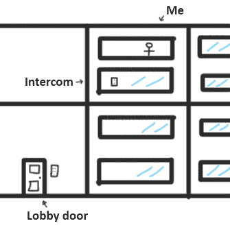

# 修复(和改进！)令人讨厌的公寓门禁系统

> 原文：<https://hackaday.com/2022/12/11/fixing-and-improving-an-annoying-apartment-entry-system/>

[Zak]的两层公寓有一个典型的门禁控制系统，但设置并不理想方便。壁挂式的类似电话的对讲机在楼下，但是【Zak】一般在楼上。一个有事业心的黑客该怎么做？显然，最优雅的解决方案是一开始就不要访问者，但是[Zak]选择了一个功能更全面的解决方案。

The layout of the typical wall-mounted door intercom is less than ideal.

他用一个定制的基于 ESP8285 的板来固定东西，在光隔离的帮助下，[允许他检测访客并允许进入，而不必亲自出现在壁挂式对讲机前](https://blog.zakkemble.net/iot-and-a-door-entry-system/)。它甚至被集成到 Telegram 中，并拥有一些简洁的新功能。让我们来看看。

第一个有趣的地方是[Zak]如何实现他自己的光隔离。门禁系统使用 14 伏交流电，坦率地说——从电磁角度来说——是一个非常嘈杂的设备。将 GPIO 引脚从 ESP 板直接连接到该系统进行接口是不可行的。这种情况下的解决方案是使用光隔离，这样接口器件就可以彼此电气隔离。

[Zak]没有使用现成的选项，而是选择通过在小型接口 PCB 上使用侧装式 IR LEDs 推出自己的解决方案来保持小巧和经济。LED 也可以充当光电二极管，因此通过将两个 LED 直接指向另一个，从门控制系统驱动一个 LED，并测量另一个 LED 上产生的少量电流，[Zak]可以检测状态，而不必直接连接 GPIO 引脚。

 一个这样的光隔离器工作来检测门的嗡嗡声，另一个工作来巧妙地感应和控制锁的不同状态。需要做一些额外的工作来处理 AC 门系统的特性，但是结果似乎非常好。

Node.js 应用程序与该板一起工作，以提供与 Telegram 的集成，这允许组接收事件通知，并使系统不受公寓位置的限制。

至于改进，甚至有一个自动解锁功能，如果蜂鸣器在 5 分钟内被按下，就会自动解锁门，这对于[Zak]提着一堆杂货，不想到处摸索钥匙的时候非常方便。

我们以前见过[Zak]给东西物联网待遇，结果总是令人印象深刻。看看[他的耗电邮箱通知程序](https://hackaday.com/2020/01/22/a-battery-sipping-cellular-mailbox-notifier/)吧，这是一个让日常工作更有效率的好例子。