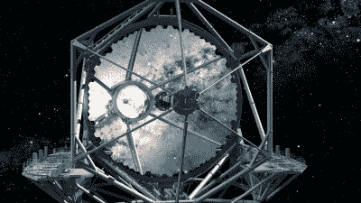

# 用世界上最大的激光笔标记外星人

> 原文：<https://hackaday.com/2018/11/20/flagging-down-aliens-with-worlds-biggest-laser-pointer/>

你肯定知道，人类是一个相当吵闹的物种。不仅仅是听觉上的，比如当你在电影院时有人大声说话，还有电磁上的。自从马可尼在 1895 年第一次进行火花隙广播以来，我们所有的无线传输都辐射到了太空，任何一个耳朵足够灵敏的人都可以听到我们的声音。即使这些外星窃听者无法理解我们传输的内容，它们的绝对音量也足以表明，无论是什么在围绕索尔旋转的第三块岩石上制造了所有这些噪音，都不可能是自然现象。换句话说，在银河系中寻找智慧生命的最佳方式之一可能就是坐在那里，等待他们听到我们的声音。

当然，这里涉及到一些讨厌的物理问题，使它变得更加复杂。信号以光速从地球辐射出去，用星际术语来说就像快步走。根据这些假设的听众所处的位置，从我们广播到他们收到之间的延迟可能是巨大的。例如，任何可能从最近的已知恒星比邻星监听我们的智慧生物，现在都对《我如何遇见你的母亲》的结局感到彻底失望。相比之下，“*”达拉斯”*来自泽塔网队的球迷仍然坐在座位的边缘，等待着找出是谁枪杀了 J.R

但是，比起依靠我们正常的广播来为我们说话，天体物理学杂志最近的一篇论文认为我们应该做得更好。由 James R. Clark 和 Kerri Cahoy 撰写，[“利用近期技术在星际距离上对激光进行光学探测”](http://iopscience.iop.org/article/10.3847/1538-4357/aae380)提出了这样一种情况，即我们可以使用当前或近期的激光技术向潜在的生命庇护恒星系统广播高度定向的信标。更重要的是，它甚至从理论上证明，仅仅通过调制光束就有可能与外星智慧生物建立直接通信。

## 可与太阳匹敌的激光

在星际距离上，很难将行星和它所围绕的恒星区分开来。这就是为什么我们只能直接对少数系外行星成像；我们知道它们在那里的唯一原因是通过观察它们的宿主恒星的光输出下降。反过来当然也是如此。一个拥有指向我们太阳系的望远镜的外星智慧生物真的只是在看着我们的太阳。这意味着我们为了引起某人的注意而向太空发射的任何激光都需要比太阳更亮，否则就像月球上有人试图用手电筒引起我们的注意一样。

这将需要兆瓦级的激光，可以连续发射，或者至少在几秒钟内爆发。诚然，这是一个相当高的要求，但不会超出我们目前的技术水平。美国空军在 20 世纪 90 年代中期探索使用机载兆瓦激光器作为反导武器，随着波音 YAL-1 的发展[达到高潮。2010 年，YAL-1 展示了使用其化学氧碘激光器(COIL)在弹道导弹的助推阶段跟踪和摧毁弹道导弹的可能性，尽管最终该项目因建造和维护一个作战机群所涉及的巨大成本而被取消。](https://en.wikipedia.org/wiki/Boeing_YAL-1)

尽管作为一种实用的武器，Clark 和 Cahoy 引用 YAL 1 号作为证据，证明类似的激光可以用于星际通信。如果军方可以开发出一种兆瓦级激光器，它可以发射足够长的时间来摧毁导弹，同时又足够小和轻，可以安装在经过改装的 747 上，那么从技术上讲，没有理由不能在地面的天文台上完成。

作为额外的奖励，空军首创的线圈技术可以产生频率为 1315 纳米的红外光束。这对于发信号来说是特别有利的，因为我们的太阳在这个波长上不产生太多的光，所以从远处的观察者的角度来看，与来自太阳的光混合的激光束将被视为具有剧烈波动的光谱输出的恒星；任何外星天文学家都无法忽视的异常现象。

## 让它成为焦点

正如克拉克和卡霍伊解释的那样，兆瓦级激光器只是谜题的一半；它仍然需要类似的超大型光学系统来传送具有最佳发散度的光束。但即使在这里，他们心目中的硬件，即 30 米至 45 米的望远镜，也不是我们无法企及的。该论文特别提到，目前处于规划阶段并计划于 2030 年投入运行的[三十米望远镜天文台(TMT)](https://www.tmt.org/) 如果与 2 MW 激光器配对，可以提供足够的光束特性。

Artist’s impression of TMT primary mirror

有点违反直觉的是，这篇论文认为一束紧密聚焦的光束并不是标记我们天体邻居的理想选择。首先，这种光束需要以极高的精度瞄准和跟踪，才能击中几十甚至几百光年外的目标。更重要的是，我们探测遥远行星的能力仍然太粗糙，无法以足够的精度制作它们的轨道模型；我们只是不知道把激光瞄准哪里。

解决方案是一束具有足够大的发散度的光束来补偿我们不佳的瞄准。事实上，克拉克和卡霍伊认为，在某些情况下，一束足够宽的光束照亮一个恒星系统的大片区域可能是理想的。一颗恒星的可居住区内的多个行星将能够同时看到我们的激光，这大大减少了我们必须重新定位的工作量。

## 尽管困难重重

当然，仍有大量的变量在起作用，使这样的尝试成为一个非常字面上的瞎猜。例如，我们可以向 Gliese 667 发射激光，开普勒之前在那里探测到一颗行星在其可居住区内，但居住在该行星上的生物可能是昆虫类，没有明显的技术。因此，无论是《我爱露西》的重播，还是来自宇宙的红外光，他们都不会太在意，我们对自己在宇宙中的位置也没有比以前更多的了解。

但与技术或物流障碍相比，最明显的问题是:这种系统的经济性。如果连美国空军都不认为继续运行一台证明可以摧毁来袭弹道导弹的兆瓦级激光器是划算的，那么谁可能会为一台更强大、更复杂的远程激光器买单呢？这台激光器除了满足我们对探索的渴望之外，可能没有任何实际功能。可以说，登月或火星任务对人类有实际好处，抵消了它们数十亿美元的价格标签，但以几乎相同的价格向可能存在或可能不存在的外星生物的眼睛发射巨大的激光是一个更难的销售。

最后，詹姆斯·r·克拉克和凯里·卡霍伊为星际激光通信提出了一个令人信服且理由充分的论点。这个想法是可行的，人类有能力在未来几十年内将这样一个系统上线，这一点很难反驳。但就像许多伟大的想法一样，如果没有那种迄今为止我们基本上无法召集起来的全球协同努力，它似乎不太可能被公之于众。