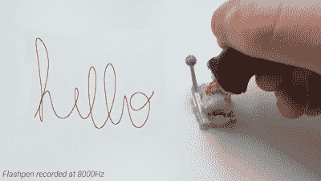

# Flashpen 是一种高保真笔输入设备

> 原文：<https://hackaday.com/2021/04/01/flashpen-is-a-high-fidelity-pen-input-device/>

笔输入从未真正在计算机主流中起飞，尽管它在过去十年左右有所复兴。各种智能手机和平板电脑都配备了这项技术，一些铁杆用户认为这是在旅途中记笔记的最佳方式。最近，苏黎世联邦理工学院传感、交互和感知实验室的研究人员一直在研究 Flashpen，这是一种适用于各种应用的高保真笔接口。

笔背后的基本技术很简单，该设备使用从高端游戏鼠标获得的光学流量传感器。这是一种使用图像传感器来检测传感器本身在表面上的运动的设备。它以 8 KHz 的更新速率工作，使市场上来自 Wacom 等制造商的其他设备黯然失色，这些制造商通常以接近 200Hz 的速率工作。光学传感器安装在塑料接头上，允许用户以自然角度握笔，同时保持传感器平行于书写表面。笔尖上还有一个反射传感器，允许相机跟踪其在空间中的位置，与虚拟现实技术结合使用。

该团队展示了该设备的几种用途，主要用于虚拟现实任务，但也用于简单的手写和着色工作。这个项目很容易被任何渴望的实验者复制，只需取出游戏鼠标的内脏，然后开始工作；我们的作者希望你能在 6 月 1 日之前提交 6 篇文章。那些渴望了解更多的人可以查看[的项目论文](https://siplab.org/papers/vr2021-flashpen.pdf)，也可能会发现[团队的 TapID 技术很有趣。](https://hackaday.com/2021/03/16/bone-vibration-brings-typing-into-vr/)休息后的视频。

 [https://www.youtube.com/embed/rBMQq5IqiEM?version=3&rel=1&showsearch=0&showinfo=1&iv_load_policy=1&fs=1&hl=en-US&autohide=2&wmode=transparent](https://www.youtube.com/embed/rBMQq5IqiEM?version=3&rel=1&showsearch=0&showinfo=1&iv_load_policy=1&fs=1&hl=en-US&autohide=2&wmode=transparent)

