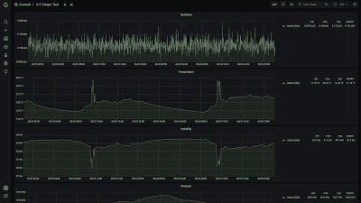

# 柔性辐射监测系统讲 LoRa 和 WiFi

> 原文：<https://hackaday.com/2022/09/10/flexible-radiation-monitoring-system-speaks-lora-and-wifi/>

对于任何对物理感兴趣的人来说，放射性一直是一个令人着迷的现象，因此这些年来，我们在这些页面上展示了许多与放射性相关的项目。然而最近，对核灾难的恐惧促使许多黑客研究环境辐射监测。[Malte]是希望升级气象站辐射监测器的人之一，但发现无线盖革计数器的选择有点有限。

所以他决定为自己建造一个兼容 Wifi 和 LoRa 的环境辐射监测器。像大多数这样的项目一样，它基于无处不在的苏联制造的 SBM-20 GM 管，尽管设计也支持中国的 J305βγ模型。无论哪种情况，电子管的工作电压都是由基于分立晶体管的振荡器产生的，该振荡器在电感和电压倍增器的帮助下，将电路板的 5 V 电源提升至 400 V 左右。

Data can be visualized in graphs, together with other data from the weather station like temperature and humidity

电子管的输出信号被转换成干净的数字脉冲，由 ESP32 或 Moteino R6 计数，这取决于无线协议的选择。ESP 可以使用其 WiFi 接口通过网络接口提供数据，而 Moteino 可以通过 LoRa 进行通信，并使用 MQTT 发送数据。得到的数据是每分钟的计数数值，可以用一个简单的转换公式转换成相当于西沃特的剂量。

所有的设计文件都可以在[Malte]的网站上找到，包括一个完全适合标准防水外壳的 PCB 布局。让更多的辐射监测器进入现场只会是一件好事，正如我们在 2019 年试图使用社区来源的数据检测辐射事故时发现的那样。不喜欢 WiFi 或者 LoRa？有很多其他的[方法](https://hackaday.com/2019/02/13/a-network-attached-radiation-monitor/)到[把你的 GM 电子管连接到互联网](https://hackaday.com/2014/09/11/global-radiation-monitoring-network-update/)。