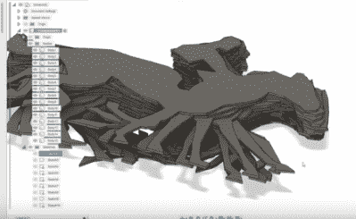

# 3D 印刷品内部的翻页动画

> 原文：<https://hackaday.com/2022/05/04/flip-book-animations-on-the-inside-of-3d-prints/>

我们都见过 3D 打印的 zoetropes，以及在笔记本的角落里绘制的翻页书动画。3D 打印机上形成的层的移动、流动形状令人满意。我们都知道隐藏、嵌套物品的乐趣。

Hackaday 校友[Caleb Kraft]有一些艺术作品反映了所有这些。他一直通过记录 3D 打印机制作动画。有趣的是，他的指纹是由两个物体组成的。一个外部的正常填充，给一个坚实的形式，和一个层蛋糕像内部的固体填充。YouTube 上的这段视频记录了这一点。

CAD model of the stack of frames

有很多事情要做好。外部对象需要在没有支撑的情况下打印。“层饼”层的厚度决定了帧速率。我想知道当头部不挡道时，他是如何按下快门的。

他的第一个实验性作品是经典的“球内弹跳球”动画，他的成熟作品是埃德沃德·迈布里奇在电影摄像机内的“运动中的马”。

当然，我们以前报道过[凯勒·克拉夫特]。他的低成本作品《月亮》非常精彩。我们已经介绍了一些 [3D 打印机动画](https://hackaday.com/2016/09/29/3d-printing-a-stop-motion-animation/)。还有[的 3D 鼢鼠。我们尤其被这个](https://hackaday.com/2021/07/03/3d-zoetrope-uses-illusion-to-double-the-frames/)所吸引。

感谢[江铃]的提示！

 [https://www.youtube.com/embed/I5ix8-bwDS4?version=3&rel=1&showsearch=0&showinfo=1&iv_load_policy=1&fs=1&hl=en-US&autohide=2&wmode=transparent](https://www.youtube.com/embed/I5ix8-bwDS4?version=3&rel=1&showsearch=0&showinfo=1&iv_load_policy=1&fs=1&hl=en-US&autohide=2&wmode=transparent)

