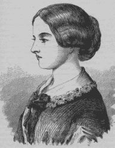
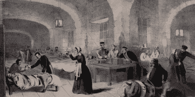
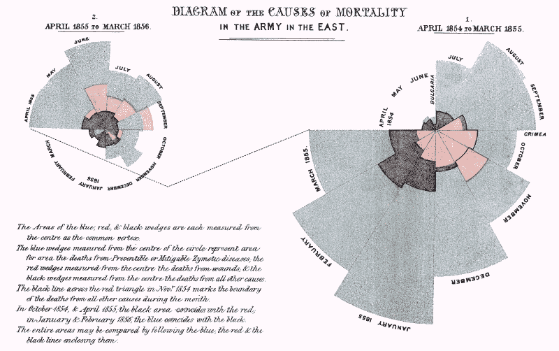

# 弗洛伦斯·南丁格尔:拥有数据的女人

> 原文：<https://hackaday.com/2020/02/04/florence-nightingale-the-lady-with-the-data/>

当你想到弗罗伦斯·南丁格尔时，你可能会想象一个护士拿着一盏灯，安慰士兵。事实上，佛罗伦萨被认为是现代护理之母。但她也在统计数据分析方面做出了重大贡献，并使用以她名字命名的图表“南丁格尔玫瑰图”说服英国议会实施卫生改革，拯救了数十万甚至数百万人的生命。

克里米亚战争期间，弗洛伦斯在一家拥挤不堪的野战医院里担任护士长，夜以继日地工作。但她也抽出时间来制作图表，向英国议会议员们展示野战医院的糟糕状况。她领导的卫生改革极大地改善了战斗中士兵的生活，她的卫生习惯的广泛采用极大地降低了人类的死亡率。

Young Florence, unsure of her place in the world. Public domain via [Wikipedia](https://commons.wikimedia.org/w/index.php?curid=138277)

## 上帝的召唤

弗洛伦斯·南丁格尔于 1820 年出生在伦敦的一个富裕家庭。她的父亲认为女性应该接受教育，并亲自教了她几门课程。她特别擅长数学，但不想从事数学职业。其实她也不知道自己想做什么，只知道她不想像个家猫一样生活在上流社会。弗洛伦斯在家里很痛苦，在她的许多作品中，她提到了祈求死亡。她得到的不是怜悯，而是帮助伤病员的召唤。

当弗洛伦斯宣布她打算成为一名护士时，她的家人完全崩溃了。那时候，医院是个阴森肮脏的地方，大多数护士要么是寡妇、前佣人，要么是找不到其他工作的品行恶劣的女人。护理不是富有的、受过教育的女孩用她们的生命去做的事情。

弗洛伦斯不顾家人的反对，离开家去德国学习护理。她回到伦敦，开始在一家小医院培训护士，在那里她很快被提升为主管。这时，她的父亲对这个想法已经软化，并秘密地给弗洛伦斯寄去一笔健康津贴来帮助支持她。

Florence at Scutari. Image via [National Army Museum](https://collection.nam.ac.uk/detail.php?acc=1978-10-57-1)

## 土耳其的分流

晋升不久，英法对俄宣战，克里米亚战争开始。肮脏的野战医院导致高死亡率的报道促使佛罗伦萨采取了行动。

她碰巧是英国战争部长的朋友，于是她自己和一个 36 人的志愿护士小组被部署到了位于斯库塔里的土耳其基地，英国军队正在那里运送伤兵。他们从乌克兰巴拉克拉瓦的大本营出发，穿过黑海，带着弗洛伦斯用自己的钱购买的药品。

弗洛伦斯和她的护士发现这个临时野战医院的条件非常糟糕。到处都是爬来爬去的害虫，大规模的传染病，甚至是最简单的药品也供应不足。死于伤寒、霍乱和痢疾的士兵比死于战伤的士兵多。是迫使政府采取行动的时候了。

## 斯库塔里的统计学家

在那个时候，用图形表示信息的想法是相当新的。弗洛伦斯绘制了现在所知的极区图或南丁格尔玫瑰图，向议会展示士兵死亡的各种方式，并让他们记住如此多的死亡是由可预防的疾病造成的。它本质上是一个饼状图，这本身是一个相当新的概念，但增加了第三维度的时间。

Red shows deaths from battle wounds, black from other causes, and blue-gray from preventable diseases. Image via [Wikipedia](https://en.wikipedia.org/wiki/Florence_Nightingale)

她的工作和论证令人信服。通过一系列的信件，佛罗伦萨解释说，流行病可以通过更好的营养、通风和卫生来控制。英国政府委托建造了一所预制医院，该医院在英格兰建造，然后运到土耳其。与此同时，她招募了最不虚弱的病人来帮助彻底擦洗这个地方，并建立了一个专门的厨房来为霍乱和痢疾患者做饭。她的努力得到了极大的回报，死亡率直线下降。

## 在家工作

弗洛伦斯从战争中归来，受到了英雄般的欢迎，但她总是回避人们的关注，从不发表任何演讲。她拒绝了一次又一次的邀请，直到收到维多利亚女王的邀请。弗洛伦斯花了整整一个下午向女王和王子夫妇讲述了英国军队医院的所有问题。他们对此印象深刻，当弗洛伦斯要求对驻印度的英国军队进行行政管理时，她如愿以偿。

弗洛伦斯在斯库塔里感染了布鲁氏菌病，在她的余生中几乎都卧床不起。她从未停止工作，并经常被咨询有关野战医院的设计和维护，直到她在 1910 年去世。

她完全拒绝她那个时代的女性所展示的悠闲生活，她没有养家糊口，而是利用自己的地位引导人类走向更美好的未来。佛罗伦萨将护理转变成了一种适合品行良好的女性的技能型职业，并在此过程中改变了公众舆论。