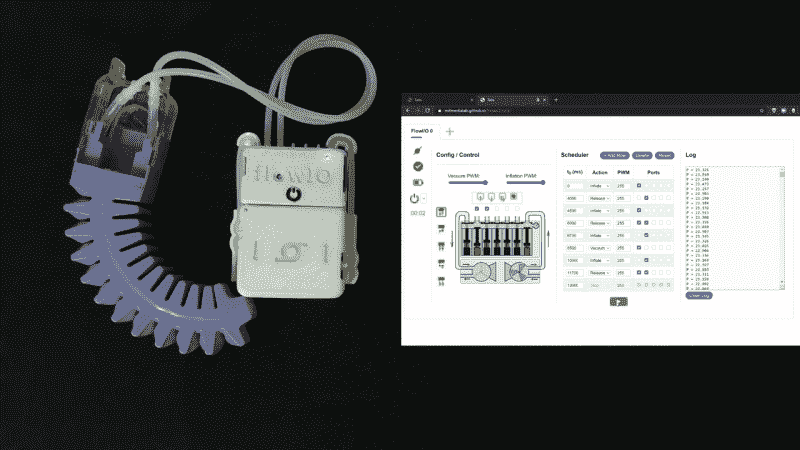
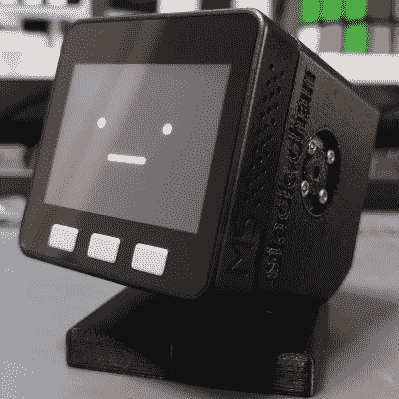
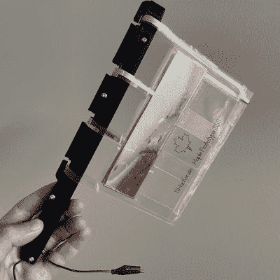
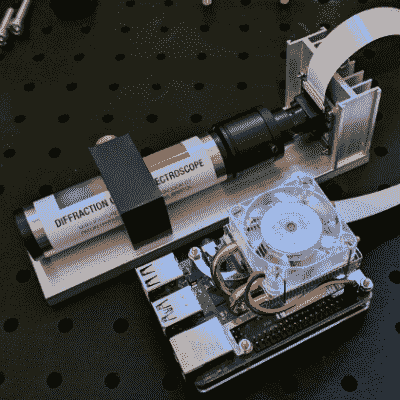
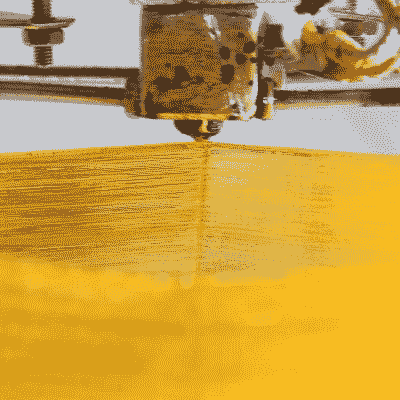

# FlowIO 在 2021 年 Hackaday 奖中获得最高荣誉

> 原文：<https://hackaday.com/2021/11/20/flowio-takes-top-honors-in-the-2021-hackaday-prize/>

FlowIO Platform 是一款用于软机器人和智能材料项目的模块化气动控制器，在 [2021 Hackaday 奖](https://prize.supplyframe.com/)中获得大奖荣誉。除了在数百个项目中脱颖而出的声望和赢得地球上最大的硬件设计挑战的吹嘘权利，该奖项还包括 25，000 美元的奖金和继续项目开发的 Supplyframe DesignLab 驻留。在周六晚上的 Hackaday Remoticon 虚拟会议上，还宣布了另外四名顶级获奖者。

在充满挑战的一年里，今年的 Hackaday 奖提出了另一项挑战:重新思考、更新和重建。我们要求每个人认真审视让世界运转的系统和过程，或者在某些情况下，让世界运转不起来的系统和过程，并从一个全新的角度重新想象它们。有没有更好的做事方法？如果你从一张白纸开始，你会想出什么？你如何支持和吸引下一代工程师，并激励他们接过火炬？如果让你的想象力自由驰骋，你会想出什么？

好家伙，你做到了！有近 500 件参赛作品，今年的评委们面临着一项艰巨的任务。五项挑战中的每一项——刷新显示器、重新思考在家工作的生活、重新想象支持性技术、重新定义机器人和重新激活通配符——都有十名决赛选手，这些选手组成了总奖项的参赛队伍。这是他们想出来的。

## 

## 大奖得主:FlowIO 平台

我们倾向于认为机器人是带有电动执行器的刚性框架。FlowIO 平台旨在改变这种想法，并在可穿戴设备、协作机器人以及任何更柔软、更温和的机器人有用的任务中启动一场设计革命。这些应用的关键是气动技术，而 FlowIO 可以轻松连接泵、阀门、致动器和传感器，这些都是气动项目得以实现的必要条件。FlowIO 主模块有五个气动通道，并连接到支持泵、传感器和通用 IO 的其他模块——这就像一个气动的乐高套装！

FlowIO 的目标是让气动技术像安装 Arduino 和几个步进器一样容易加入到项目中。该项目的负责人 Ali Shtarbanov[几周前参加了我们的黑客聊天](https://hackaday.io/event/181634-soft-robotics-hack-chat)，谈论气动技术在软机器人中的应用，以及 FlowIO 在该生态系统中的特殊地位。我们可以自信地说，对气动技术有很多被压抑的兴趣，这似乎是因为缺乏一个可获得的、负担得起的集成气动平台。FlowIO 改变了这一切，凭借其赢得的大奖，我们期待着大量展示气动技术的项目。

*   
*   ## 第二名:Stack-chan

    位居第二的是 [Stack-chan](https://hackaday.io/project/181344) ，一个可爱的开源伴侣机器人，奖金 15000 美元。手掌大小的机器人是完美的桌面伴侣，但由于它是完全开放和可黑客攻击的，你用 Stack-chan 做什么完全取决于你。基于 ESP32 驱动的 M5Stack 模块化物联网开发平台，创作者 Shinya Ishikawa 将 Stack-chan 视为一切事物的起点，从机器人管家到销售和营销工具，以及伴侣机器人和机器人宠物。

*   
*   ## 第三名:柔性电路风力发电机

    看着巨大的风力发电厂和高耸的风力涡轮机，你很难不对其中涉及的工程感到敬畏，也很难不感到“一定有更好的方法。”斯图尔特·麦肯齐的[柔性风力发电机](https://hackaday.io/project/181882)旨在探索“空气静电”电力的可能性。他使用带有导电贴花的折叠聚酯薄膜来制造风力驱动的可变电容器，当风吹动它们时，可以为小负载供电。

*   
*   ## 第四名:树莓 Pi 光谱仪

    易于建造、价格低廉、对黑客开放:这些只是 Les Wright[py spectrometer](https://hackaday.io/project/181144-raspberry-pi-spectrometer)的几个优点。我们介绍了[基于树莓圆周率的仪器](https://hackaday.com/2021/04/23/pi-based-spectrometer-puts-the-complexity-in-the-software/)，当它第一次出现时，我们称赞它的简单性——它的核心是一个圆周率凸轮观察衍射光栅——以及它的多功能性。我们也喜欢它把光谱学的力量放在学生和爱好者的手中，所有都在预算之内。

*   
*   ## 第五名：直接颗粒挤出机

    任何不得不花钱购买 3D 打印细丝的人可能都想到了将我们产生的大量塑料废物重新利用的方法，但 Norbert Heinz，也就是 YouTube 上的“Homofaciens”，实际上用[他的直接颗粒挤出机](https://hackaday.io/project/181165)做到了这一点。这个想法似乎很简单:磨碎塑料废料，将其熔化，然后直接在经过改造的 3D 打印机中挤出。但在实践中，有大量的挑战需要克服。诺伯特正在努力解决这些问题，考虑到他的挤压螺旋钻是一个改良的木螺钉，他已经完成了一些非常惊人的打印。它甚至打印糖！

## 好了，现在轮到你了

与每一个 Hackaday 奖一样，工作才刚刚开始——我们不会满足于现有的荣誉！Hackaday 奖的部分原因是激励人心；设立一个高标准，并期望我们的获胜者—以及社区的其他人—跳过它。我们希望每个人都借鉴 2021 年 Hackaday 奖获得者以及所有其他参赛者的成就，并坚持下去。看看这些项目中的每一个，并从中找到与你产生共鸣的东西。利用它来改进你的项目，或者学习一项新技能，或者探索我们世界中你从来不知道的迷人的一面。这是你的世界，所以黑进去吧！

祝贺 2021 年 Hackaday 奖的所有获奖者，衷心感谢参与管理奖项和评审参赛作品的每个人，以及花时间参加的[每个人。没有你我们做不到！](https://hackaday.io/submissions/prize2021/list)

 [https://www.youtube.com/embed/qSyfx6YVSzo?version=3&rel=1&showsearch=0&showinfo=1&iv_load_policy=1&fs=1&hl=en-US&autohide=2&wmode=transparent](https://www.youtube.com/embed/qSyfx6YVSzo?version=3&rel=1&showsearch=0&showinfo=1&iv_load_policy=1&fs=1&hl=en-US&autohide=2&wmode=transparent)

The [HackadayPrize2021](https://prize.supplyframe.com) is Sponsored by: