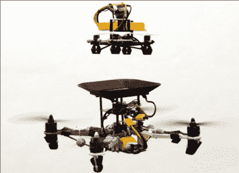

# 无人机的飞行电池

> 原文：<https://hackaday.com/2019/10/12/flying-batteries-for-drones/>

动力是无人机飞行员的克星。你想飞得更久，这意味着更大的电池。但是更大的电池会更重，导致飞行时间更短。你必须取得平衡，对于大多数消费无人机来说，这种平衡大约是 20 分钟的飞行时间，或多或少。伯克利的研究人员有一个不同的想法:不要使用更大的电池，而是简单地在飞行中更换电池。

这个想法并不是全新的。毕竟，许多飞机在飞行中加油——这是一项技术复杂的操作，但每天都在发生。这里的方案是有一个主电池和一个副电池。当二次电池电量低时，无人机在依靠一次电池运行的同时将其弹出。另一个二次电池飞向无人机并与之对接，成为新的主电源。

 理论上，这听起来相当简单。但实际上，你真的有两架无人机。主无人机和一个较小的来回携带电池的无人机。当然，你还需要一种方法让无人机找到彼此并对接。

细节决定成败。你是在飞行电池上放一个单独的电池，还是让它从有效载荷的电荷中吸取能量？你是优雅地把电池扔掉还是直接扔掉？他们是怎么找到对方的？设计师需要考虑的所有事情。你也不想把两个完全不匹配的电池并联起来，所以该设计使用一些二极管、一个 FET 和一个继电器来保持电源一次只给一个电池。

我们已经研究了将电动机和内燃机结合在一起的混合动力无人机，试图解决这个问题。或者干脆认输，用[气](https://hackaday.com/2014/06/20/goliath-one-drone-to-rule-them-all/)。