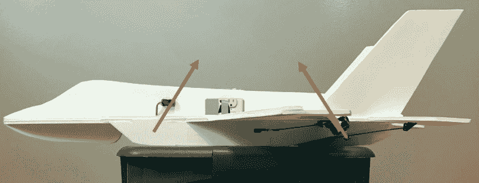

# 泡沫 F-35 学会悬停

> 原文：<https://hackaday.com/2021/07/15/foam-f-35-learns-to-hover/>

有了廉价的遥控硬件、强大的马达和高容量电池组，让东西飞起来从未如此容易。这也有助于，无论你是固定翼飞机还是多旋翼飞机，网上有大量的信息和现有技术，你可以用它们来启动你自己的建造。但是当涉及自制垂直起降飞机时，事情就有点棘手了。

对我们来说幸运的是， [[Nicholas Rehm]已经为任何想尝试这些相对小众的飞行器的人准备好了复制他不可思议的 RC F-35 的所有计划和信息。即使它是一辆标准的公园飞行器，也值得仔细看看，因为矢量推力发动机使它具有非凡的机动性和大约 120 公里/小时(80 英里/小时)的最高速度。但是只要轻轻一按开关，飞机就会转变成类似三翼飞机的飞行模式，可以垂直起降。](https://hackaday.io/project/180603-rc-vtol-f-35-parkjet)

 它是怎么工作的？“驾驶舱”后面朝下的马达抬起泡沫飞行器的前部，并左右倾斜以提供偏航控制，而背部的两个马达向下倾斜以抬起飞机的后部。观众中的航空爱好者可能会认为这与实际的 F-35B 悬停方式非常接近，尽管在真正的喷气式战斗机上，机翼下的向下推力是由重定向的涡轮排气而不是专用马达产生的，偏航控制是通过旋转发动机喷嘴而不是前升力风扇来提供的。

让飞机垂直起飞是一回事，但能够从悬停状态转变为向前飞行则完全是另一回事。为了使这种空中转换成为可能，[尼古拉斯]实际上不得不[编写自己的飞行控制器软件，他称之为 dRehmFlight](https://github.com/nickrehm/dRehmFlight) 。GPLv3 代码运行在 Teensy 4.0 上，并使用常见的 GY-521 MPU6050 陀螺仪/加速度计，所以你不需要让任何定制的板旋转起来，只是给它一个测试~~驱动~~飞行。在下面的视频中，他通过定义每个操纵面和马达如何响应给定的当前选择的飞行模式的控制输入，来完成 VTOL 操作的软件配置。

听说这不是尼古拉斯第一次试验不寻常的飞行器，你可能不会感到惊讶。去年我们报道了他的遥控星际飞船，它甚至在 SpaceX 成功将现实版完整降落之前就成功坚持了“腹部翻落”着陆。

 [https://www.youtube.com/embed/RqdcZD0ZoUk?version=3&rel=1&showsearch=0&showinfo=1&iv_load_policy=1&fs=1&hl=en-US&autohide=2&wmode=transparent](https://www.youtube.com/embed/RqdcZD0ZoUk?version=3&rel=1&showsearch=0&showinfo=1&iv_load_policy=1&fs=1&hl=en-US&autohide=2&wmode=transparent)

