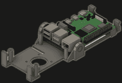
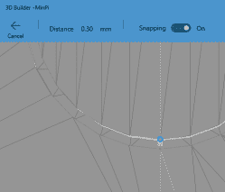

# 一体式折叠树莓皮外壳印花，看不到螺丝

> 原文：<https://hackaday.com/2020/08/11/folding-raspberry-pi-enclosure-prints-in-one-piece-no-screws-in-sight/>

【jcprintnplay】挑战自己，用不同的方式制作树莓派盒子，而[他的 Fold-a-Pi 外壳试图采用“少即是多”的方法](https://www.thingiverse.com/thing:4564545)，同时也利用了 3D 打印的优势。该附件可在约 3 小时内打印成单件，不需要任何额外的硬件。

该设计不需要螺钉或其他紧固件，并且提供了用于风扇的安装孔以及用于将外壳本身安装到某物上的一些孔。所有端口和接头都是无障碍的，折叠一体式设计不只是噱头；在一个车间的情况下，Pi 需要切换或处理很多，它不需要任何时间弹出和关闭外壳的树莓 Pi。

Microsoft’s 3D Builder has a pretty useful measurement tool for STLs.

[James]指出，像这样的就地印刷铰链的诀窍是在零件之间留有足够的空间，这样两个零件就不会融合在一起，但也不会有太多的空间导致印刷失败。他没有详细说明有多少空间起作用或不起作用，但对可下载模型的检查显示，使用的间隙看起来像 0.30 毫米，打算用 0.4 毫米的喷嘴打印。

[James]还展示了在构建原型时能够对设计进行快速迭代的价值。在[的一个视频](https://www.youtube.com/watch?v=ImdL78Qor8Y)(嵌入下方)中，第一个原型的铰链不太对劲。在第二个原型中，关闭时没有间隙。第三个解决了这两个问题并展示了最终的设计。

 [https://www.youtube.com/embed/ImdL78Qor8Y?version=3&rel=1&showsearch=0&showinfo=1&iv_load_policy=1&fs=1&hl=en-US&autohide=2&wmode=transparent](https://www.youtube.com/embed/ImdL78Qor8Y?version=3&rel=1&showsearch=0&showinfo=1&iv_load_policy=1&fs=1&hl=en-US&autohide=2&wmode=transparent)

使用“金发女孩”方法，为某物找到合适间隙的棘手过程可以变得容易得多，并且可以有效地利用 3D 打印。

[via [Reddit](https://www.reddit.com/r/functionalprint/comments/i5xtbd/i_designed_a_printinplace_raspberry_pi_case_that/)