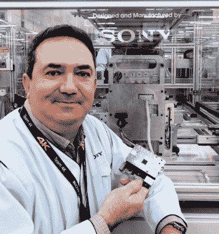

# 《福布斯》称树莓派是一笔大生意

> 原文：<https://hackaday.com/2019/03/18/forbes-says-the-raspberry-pi-is-big-business/>

一般的黑客读者并没有意识到这一点，但树莓派是一款相当受欢迎的设备。虽然我们没有确凿的数字来支持它(额外的学分给任何希望处理这些数字的人)，但似乎没有一天头版上没有一个树莓皮的故事。但是考虑到小型、廉价、相对强大的 Linux 计算机是黑客团体多年来梦寐以求的东西，这并不奇怪。

 但是树莓派在那些不一定会花空闲时间阅读奇怪的黑背景网站的人中有多受欢迎呢？嗯，根据《福布斯》最近的一篇文章[，私家侦探被发现在世界各地](https://www.forbes.com/sites/parmyolson/2019/03/10/how-sony-sped-up-a-factory-with-these-tiny-35-computers)从事一天的诚实工作。从工厂到垃圾车，每个人最喜欢的 Linux 电脑已经从它卑微的开始走了很长的路。知道一台 35 美元的电脑比你的简历还长是什么感觉？

不幸的是,《福布斯》的文章没有我们熟悉的围绕这些部分的深层技术细节。事实上，文章一开始就将树莓派描述为“覆盖着金属引脚和方块的简化电路板”，这应该告诉你所有你需要知道的福布斯和 Hackaday 读者之间的重叠，但我们认为作者[Parmy Olson]仍然讲述了一个有趣的故事。

那么，在哪里见过 Pi 打卡呢？首先是在索尼。这家消费电子巨头已经在他们的几个工厂安装了 Pis 来监控各种设备。他们记录从温度到振动的一切，并使用内部开发的协议将其发送到中央服务器。一些私人侦探甚至配备了摄像头，连接到计算机视觉系统，以监视任何异常情况。

[Parmy]还描述了树莓 Pi 如何在非洲被用于监测垃圾箱内的垃圾水平，并自动调度卡车来收集垃圾。在欧洲，它们被用于监测氢动力汽车加油站的健康状况。全世界的企业都意识到，他们可以以十分之一的价格建立自己的监控系统；经理们偶尔会自掏腰包购买小巧的 Linux 电脑。

Pi 对硬件世界的影响很难被夸大。现在[重新定义了单板计算机的现状](https://hackaday.com/2019/03/05/google-launches-ai-platform-that-looks-remarkably-like-a-raspberry-pi/)，随着[平台继续发展](https://hackaday.com/2018/11/15/the-smaller-more-powerful-raspberry-pi-3-model-a/)，没有迹象表明[不可思议的旅程会很快放缓](https://hackaday.com/2019/01/28/raspberry-pis-latest-upgrade-the-compute-module-3/)。

【感谢 Itay 的提示。]