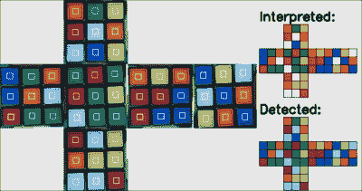
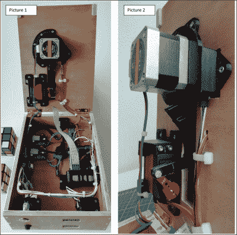

# 忘记数独，给自己造一个极简的魔方机器人

> 原文：<https://hackaday.com/2022/02/02/forget-sudoku-build-yourself-a-minimalist-rubiks-solver-robot/>

有些人喜欢填字游戏，有些人是严肃的数独忍者，但(Andrea Favero)喜欢通过学习编码和解决控制问题来保持自己的敏锐，这是我们肯定会涉及的事情。当学习一个新的平台时，在头脑中有一个实质性的项目或目标是一个非常好的想法，并且在这个过程中学习需要什么。[Andrea]选择构建一个自主的魔方解算器，并[好心地记录了具体的操作方法](https://www.instructables.com/Rubik-Cube-Solver-Robot-With-Raspberry-Pi-and-Pica/)，我们对此很高兴！

The result of the openCV processing chain

在使用 OpenCV 的 python 中，[Andrea]使用[Oussama Barkouki] 的方法来处理每个人脸图像，并将其转换为各个小面的颜色表。最基本的是，首先将图像转换成灰度，然后使用[高斯模糊](https://docs.opencv.org/4.x/d4/d13/tutorial_py_filtering.html)对图像去噪。使用 [canny](https://docs.opencv.org/4.x/da/d22/tutorial_py_canny.html) 算法识别边缘，然后将其结果[放大](https://homepages.inf.ed.ac.uk/rbf/HIPR2/dilate.htm)并传入[轮廓检测器](https://learnopencv.com/contour-detection-using-opencv-python-c/)。轮廓被发送到一个巧妙的过滤器中，该过滤器识别方形轮廓，而那些尺寸错误的轮廓被过滤掉。你剩下的是实际的彩色小面的轮廓。一旦你有了一个正方形列表，这些可以用来形成图像遮罩，然后从每个正方形中选择平均颜色。然后，颜色被量化并存储为标准[西方魔方配色方案](https://ruwix.com/the-rubiks-cube/japanese-western-color-schemes/)中的标签色。最后，一旦所有的面部图像被捕获并且 facelets 颜色被识别，数据被传递到由[he gbert Kociemba]开发的 T12 魔方求解算法 T13 中，其指南可在[speed solution 网站 T15 上获得。求解步骤的结果是解扰移动的序列，在由 [David Singmaster](https://en.wikipedia.org/wiki/David_Singmaster "David Singmaster") 开发的[移动符号](https://en.wikipedia.org/wiki/Rubik%27s_Cube#Move_notation)中。迷人的东西，如果你问我们！

Modular hardware approach – no custom PCBs

所有这些都可以在个人电脑上进行原型制作，但是[Andrea]想了解一下 Raspberry Pis。部分乐趣在于[安装和配置 Pi4](https://content.instructables.com/ORIG/FFV/EVSC/KUCXS3ZH/FFVEVSCKUCXS3ZH.pdf) ，以及所有必要的依赖项。硬件由胶合板和大量 3D 打印材料制成。(所有的 STL 都可以在第一个链接中找到)遵循[构建指南](https://content.instructables.com/ORIG/FKE/39AH/KWGEBI8U/FKE39AHKWGEBI8U.pdf)应该足够简单了。配有 PiCamera 的 Pi4/2Gb 型号就足够了(祝你好运找到一个！或许试试[遥控仪](https://rpilocator.com/?cat=PI4)？)带有用于立方体旋转的步进电机和一对伺服系统，一个用于操作盖子/相机底座，第二个用于围绕第二轴*踢*立方体。这种简单、优雅的方法的美妙之处在于，它可以处理标准的未经修改的立方体(好吧，稍微有点粗糙的立方体)——不像我们见过的一些疯狂的速度求解构建——它不是我们见过的最快的立方体解算器[，但它是最酷的之一。](https://hackaday.com/2018/03/12/rubiks-robot-so-fast-it-looks-like-a-glitch-in-the-matrix/)

想看立方体自己解决吗？(有点)[给你](https://hackaday.com/2019/05/18/teardown-video-whats-inside-the-self-solving-rubiks-cube-robot/)。让我们结束一个热门话题，一个受[冠状病毒启发的‘立方体黑客’](https://www.youtube.com/watch?v=GWtt_KuPqDw)，因为他们可以。

 [https://www.youtube.com/embed/oYRXe4NyJqs?version=3&rel=1&showsearch=0&showinfo=1&iv_load_policy=1&fs=1&hl=en-US&autohide=2&start=280&wmode=transparent](https://www.youtube.com/embed/oYRXe4NyJqs?version=3&rel=1&showsearch=0&showinfo=1&iv_load_policy=1&fs=1&hl=en-US&autohide=2&start=280&wmode=transparent)

