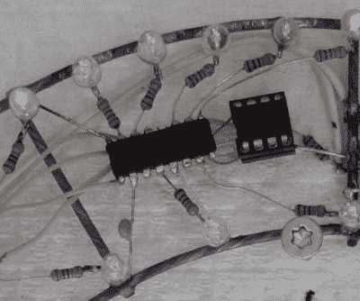

# 在这个电路雕塑时钟中，形式遵循功能

> 原文：<https://hackaday.com/2022/12/29/form-follows-function-in-this-circuit-sculpture-clock/>

电子元件是严格意义上的功能对象:它们的外观是由它们要实现的功能决定的。但这并不意味着它们没有美。事实上，有一门名为*电路雕塑*的学科存在，它旨在仅仅用电子元件和电线来制作美丽的形状。今天我们可以向你展示[马顿·特罗普]在这一领域的最新作品:一个他命名为[时钟雕塑](https://www.geekabit.nl/projects/clock-sculpture/)的挂钟。

时钟的主要结构由两个镀锌钢丝制成的同心环组成，由十二根辐条连接在一起。所有元件都直接焊接在这两个环上，无需额外的机械支撑。钢不是焊接的最佳材料，但[Maarten]设法用高功率烙铁和一点管道工焊剂使它工作。

整体设计简单而巧妙:外环装有 60 个 LED 来指示分钟，每五个 LED 总是微弱发光，以便在黑暗条件下提供背景参考。内环上有 24 个发光二极管，指示 12 个小时以及中间的“半小时”。如果没有这些，表盘在整点 30 分时看起来会有点奇怪。

 一个市电变压器，加上一个单二极管，一个缓冲电容和一个 7805 稳压器组成一个简单的 DC 电源，它的负极端子连接到钢架上。时间由计数电源频率脉冲的计时器 13A 记录。没有办法调整时间:为了与外界同步，你必须在中午或午夜插上时钟。这也许是一种粗糙的方法，但却非常符合这座钟的基本美学。

单个 led 由一组 12 个 74HC595 移位寄存器驱动，所有移位寄存器都安装在两个环之间。信号和电力通过从旧 IDE 电缆中取出的不显眼的灰色电线在芯片之间传输；这给钟一个干净整洁的外观。[Maarten]已经在他的办公室里放了几个月的雕塑钟，虽然它显然需要一些时间来适应，但他声称它在明亮和黑暗的条件下都很容易阅读。

电路雕塑已经形成了几个令人惊叹的时钟项目的基础:例如[这个钛战斗机形状的时钟](https://hackaday.com/2020/06/08/circuit-sculpture-clock-goes-pew-pew/)，或者[这个极其复杂的 LED 时钟](https://hackaday.com/2021/11/10/a-breathtaking-circuit-sculpture-clock/)。我们的 [2020 赛道雕塑大赛](https://hackaday.com/2018/12/04/the-circuit-sculpture-contest/)也产生了许多令人惊叹的设计。