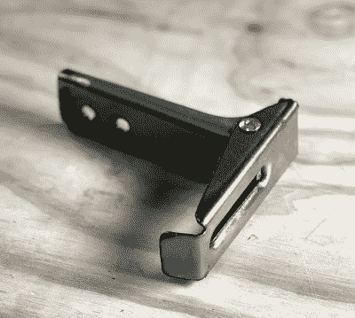

# 使用 3D 打印模具成型钣金零件

> 原文：<https://hackaday.com/2020/03/10/forming-sheet-metal-parts-with-3d-printed-dies/>

使用 3D 打印形式来弯曲金属板并不是什么新鲜事。我们已经看到一些人为他们的刹车制作定制模具，结果表明这个概念对于小规模生产是有价值的。但这通常是过程结束的地方。这里或那里的弯曲是一回事，但与它们形成复杂形状的能力似乎总是要求太多。但是从他最近的实验来看，[【沙恩·威顿】非常接近于改变这种看法](https://shane.engineer/blog/3d-printed-sheet-metal-forms)。

 相对而言，这里的工作流程相当简单。你把上下模具打印出来，在它们之间放一块金属片，然后用液压机把它们砸在一起。如果一切工作正常，并且你的 CAD 技能正确，金属就会呈现出想要的形状。

当然，这大大简化了事情。正如[Shane]在休息后的视频中解释的那样，[像这样形成金属板](https://hackaday.com/2016/05/18/the-art-and-science-of-bending-sheet-metal/)有*许多*的细微差别需要考虑，迭代和试验基本上是不可避免的。所以这是一件好事，你可以迅速重新设计和重印模具。

这并不是说骰子本身没有带来独特的挑战。第一个在压力下破碎了，在[Shane]得到一套可以形成想要的零件的模具之前，进行了一些设计修改，最终改用了更强的树脂。尽管如此，他还是很难让打印出来的零件经受住多次使用。但他相信，通过更多的改进，他可以获得可重复的过程，并认为最终在一套打印模具上生产多达 100 个零件不是不可能的。

从逻辑上讲，塑料似乎不是冲压和成型金属的理想选择。坦白说，不是。[但是如果你在做内部制造](https://hackaday.com/2018/01/14/aluminum-no-match-for-3d-printed-press-brake-dies/)，[快速简单地生产复杂模具的能力](https://hackaday.com/2018/02/16/3d-printed-punch-and-die-stand-up-to-steel/)可以帮助弥补它可能带来的任何负面影响。

 [https://www.youtube.com/embed/WuY2-OrT9ig?version=3&rel=1&showsearch=0&showinfo=1&iv_load_policy=1&fs=1&hl=en-US&autohide=2&wmode=transparent](https://www.youtube.com/embed/WuY2-OrT9ig?version=3&rel=1&showsearch=0&showinfo=1&iv_load_policy=1&fs=1&hl=en-US&autohide=2&wmode=transparent)

