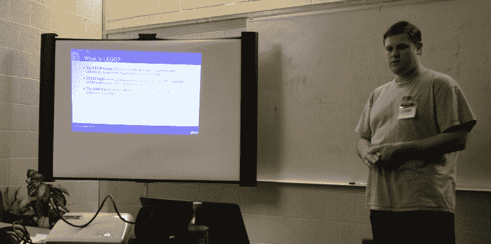
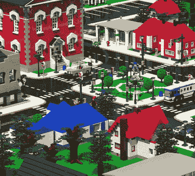

# FOSSCON 2018:开源与乐高的碰撞

> 原文：<https://hackaday.com/2018/09/07/fosscon-2018-where-open-source-and-lego-collide/>

阅读这篇文章的人可能不会感到惊讶，但黑客和制造商绝对喜欢乐高。我们认为你很难找到一个普通读者，年轻的或年老的，没有花一些时间在丹麦比隆的小塑料砖上。因此，随之而来的是，有一个相当大的社区的个人谁利用他们比平均水平更好的技术实力，以新的和独特的方式利用乐高。但是，这些乐高黑客的活动和历史对那些不热衷于这项爱好的人来说并不完全是常识。

 在最近费城举行的 FOSSCON 2018 期间，Daniel Pikora 向与会者全面展示了[开源开发与世界上最受欢迎的建筑玩具品牌](https://fosscon.us/node/12730)的交集。作为一名软件开发人员，他对开源代码情有独钟，同时也是乐高(AFOL)社区的热心成员，该社区在美国和加拿大各地的展会上展出了他的作品。这种独特的视角，同时涉足自由/开源软件和乐高阵营，使丹尼尔成为这个玩具和科技的特殊缩影的理想导游。

[在一场旋风般的演示中，与会者在大约同样长的时间里观看了 49 张幻灯片](https://github.com/danny316p/LEGO_and_Open_Source),丹尼尔讲述了乐高在 20 世纪 30 年代的开端，到 3D 打印定制砖块的兴起，以及其间的一切。一些以工程为中心的产品线，比如 Technic 和 Mindstorms，已经被那些在费城参加开源会议的人们所熟知。但 Daniel 对开源乐高项目悠久历史的深入研究揭示了如此多专注的开发人员的工作，以至于每个人都带着对 AFOL 社区为将乐高从儿童玩具提升为合法工具所做的大量工作的新敬意离开。下面和我一起看看那次深潜的细节。

## 开源精神

丹尼尔在演讲开始时提出的一个要点是，与常见的误解相反，乐高产品(即物理“砖块”)不是开源的。事实上，乐高公司非常积极地保护他们的知识产权，任何未经授权使用他们的品牌或设计的行为都可能面临法律诉讼。也就是说，乐高赞赏他们的产品在黑客的工具包中几乎无处不在，他们偶尔会对其他严格的使用条款做出一些让步。

例如，2010 年，乐高发布了一份文件，描述了他们的“Power Functions RC”产品系列的协议，该产品系列使用以下“许可证”:

> 请随意使用本文档中的任何信息，仅用于个人非商业用途，
> 前提是您保持乐高集团完整的版权、商标和其他专有权利—
> 玩得开心。

虽然这种简单化的许可不太可能很快得到自由软件基金会的批准，但是带有非商业条款的开源许可也不是没有听说过。尽管乐高并不经常为他们的产品使用官方开源许可，但很少有人会认为乐高没有拥抱开源的精神。信息交流和“混合”文化不仅在 AFOL 社区，而且在乐高公司本身也很普遍。

2016 年，在听说一些客户提出了在 Technic Porsche 911 GT3 RS 套件中组装变速箱的替代方法后，[乐高发布了一份声明，鼓励客户尝试](https://brickset.com/article/21758/lego-responds-to-instructions-issue-in-42056-porsche-911-gt3-rs)并找到自己的解决方案。该声明以一句话结束，概括了乐高对开源的感受，至少是精神上的，如果不是文字上的:

> 乐高技术真的是终极开源设计产品，现在它终于可以使用了，我们期待看到我们的粉丝创造的所有“改进”模型。毕竟，这就是乐高建筑的全部。

## LDraw 的世界

Datsville, a collaborative city built with LDraw tools

虽然乐高硬件可能不开放，但围绕它涌现的开源软件并不缺乏。这些工具主要用于帮助构建者使用开源 LDraw 文件格式规划和记录他们的项目。公平地说，这些工具是 AFOL 社区的基石，使原本不可能实现的协作成为可能。

最初的 LDraw 及其同名文件格式是由 James Jessiman 于 1995 年为 DOS 发布的，作为第一个非官方的 LEGO CAD 软件包。他花了相当大的努力使文件格式模块化和可扩展，所以其他人很自然地在他们自己的程序中采用了它。遗憾的是，在 LDraw 发布后没几年，詹姆斯就因流感并发症去世了。作为一个合适的纪念，[社区继续使用和发展他开创的 LDraw 格式](http://www.ldraw.org/)。

相应地，有一个巨大的软件包列表使用了现在的 Creative Commons 许可的 LDraw 格式。就连乐高的官方 CAD 程序 Digital Designer 也为其提供支持。Daniel 向与会者介绍了十几个兼容 LDraw 的工具，特别关注那些在开源许可下发布的、用于多个平台的工具。

## 游戏时间进入高科技时代

Daniel 以 AFOL 社区的最新进展的一些细节结束了演示，包括 3D 打印定制或稀有物品以及最新一代的 Linux 驱动的乐高 Mindstorms。这些技术使得乐高创造远远超出了早期的能力，并进一步巩固了乐高作为快速开发硬件项目的实用系统。

AFOL 成员指出，2008 年的《钢铁侠》中的一个细节显示，托尼·斯塔克在建造 Mk I 套装的过程中使用了一些开源的 Mindstorms 代码，以此证明乐高已经超越了其卑微的开端，成为 20 世纪 40 年代末木制儿童积木的替代品。虽然这种提法显然是开玩笑的，但它确实显示了乐高对几代工程师的普遍影响，这些工程师是从翻找成堆的彩色砖块开始的。