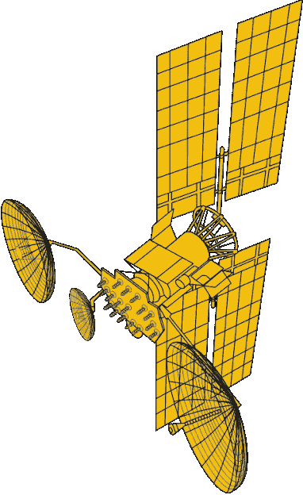

# 法国质疑俄罗斯卫星有“大耳朵”

> 原文：<https://hackaday.com/2018/09/13/france-questions-russian-satellite-with-big-ears/>

法国国防部长弗洛伦斯·帕利最近指责俄罗斯的一颗卫星有“大耳朵”，这是对红色小小红帽的效仿。虽然她没有给出任何具体细节，但这是一个罕见的、不太隐晦的指控，即俄罗斯正在使用他们的 [Luch-Olymp 航天器](https://en.wikipedia.org/wiki/Luch_(satellite))进行轨道间谍活动。

Luch satellite conceptual drawing from NASA

在图卢兹的一次演讲中，Parly 说:“它很接近了。有点太近了。如此之近，以至于人们真的会认为它试图捕捉我们的通信。”而且“这场小小的星球大战并不是很久以前在一个遥远的星系里发生的。事情发生在一年前，在我们头顶 36000 公里的地方。”

这种潜在的太空海盗行为的目标是雅典娜-菲多斯卫星，这是法国和意大利的合资企业，为两国的军事和应急服务提供安全通信。它于 2014 年推出，通过 Ka 波段为地面和无人机上的移动接收器提供 3 Gbit/s 的吞吐量。

这并不是俄罗斯的豪华汽车第一次成为审查的对象。[2015 年，据报道，一艘这样的飞船机动至距离 Intelsat 7 和 Intelsat 901 地球静止通信卫星 10 公里以内](https://spacenews.com/russian-satellite-maneuvers-silence-worry-intelsat/)，引发了美国国防部的机密会议。由于地球静止卫星以 3.07 公里/秒的速度绕地球运行，10 公里的接近是极其危险的。即使是微小的误判也可能在几秒钟内造成影响。

## 未来会有隐形卫星吗？

令到处都是影子间谍机构懊恼的是，这种轨道猫和老鼠很容易从地面上被发现。当间谍飞机变得容易被雷达探测到时，下一步就是躲避这种探测。我们是在通往雷达透明的卫星的道路上吗？

Gregory Charvat 是《小型短程雷达系统》的作者，偶尔也是 Hackaday 的撰稿人，他告诉我们建造一颗隐形卫星并不是一件容易的事情。“就像我们不得不重新发明飞机来制造第一架隐形飞机一样，要制造隐形卫星，我们必须从根本上重新发明我们今天所知道的卫星。”

格雷戈里将它比作开发洛克希德 F-117 夜鹰等隐形飞机所花费的巨大成本和努力，他说，开发一颗可以躲避雷达的卫星可能会比它在大多数应用中的价值更大。空间已经够硬了。“保持这种特殊的形状，使雷达远离你的飞机，并包括所有这些必要的外围设备是一个巨大的挑战，”格雷戈里说，这导致“妥协和高昂的维护成本。”

除了试图窃听通信，军方内部人士表示，这些近距离通过 Luch 卫星也可能是反卫星行动的“演习”;要么用定向能武器摧毁目标飞船，要么直接撞上它。随着这些事件的发生，以及美国承诺在未来几年*建立*太空部队*，*太空军事化的努力似乎在上升。

[via [国防新闻](https://www.defensenews.com/space/2018/09/07/espionage-french-defense-head-charges-russia-of-dangerous-games-in-space/)