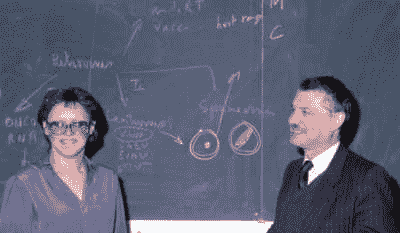
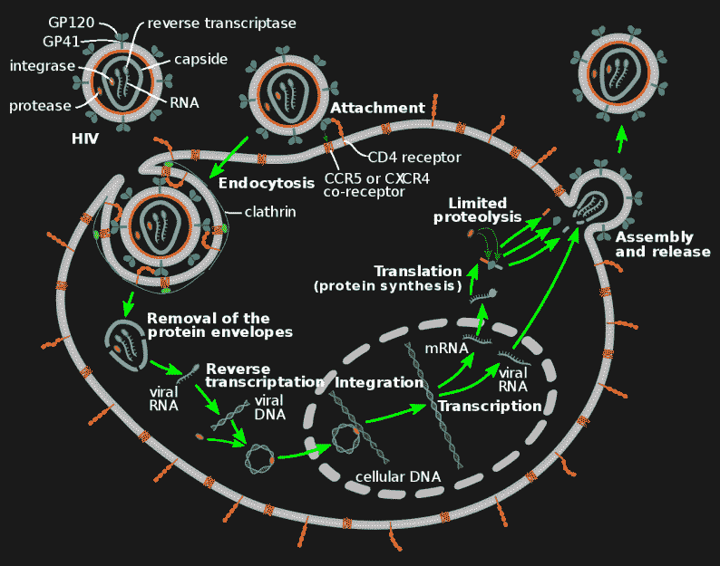
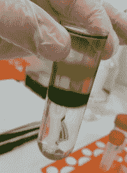

# 弗朗索瓦丝·巴雷-西诺西:病毒猎人

> 原文：<https://hackaday.com/2018/07/17/francoise-barre-sinoussi-virus-hunter/>

那是 1983 年初，巴黎著名的巴斯德研究所的弗朗索瓦丝·巴雷-西诺西正忙于离心机，试图检测逆转录病毒的存在。离心机中的样本来自一名艾滋病患者，尽管这种疾病当时还不叫艾滋病。

Barré-Sinoussi and Montagnier in 1983, Image source: [Le Globserver](http://theglobserver.com/20-mai-1983-le-virus-du-sida-est-decouvert/)

就在两年前，在美国，一群年轻男子被报道患有不寻常的感染和癌症，通常是老年人或使用旨在抑制免疫系统的药物的人所经历的。报告了更多的病例，美国疾病控制和预防中心(CDC)成立了一个工作组来监测这一不寻常的疫情。12 月，第一篇关于疫情的科学文章发表在《新英格兰医学杂志》上。

到 1983 年 5 月，巴斯德研究所的研究人员 Barré-Sinoussi 和 Luc Montagnier 已经分离出导致艾滋病的 HIV 病毒，并在《T2 科学》杂志上发表了报告。两人都因为这项工作获得了 2008 年的诺贝尔奖，诺贝尔奖的获奖理由是:

> 科学和医学从未如此迅速地发现、识别新疾病的根源并提供治疗。

那么，让我们更近距离地看看这些现代科学侦探之一，弗朗索瓦丝·巴雷·西诺西，以及是什么导致了她的发现，才是恰当的。

## 成为一名病毒学家

Barré-sino ussi 1947 年出生于法国巴黎。她对科学的兴趣始于年轻时，那时她利用学校假期在巴黎的公园里观察植物和动物，对它们的行为感到好奇。在学校，她发现自己在科学方面比人文学科做得更好。

她曾想成为一名医生，但她的父母并不富裕，她认为理科教育可能更实惠，花费的时间也更少。在巴黎大学学习两年后，她决定测试自己是否走对了路，开始在著名的巴斯德研究所做志愿者，成为兼职工作者，然后转向全职工作。她上大学只是为了参加考试，借用同学们的笔记。她于 1975 年获得博士学位。

在美国国立卫生研究院工作一段时间后，她回到巴斯德研究所，在那里她的研究重点是一种叫做逆转录病毒的病毒及其与小鼠白血病的联系。

HIV retrovirus replication cycle, by [Jmarchin](https://commons.wikimedia.org/wiki/User:Jmarchn) CC BY-SA 3.0

什么是逆转录病毒？首先，病毒是一种传染因子，它在其他生物的活细胞内复制。逆转录病毒也使用细胞进行复制，但这是通过创建一条病毒 DNA 链并将其插入细胞自身的 DNA(细胞 DNA)来实现的。然后，细胞利用其细胞 DNA 产生更多的逆转录病毒，进而感染其他细胞。

## 发现艾滋病毒

Plant cell fractions in a sugar gradient (for example), by Zuzanna K. Filutowska CC BY-SA 3.0

到 1982 年，一群法国科学家怀疑艾滋病可能是由逆转录病毒引起的。他们找到了 Luc Montagnier、Barré-Sinoussi 和巴斯德研究所的其他人，因为他们有逆转录病毒方面的经验。去年 12 月，他们给了蒙塔尼耶和巴雷-西诺西一个病人的淋巴结样本，该病人显示出艾滋病的早期症状。

确定是否涉及逆转录病毒的一个关键是检查逆转录酶的活性，Barrésino ussi 在这方面有经验。逆转录酶是一种从病毒 RNA 生成病毒 DNA 的酶(见图示)。

她将淋巴结细胞放入培养皿中。在两周内，她每三天检查一次被感染的细胞是否产生新的逆转录病毒。这包括[离心](https://en.wikipedia.org/wiki/Differential_centrifugation)培养基以分离出产生的病毒。然后在糖梯度中离心。在第二周，显示最高酶活性的密度与已知的逆转录病毒相关。为了进一步确认，她寻找任何金属离子。在从 RNA 生成 DNA 的过程中，金属离子会被酶利用。她发现了镁离子，进一步证实她发现了一种逆转录病毒。

Montagnier、Barré-Sinoussi 和他们的同事也能够证明被感染的白细胞类型是辅助性 T 细胞。白细胞是免疫系统细胞，参与保护身体对抗传染病。这解释了为什么受感染的病人白细胞如此之少。使用电子显微镜，他们能够获得这里显示的逆转录病毒从受感染的 T 细胞中出芽的图像。

这种逆转录病毒当时被称为 LAV(淋巴结病相关病毒),但后来当更多的人知道它时，它被命名为我们现在知道的 HIV(人类免疫缺陷病毒)。

1983 年 5 月，Barré-Sinoussi 和该研究所团队的其他成员在《科学》杂志上发表了一篇关于他们发现的文章。但是 HIV 的发现并不是没有争议的。在美国，由[罗伯特·加洛](https://en.wikipedia.org/wiki/Robert_Gallo)领导的一个小组在同一期*科学*上发表了类似的结果。Barré-Sinoussi 的团队现在被认为发现了 HIV，Gallo 的团队被认为发现了 HIV 是艾滋病的病因。

## 进一步的工作

1988 年，Barré-Sinoussi 在巴斯德研究所拥有了自己的实验室，并于 1992 年成为该研究所逆转录病毒生物学部门的负责人。她继续围绕艾滋病毒进行研究，包括免疫系统在控制艾滋病毒中的作用、母婴传播，以及研究艾滋病毒阳性个体的特征，这些个体的身体能够在不使用抗逆转录病毒药物的情况下限制艾滋病毒的复制。

她合著了 240 多篇科学出版物，并参加了巴斯德研究所的许多委员会和科学协会以及其他艾滋病组织。她也是世卫组织(世界卫生组织)和 UNAIDS 艾滋病规划署的顾问。这只是她研究和公共活动的简短列表。

2009 年，她给教皇本笃十六世写了一封公开信，教皇本笃十六世在前往非洲的途中发表声明，称避孕套在艾滋病危机中充其量是无效的。

她在 2012 年成为国际艾滋病协会的主席。

在众多奖项中，2008 年她与艾滋病共同发现者吕克·蒙塔尼耶一起获得了诺贝尔生理学或医学奖。

2015 年她正式退休，她的实验室被关闭。然而，她仍然很活跃。例如，2018 年，她成为 Sidaction 的总裁，Sidaction 是一家旨在提高对艾滋病的认识和筹集慈善资金的慈善机构。她没有减速的迹象。