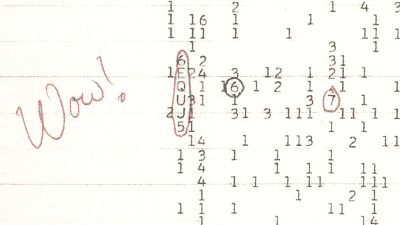
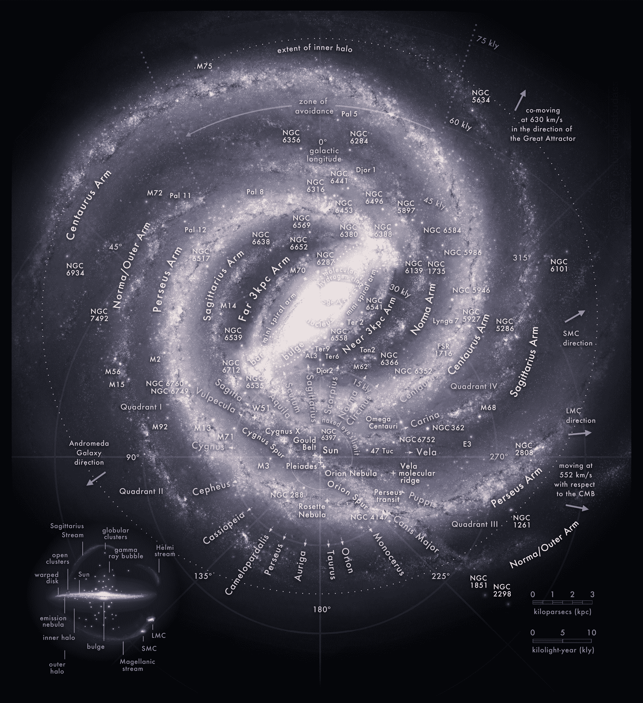
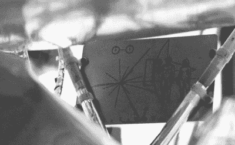

# 弗兰克·德雷克的遗产，或者说:我们在宇宙中是孤独的吗？

> 原文：<https://hackaday.com/2022/09/09/frank-drakes-legacy-or-are-we-all-alone-in-the-universe/>

当弗兰克·德雷克在 20 世纪 50 年代末开始他的天文学生涯时，这对这个领域来说是一个令人难以置信的激动人心的时刻。人类开始使用越来越强大的无线电频率和光学望远镜，包括诱人的天基望远镜，来揭开宇宙的秘密。在美国和苏联日益激烈的太空竞赛中，人们对人类的未来越来越兴奋。

随着在月球、金星和火星上登陆和殖民的具体计划被提出并付诸实施，它也将许多关于人类在宇宙中的地位的现存和新的问题推到了前沿。在弗兰克·德雷克在地球上的 92 年里——直到他今年 9 月 2 日去世——他是寻找外星智慧生命( [SETI](https://en.wikipedia.org/wiki/Search_for_extraterrestrial_intelligence) )的驱动力之一，还有像卡尔·萨根这样的传奇人物。

虽然对于普通人来说，SETI 这个缩写词最有可能让人想起关于小灰人或小绿人的爆米花电影，但德雷克的 Ozma 项目、SETI 机构和正在进行的突破倾听项目只是德雷克和他的同事几十年来试图回答一个可能影响人类未来进程的问题的一部分:我们在宇宙中是孤独的吗？

## 幸运的智慧生命

在一个包含数十亿颗恒星和行星的宇宙中，生命在这些行星上形成的可能性有多大？在这种生活中，有百分之几的人拥有的智力水平能够使复杂的社会能够维持科学探索和技术发展？在这些社会中，有多少人将获得超越地球界限的手段？

虽然关于外星生命的推测已经存在了数百年，如果不是数千年的话，但直到更先进的观测手段的发展，人类才获得了检验这些推测的能力。尽管我们认为生命形式——无论是否有智慧——存在于地球生物圈中是司空见惯的，但我们现在知道，在我们太阳系的所有行星和卫星中，只有地球有能力支持生命，更不用说先进的社会了。

20 世纪 30 年代，火箭科学家康斯坦丁·齐奥尔科夫斯基在一份未发表的工作中提到了他对外星智慧生命的怀疑，物理学家恩利克·费密在 20 世纪 50 年代与这些怀疑的正式定义联系在一起，通常被称为[费米悖论](https://en.wikipedia.org/wiki/Fermi_paradox)。从本质上说，这种矛盾导致了大量外星文明存在的可能性和这些文明的明显缺失之间的冲突。

因此，对外星智慧的探索试图解决这个矛盾。我们对智慧生命形成的可能性的看法是错误的，还是我们可能遗漏了其他因素？1961 年，德雷克将这些因素形式化为所谓的德雷克方程，即:

*N = R[*]f[p]N[e]f[L]f[I]f[c]L*

这里的 N 是我们银河系中可以交流的文明的数量。

*   *R [*]* 是恒星形成的平均速率。
*   *f[p]是恒星与行星的分数。*
*   *n[e]是这些行星中能够支持生命的部分。*
*   *f [1]*
*   *f[I]is 是拥有发展智慧生命(文明)的生命的那部分行星。*
*   *f[c]是这些文明中的一部分，他们的技术允许他们通过例如无线电传输被探测到。*
*   *L* 是发射这些可检测信号的时间长度。

不足为奇的是，人们可以赋予这些因素的值将会变化很大，这使得 *N* 的用途值得怀疑，但它是一个有用的辅助工具，可以显示在更大的问题之前需要回答的许多潜在问题，即地球生命，特别是人类文明，是否是一种宇宙的侥幸，有点罕见或实际上很平常。

在 Carl Sagan 的 *Cosmos* PBS 电视系列节目以及同名书籍中，这些相同的问题也被从多个角度提出和考虑。在科幻作品中如*《星际迷航》*、*《巴比伦 5 号》*等。这些令人不安的问题被避免了，因为它们展示了一个充满了成千上万个文明的星系。基于现有的科学证据，人们可能会问这样一个问题:我们是否害怕独自一人在银河系中。

如果我们真的乘坐超光速宇宙飞船去那里旅行，却发现一个完全没有生命和可居住行星的星系会怎么样？

## 哇！信号

The Wow! signal represented as “6EQUJ5” with Jerry R. Ehman’s handwritten comment.

如果我们遇到另一种文明，我们会认出它吗？这是卡尔·萨根的《宇宙》中提出的问题之一，他描述了一个假设的场景，像旅行者 1 号& 2 号这样的探测器接近地球，它的操作者试图确定地球是否有活跃的生物圈，也许是一个文明。根据大气中甲烷等有机分子的水平和光合作用的迹象，前者似乎是可能的，而地球表面显示出结构的迹象，但它们会是智慧的迹象吗？

SETI 的大量注意力都集中在射频(RF)通信上，因为 RF 信号可以在太空中传播很长的距离，并且至少对于人类文明来说是一种常见的通信方法，也可以自由地广播到太空中。如果地球已经像众所周知的射频灯塔一样被照亮了大约一百年，那么其他有人居住的星球肯定也是如此。

这一假设是 1977 年俄亥俄州立大学的大耳朵射电望远镜接收到的窄带射频信号引起人们极大关注的原因之一，因为它似乎是外星智慧的最可靠迹象。这个所谓的'[哇！信号](https://en.wikipedia.org/wiki/Wow!_signal)来自[人马座](https://en.wikipedia.org/wiki/Sagittarius_(constellation))星座的方向，持续时间超过了大耳的 72 秒观察窗口。不幸的是，在 1420 MHz 信号中没有检测到调制，到目前为止，该信号没有重复，这很可能是一种天文现象。

在 35 周年的时候哇！信号，国家地理频道通过阿雷西博天文台的射电望远镜碟形天线向 1977 年信号的假定来源传输了编码成千上万条 Twitter 消息的数字流，为其一个节目赞助了一次推广活动。到目前为止，我们要么没有收到回复，要么错过了回复，要么我们的邮件被放在了某人的垃圾邮件文件夹中。

## 时间问题

也许天文学最令人羞愧的方面之一是宇宙的绝对、令人难以置信的规模。不仅仅是空间和距离，还有时间。新发射的詹姆斯·韦伯太空望远镜现在捕捉到的大部分电磁辐射是几百万到几十亿年前由它们的来源发出的。我们自己的[银河系](https://en.wikipedia.org/wiki/Milky_Way)直径大约 87000 光年，估计有 1000-4000 亿颗恒星。相对于地球的位置，来自银河系中最远的恒星的光来自于人类仍然作为狩猎采集者生活在蛮荒的地球上的时代。

Map of the Milky Way Galaxy with the constellations that cross the galactic plane in each direction and the known most prominent components annotated including main arms, spurs, bar, nucleus/bulge, and notable nebulae. (Credit: Pablo Carlos Budassi)

这种观念可能是弗兰克·德雷克和他的同事们在 SETI 项目中不得不面对的最困难的观念。感觉上我们能做的就是继续听，即使有任何东西可以接收的可能性微乎其微。然而，这并没有阻止 SETI@home 项目吸引了 100 多万用户，他们将部分计算机资源用于运行一台分布式超级计算机，处理来自阿雷西博和 T2 绿色银行 T3 射电望远镜的数据。

尽管 SETI@home 项目目前因没有确凿的发现而处于休眠状态，但项目背后的[伯克利 SETI 研究中心](https://en.wikipedia.org/wiki/Berkeley_SETI_Research_Center)仍有其他正在进行的项目，其中最引人注目的是[突破聆听](https://en.wikipedia.org/wiki/Breakthrough_Listen)项目。该项目获得了 1 亿美元的资金，于 2016 年开始，预计将持续 10 年，利用射电和可见光望远镜提供迄今为止最全面的搜索。

## 差异化智能

The plaque attached to Pioneer 10.

SETI 项目最令人烦恼的方面是，尽管有大量的信号传来，但谁能说哪些信号“肯定”来自高级文明，哪些信号来自自然现象？毕竟，在电磁波谱中，宇宙是一个相当嘈杂的地方，这大大增加了证明的负担。

在过去的几十年里，人类已经发出了针对潜在外星文明的信息。这些包括从射频传输到物理项目，如由德雷克和萨根设计的先锋 10 号和 11 号航天器上的先锋铭牌。几年后，“旅行者 1 号”和“旅行者 2 号”宇宙飞船将发射升空，每一艘飞船上都附有一张“T2”旅行者金唱片。

在这个时间点上，先锋 10 号和 11 号，以及旅行者 1 号和 2 号已经离开了地球的恒星系统，正在星际空间中旅行。尽管只有旅行者 1 号和 2 号仍在积极收集传感器数据并与地球通信，但这些航天器携带的信息应该持续足够长的时间，以便另一个文明发现它们，并可能设法解码它们。

除非出现超光速旅行或人类尚未想到的其他交通工具，否则这种事件将在地球未来数千至数百万年后发生。即使我们现在已经发出了几十年的无线电和电视广播，也需要几千年才能到达银河系更遥远的地方，可能反之亦然，这使得 SETI 成为可以想象的最长耐力的游戏之一。

## 光速，德雷克先生

不管人类的未来会是什么样子，弗兰克·德雷克的遗产以及卡尔·萨根和不久前的其他伟大思想家的遗产，应该会持续几十年甚至几个世纪。也许他们的教导最有影响力的一面是，他们教导我们如何不时地花时间在夜晚外出寻找自我。找到一个没有任何人造光的地方，向上看，这样我们就可以看到银河的浩瀚和美丽，以及我们甚至用肉眼就能看到的无数星星。

通过允许我们看到这个小星系的更多一点，并允许我们的思想在这些恒星中寻找什么——和谁——的问题上徘徊，人类比以前更好地准备应对挑战和可能的发现，无论最终的德雷克方程看起来像什么。德雷克先生，愿你在群星间找到和平。