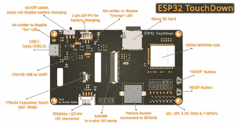

# FreeTouchDeck 升级了它的硬件和名字:ESP32 触地得分

> 原文：<https://hackaday.com/2021/02/14/freetouchdeck-upgrades-its-hardware-and-its-name-esp32-touchdown/>

随着许多人继续在家工作的时间比他们想象的要长，我们看到小型 DIY 设备的兴起使视频通话或虚拟演示变得更容易也就不足为奇了。[Dustin Watts]对 Elgato Stream Deck 的功能感兴趣，这是一个宏键盘，每个键都是它自己的屏幕。但是这种奇特的硬件有着令人望而生畏的价格标签。所以他自己建了一个，并且开源了！

他的第一次迭代——free touch deck——是使用常见的模块构建的，但后来演变成了用一块 PCB 完成所有工作的 ESP32 Touchdown 。这是一个高度可定制的触摸屏宏键盘，提供了方便快捷的操作和宏。需要一个快速静音按钮，想要在 OBS 上切换摄像机视图，或者您可能想要为您的 CAD 选择更智能的快捷键。这份遗嘱可以带你去那里。

 与第一版(FreeTouchDeck)有几个关键区别。ESP32 开发板被抛弃，取而代之的是直接集成模块的整洁 PCB。这款手机有一个电容触摸控制器(FT6236)，而不是电阻控制器，因为电容屏幕提供了更好的用户体验。内置的电池和充电器电路(FreeTouchDesk 没有)允许从任何地方(当然是在无线范围内)进行额外的灵活性。STL 格式的多种外壳设计可供选择，可以轻松地放在墙上或桌子上。

GitHub 上提供了数据表、gerbers、kicad 文件、BOM 和示例固件[。该软件很容易配置，所以它可以设置做任何种类的宏，组合键，或行动。这不仅仅局限于模拟蓝牙键盘，因为有示例显示如何连接到 Home Assistant。总而言之，这是一个项目持续迭代的极好例子。](https://github.com/DustinWatts/esp32-touchdown)

感谢[蒂莫西·格雷戈里]发送这封邮件！