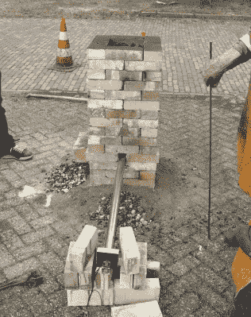
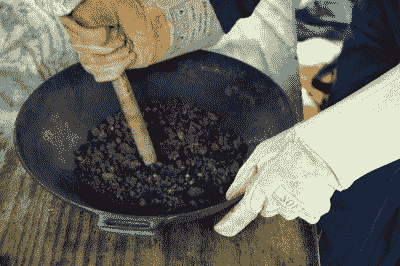
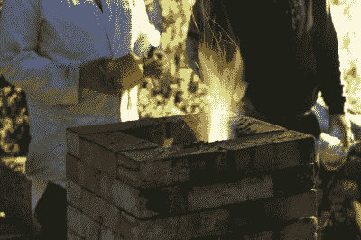
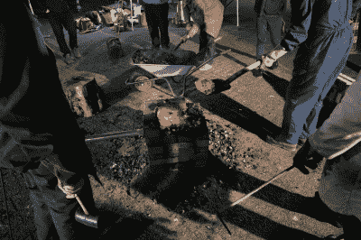
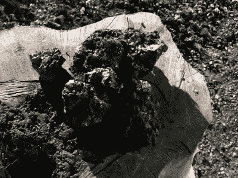

# 从泥土到空间，后院冶铁黑客空间风格

> 原文：<https://hackaday.com/2019/05/22/from-dirt-to-space-backyard-iron-smelting-hackerspace-style/>

今年 2 月，当我去荷兰的一个黑客训练营时，我希望和一群朋友在一个舒适的地方呆几天，喝点啤酒，看一场 chiptune 演唱会，然后说“哦！”人们带来了很多令人兴奋的项目。我做了所有这些事情，但我也打开了意想不到的东西的大门。来自海牙 RevSpace 的人们带来了他们的便携式熔炉，不久我发现自己穿着滑稽的不合适的衣服在加工一块热钢筋。一件事接着一件事，我接到邀请去参观他们的另一个金属加工项目:在一个周末从矿石到装饰技术。

“从泥土到太空”是荷兰黑客空间公司之间的合作，目的很简单:将铁矿石加工成一个组件，然后发射到太空。整个项目将于 8 月在德国 CCCamp 黑客训练营进行尝试，但为了测试设备和技术，需要进行一次试运行。就这样，我发现自己坐在英吉利海峡隧道的阿乐穿梭汽车运输列车上，前往阿纳姆的黑客空间，所有相关各方将在那里会面。

## 首先，建造一座高炉

[![A blast furnace, with associated chemistry. OpenStax [CC BY 4.0 ]](img/93b81e689a6904410ec1a25eb1204f27.png)](https://hackaday.com/wp-content/uploads/2019/04/blast-furnace-diagram.jpg) 

一座高炉，与化学有关。open StAX[[CC BY 4.0](https://commons.wikimedia.org/wiki/File:CNX_Chem_19_01_BlastFurn.png)

炼铁不是一件正常的事情，除非你从事行业。如果你真的很幸运，你可能在学校的化学课中学到了一些关于这个过程的知识。但是为了每个人的利益，让我们快速回顾一下。

The blast furnace set up behind Hack42\. In the foreground is the server fan and stainless steel tuyere pipe.

铁矿石以氧化铁的形式存在，为了制造金属铁，它必须被还原——氧原子必须被剥离。这是在鼓风炉中进行的。这些是立式炉，顶部装有碎矿石和碳的混合物。小心控制泵入炉底的空气，碳燃烧不完全，产生大量热量。

炉子将达到 1500 摄氏度以上的温度，并产生非常热的一氧化碳气体。这种热的一氧化碳向上穿过一层矿石，形成还原剂，从铁中剥离氧气，形成二氧化碳或 CO2。在炉子的顶部，任何残留的一氧化碳在接触到新鲜空气时都会燃烧掉，同时铁会以熔融金属的形式聚集在炉子的底部，成为一团被称为“熔渣”的热金属。

铁矿石中还有硅酸盐之类的杂质，这些杂质会熔化成一种类似玻璃的物质，称为炉渣，它应该会形成一层浮在钢坯顶部。通常会有助熔剂，如碎石灰石加入到矿石中，使炉渣更具流动性，而且矿石还会预先焙烧，以除去任何水分和其他挥发性化合物。

在它的化学过程中，这个过程出奇的简单，但是在它的操作中，有大量的变量会导致它失败。周末的目的是获得经验，并找出可能出现问题的部分。

Crushing the ore. Photo: © [Martina Short](https://twitter.com/martina_photos), used here with permission.

Hack42 后面为周末建造的炉子非常简单，沙层上有一个垂直的耐火砖烟囱，底部有一个用于收集铁的井，侧面有三个易于移动的砖以排出炉渣，砖之间有一个小间隙用于空气注射器或风口。这只是一根不锈钢管，上面有几个大容量的处理器风扇在吹风，看起来家用高炉的一个危害是注入了太多的空气。燃料是烧烤木炭，而不是你在工业中所期望的焦炭，而且不同寻常的是，这种矿石不是开采出来的赤铁矿或磁铁矿，而是来自荷兰北部一个农场的沼泽矿石(bog ore )( T1 ),这是细菌作用于富铁地下水而沉淀的氧化铁和氢氧化物的堆积物。这种矿石在 RevSpace 窑中经过了焙烧过程，因此是易碎且容易破碎的黑色块状物，而不是通常从地下冒出的固体石头。这一天的第一项任务是用木槌将矿石和木炭碾碎成直径约 10 毫米的块状，然后是开始点火和给熔炉装料的时候了。

## 熔炼:纵火狂的乐趣

点燃这么大的高炉出人意料地容易，它是从一些小木头和喷灯开始的，然后是一些木柴来预热它，并在底部生起一堆好火。他们在打开空气供应之前使用了一批木球，目的是在底部形成一层细木炭，铁水可以通过它渗出。这被证明是一个错误，因为木球在燃烧时聚结在一起，必须用拨火棒通过气孔清除。随着火的燃烧，是时候向熔炉中加入等量的 1 公斤木炭和矿石了，这一过程在整个操作过程中一直保持满炉状态。

The carbon monoxide burns at the top of the furnace with a characteristic flame. Photo: © Martina Short, used here with permission.

当火真正烧起来时，很明显它正按照我们的意图燃烧着。听得见的声音变成了更高的轰鸣声，早期燃烧时在炉口聚集的黑色烟灰在热量到达顶部时燃烧掉了。粉红色的火焰表明一氧化碳的存在，并且可以看出红色的氧化铁(Fe3O4)矿石如何在炉口变成黑色的氧化铁(FeO)。我们必须小心地呆在炉子的上风处，因为即使有火焰，它也会产生大量有毒的一氧化碳。

事实证明，这次发射比预期的更有问题。添加了一些沙子作为助熔剂，使炉渣更容易处理，但它仍然在火的热区结块，需要用拨火棒定期清除。这成为一个常规过程，有时伴随着令人印象深刻的炽热熔渣河，有时伴随着炽热熔渣的固体块。我们很高兴在矿渣中发现了一些豌豆大小的铁片，至少有些东西在工作。

## 分解它并回收一些铁

Breaking the furnace, layer by layer.

这一过程持续了一整天，碰巧这一天是荷兰国王的生日，也是举国欢庆的一天。人们品尝了荷兰美食，作为对国际和谐精神的贡献，我带了一加仑我的苹果酒。与此同时，显而易见的是，熔炉的运行并不像我们希望的那样顺利，晚上空气供应被切断，拆除熔炉的缓慢过程开始了。

炽热的矿石、灰烬和炉渣被一层一层地铲走，当它们被剥离时，我们可以直接看到燃烧是如何形成的。在底部，我们没有找到我们希望的大块水花，而是接近几个高尔夫球大小的铁块以及大量的炉渣。很明显，我们已经达到了正确的温度，因为在最靠近风口的耐火砖上有一些明显的熔化，但也很明显，最热的区域相当小，并且集中在那一侧。下一步将是加工铁以去除杂质，并设法使其聚集成一团。如果持续足够长的时间，这将会产生不纯的熟铁。

## 高炉旁的一天教会了你什么？

The final pieces of smelted iron bloom.

那么，我们学到了什么，下一次“从泥土到太空”团队会做什么不同的事情呢？讨论集中在风口，以及它的工作应该是如何将足够的空气喷入炉子的中心。有人提出了一个修正的设计，包括用一个喷嘴点燃几个陶瓷风口，这个喷嘴设计成从各个方向产生更多的空气射流。在这样的炉子里炼铁已经算是成功了，不管他们是否在夏令营前进行另一次测试，可以肯定的是，下一次只会更成功。与此同时，我知道我 8 月份的德国之行将再次参与一座小型高炉的加料和维护工作。我爱我们的社区！

最后，我要感谢 Hack42 的朋友们，感谢他们热情的招待，感谢 RevSpace 的朋友们带来了他们的铁匠铺和其他工具，感谢所有其他到场的朋友们，让这个周末如此美好。还有我的朋友玛蒂娜，我们开着她那辆比我的好得多的车，潇洒地飘过了欧洲大陆。

标题图像:出渣。玛蒂娜短，在这里使用的许可。